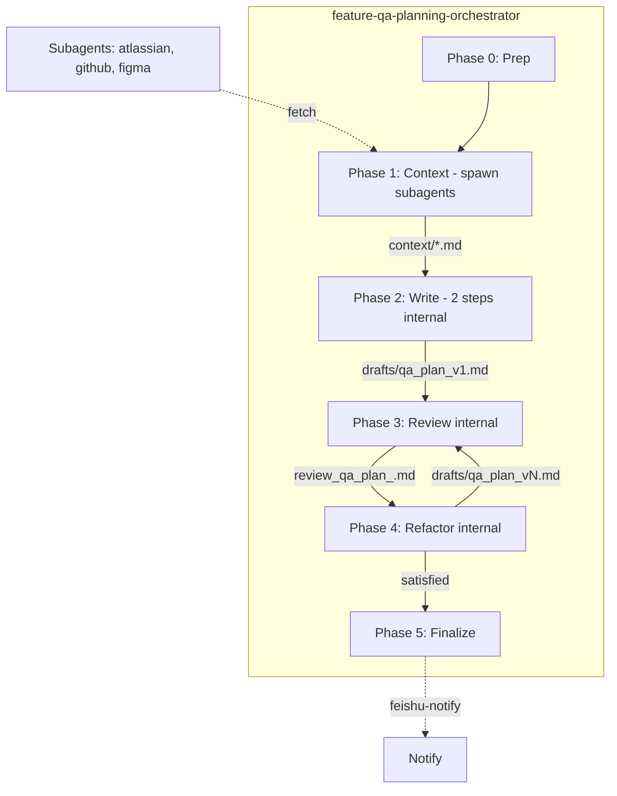

# Simplify QA Template and Validation

## Summary

- **Template**: [templates/qa-plan-template.md](workspace-planner/skills/feature-qa-planning-orchestrator/templates/qa-plan-template.md) is a **soft contract** — structure is flexible, but **top priority (P1/P2/P3) must be obeyed**
- **Skill**: **markxmind** (`.agents/skills/markxmind`) — MUST be used; obeyed by writer, review, and refactor
- **Remove**: Template tests (`validate-fixtures.mjs`, `validate_fixtures.test.mjs`)
- **Contract**: Write (2 steps: scenarios+test cases → group+priority) → review → refactor
- **Consolidation**: Phase 1 spawns subagents to collect context; Phases 2–5 orchestrator does write, review, refactor internally (no spawns for those); orchestrator decides review rounds
- **Priority**: P1 = directly relates to code change, P2 = maybe influenced, P3 = nice to have; highlight risky parts clearly
- **Validation**: XMindMark structure only via markxmind skill — no other checks (no executability)

---

## 1. Simplified Contract Documents

### 1a. New `references/qa-plan-contract-simple.md`

**Path**: `workspace-planner/skills/feature-qa-planning-orchestrator/references/qa-plan-contract-simple.md`

Replace`canonical-testcase-contract.md` and `coverage-domains.md` with: 

(remove `canonical-testcase-contract.md` and `coverage-domains.md)`

- **Who obeys**: Write, review, and refactor all obey this contract
- **MUST use skill**: **markxmind** — output must be valid XMindMark
- **Structure**: scenario -> Step 1 -> (optional Step 2) -> expected result (XMindMark). Step 2 is optional.
- **Write step 1**: List all scenarios and test steps (each step is a bullet) and expected result
- **Write step 2**: Group scenarios into top categories; mark P1/P2/P3; highlight risky parts. Leave top categories as-is if scenarios do not fit.
- **Top priority (hard rule)**: P1 (directly relates to code change), P2 (maybe influenced), P3 (nice to have) — must be obeyed; do not remove or ignore
- **Risk**: Clearly mark risky areas
- **Template**: `templates/qa-plan-template.md` is the soft contract; structure is flexible but top priority must be obeyed

### 1b. Update `templates/qa-plan-template.md` (soft contract)

Add a preamble at the top of the template:

- Declare this as a **soft contract** — structure is flexible; LLM may adapt to the feature
- **Hard rule**: Top priority (P1/P2/P3) must be obeyed; do not remove or ignore priority markers
- **MUST use skill**: **markxmind** — all output must be valid XMindMark; writer, review, and refactor all follow this
- Reference: `.agents/skills/markxmind/SKILL.md`, `reference.md`, `examples.md`

### 1c. Deprecate

- `references/canonical-testcase-contract.md` 
- `references/coverage-domains.md`

---

## 2. Validation Simplification

### 2a. Structure validation

**Replace** `validate_testcase_structure.mjs` + `testCaseRules.mjs` with:

- Call shared markxmind validator: `node .agents/skills/markxmind/scripts/validate_xmindmark.mjs <file>`
- No hierarchy check — validation is markxmind syntax only

**File**: [workspace-planner/skills/feature-qa-planning-orchestrator/scripts/lib/validate_testcase_structure.sh](workspace-planner/skills/feature-qa-planning-orchestrator/scripts/lib/validate_testcase_structure.sh)

- Change to invoke `node "$REPO_ROOT/.agents/skills/markxmind/scripts/validate_xmindmark.mjs" "$FILE_PATH"`
- Remove dependency on `validate_testcase_structure.mjs` and `testCaseRules.mjs`

### 2b. No executability validation

Remove executability checks entirely. Validation = markxmind only.

### 2c. Deploy script

**File**: [deploy_runtime_context_tools.sh](workspace-planner/skills/feature-qa-planning-orchestrator/scripts/lib/deploy_runtime_context_tools.sh)

- Deploy only: `save_context.sh`
- Remove from deploy: `validate_context.sh`, `validate_testcase_structure.sh`, `validate_testcase_structure.mjs`, `testCaseRules.mjs`, `validate_testcase_executability.sh`

---

## 3. Remove Template Tests

- **Delete**: [scripts/validate-fixtures.mjs](workspace-planner/skills/feature-qa-planning-orchestrator/scripts/validate-fixtures.mjs)
- **Delete**: [tests/validate_fixtures.test.mjs](workspace-planner/skills/feature-qa-planning-orchestrator/tests/validate_fixtures.test.mjs)
- **Update** [package.json](workspace-planner/skills/feature-qa-planning-orchestrator/package.json): remove `"validate:fixtures"` script
- **Update or remove** tests that depend on `testCaseRules.mjs`:
  - [tests/testCaseRules.test.mjs](workspace-planner/skills/feature-qa-planning-orchestrator/tests/testCaseRules.test.mjs) — remove
  - [tests/integrationRules.test.mjs](workspace-planner/skills/feature-qa-planning-orchestrator/tests/integrationRules.test.mjs) — remove

---

## 4. Phase Flow — Spawn for Context Only; Internal Write/Review/Refactor

**File**: [feature-qa-planning-orchestrator/SKILL.md](workspace-planner/skills/feature-qa-planning-orchestrator/SKILL.md)

**Key change**: Phase 1 **spawns subagents** to collect context (Jira, Confluence, GitHub, Figma). Phases 2–5 orchestrator does write, review, refactor **internally** — no spawns for those. Orchestrator **decides review rounds** (e.g., 1, 2, or more until satisfied). Same doc template used throughout.

| Phase | Action                | Who does it                                                              | Artifacts                                                                   |
| ----- | --------------------- | ------------------------------------------------------------------------ | --------------------------------------------------------------------------- |
| 0     | Prep + deploy scripts | Orchestrator                                                             | `task.json`, `run.json`, `projects/feature-plan/scripts/`                   |
| 1     | Context gathering     | Orchestrator **spawns subagents** (per source: atlassian, github, figma) | `context/qa_plan_atlassian_<id>.md`, `context/qa_plan_github_<id>.md`, etc. |
| 2     | **Write** — 2 steps   | Orchestrator (write role, no spawn)                                      | `drafts/qa_plan_v1.md` (XMindMark)                                          |
| 3     | **Review**            | Orchestrator (review role, no spawn)                                     | `context/review_qa_plan_<id>.md`                                            |
| 4     | **Refactor**          | Orchestrator (refactor role, no spawn)                                   | `drafts/qa_plan_v<N+1>.md`                                                  |
| 5     | Finalize + notify     | Orchestrator + `feishu-notify`                                           | `qa_plan_final.md`                                                          |

**Phase 1 — Context (spawn subagents)**: Orchestrator spawns subagents per source family (e.g., qa-plan-atlassian, qa-plan-github, qa-plan-figma or equivalent) to fetch Jira, Confluence, GitHub, Figma evidence. Each saves via `save_context.sh`. Do NOT spawn qa-plan-write/review/refactor.

**Phase 2 — Write (2 steps, orchestrator does both, no spawn)**:

- **Step 1 — Write scenarios and test cases**: List all test scenarios and test cases in scenario ->Step 1 -> (optional Step 2) -> expected result structure. LLM decides organization;.Use **markxmind** for XMindMark output. Optional intermediate: `drafts/qa_plan_v1_raw.md`.
- **Step 2 — Group and mark priority**: Group scenarios into top categories (do not remove top categories). Apply P1/P2/P3. Highlight risky parts. Output: `drafts/qa_plan_v1.md`.

**Phase 3 — Review (orchestrator, no spawn)**: Review draft against contract; produce `context/review_qa_plan_<id>.md`.

**Phase 4 — Refactor (orchestrator, no spawn)**: Apply review findings; produce `drafts/qa_plan_v<N+1>.md`.

**Review rounds**: Orchestrator decides how many review→refactor rounds. May loop (review → refactor → review again) until satisfied or max retries. No fixed single round.

**Benefits**: Same doc template (`templates/qa-plan-template.md`, `references/qa-plan-contract-simple.md`) used for write, review, refactor — no context switch or handoff. Orchestrator SKILL.md contains all role instructions.

**Validation**: XMindMark structure only — `node .agents/skills/markxmind/scripts/validate_xmindmark.mjs <path>` after Phase 2 and after each Phase 4 refactor. No other checks.

---

## 5. Skill Updates — Orchestrator Consolidation

**Use skill-creator** (per [workspace-planner/AGENTS.md](workspace-planner/AGENTS.md)) when updating skill design. Invoke skill-creator to refactor the orchestrator skill with consolidated write/review/refactor roles.

### 5a. feature-qa-planning-orchestrator (consolidate write/review/refactor; spawn for context only)

- **Phase 1**: Orchestrator **spawns subagents** per source family (atlassian, github, figma) to fetch context; saves via `save_context.sh (no change)`
- **Phases 2–4**: Orchestrator does write, review, refactor **internally** — do NOT spawn `qa-plan-write`, `qa-plan-review`, `qa-plan-refactor`
- **Review rounds**: Orchestrator decides how many review→refactor rounds; may loop until satisfied or max retries
- Require **markxmind skill** (`.agents/skills/markxmind`) (output remains .md)
- Use `references/qa-plan-contract-simple.md` and `templates/qa-plan-template.md` (soft contract) for all roles
- **Phase 2 (write role)**: Step 1 — scenarios + test steps + expected result; Step 2 — group + mark priority. Output XMindMark via markxmind.
- **Phase 3 (review role)**: Review draft; produce `context/review_qa_plan_<id>.md`
- **Phase 4 (refactor role)**: Apply review findings; produce `drafts/qa_plan_v<N+1>.md`
- **Phase 5**: User approval, promote to final, `feishu-notify`
- Validation: markxmind only (XMindMark structure) after Phase 2 and after each Phase 4 refactor

### 5b. qa-plan-write, qa-plan-review, qa-plan-refactor

- **Deprecate for write/review/refactor** — orchestrator no longer spawns them for Phases 2–4. Phase 1 may still spawn domain-specific context fetchers (e.g., qa-plan-atlassian, qa-plan-github, qa-plan-figma).

### 5c. Scope: orchestrator skill and relevant docs only

| File                                            | Update                                                   |
| ----------------------------------------------- | -------------------------------------------------------- |
| `feature-qa-planning-orchestrator/SKILL.md`     | Validation = markxmind only; deploy only save_context.sh |
| `feature-qa-planning-orchestrator/README.md`    | Same                                                     |
| `feature-qa-planning-orchestrator/reference.md` | Same                                                     |

---

## 6. Test Updates (if applicable)

- [validate_context.test.mjs](workspace-planner/skills/feature-qa-planning-orchestrator/tests/validate_context.test.mjs): Remove `testCaseRules.mjs` copy; structure validation now uses markxmind
- [deploy_runtime_context_tools.test.mjs](workspace-planner/skills/feature-qa-planning-orchestrator/tests/deploy_runtime_context_tools.test.mjs): Remove `validate_testcase_structure.mjs`, `testCaseRules.mjs` from expected deployed list
- [validate_testcase_scripts.test.mjs](workspace-planner/skills/feature-qa-planning-orchestrator/tests/validate_testcase_scripts.test.mjs): Update for new structure validator behavior (markxmind)

---

## 8. Files to Create/Modify/Delete

**Scope: update deploy script only.**

| Action | Path                                                                          |
| ------ | ----------------------------------------------------------------------------- |
| Update | `scripts/lib/deploy_runtime_context_tools.sh` — deploy only `save_context.sh` |

---

## 9. Diagram: Spawn for Context; Internal Write/Review/Refactor

**Phase 1 spawns subagents** to collect context. **Phases 2–4 no spawns** — orchestrator does write, review, refactor internally. **Orchestrator decides review rounds** (may loop P3→P4 until satisfied).