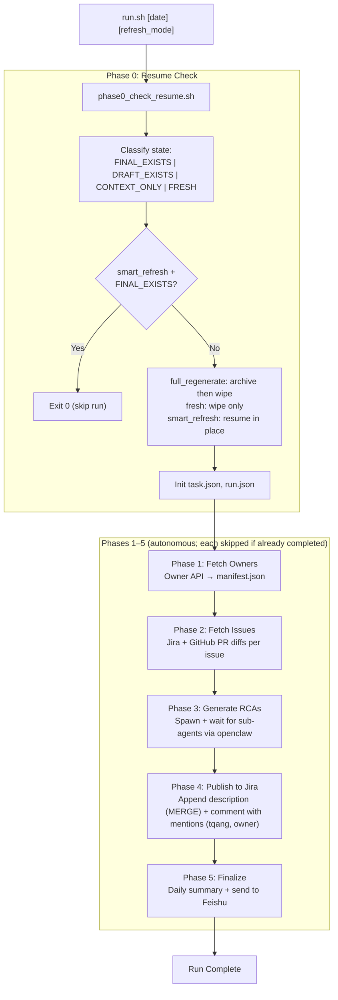

# RCA Daily Skill Refactor — Agent Design

> **Design ID:** `rca-daily-skill-refactor-2026-03-06`
> **Date:** 2026-03-06
> **Revised:** 2026-03-08
> **Status:** Draft
> **Scope:** Refactor `workspace-daily/projects/rca-daily` into a skill-first RCA workflow. Entry point is a shell script invoked by OpenClaw (scheduling configured there). All scripts are specified with concrete implementations. Legacy scripts are reused where possible.
>
> **Constraint:** This is a design artifact. Do not implement until approved.

---

## Workflow Overview



---

## 0. Environment Setup

This workflow is **fully autonomous**. OpenClaw scheduling invokes `scripts/run.sh`; no interactive confirmation or manual checkpoint is part of normal execution.

Runtime prerequisites:

- `curl` — API fetches from `http://10.23.38.9:8070`
- `jq` — JSON parsing and ADF payload construction
- `node` (via `nvm use default`) — `generate-rcas-via-agent.js`; jira-cli and feishu-notify use Node internally
- `jira` CLI — issue view, comment post (`~/.config/.jira/.config.yml` configured)
- `gh` CLI — GitHub PR diff fetch (`gh auth login` completed)
- `openclaw` CLI — `sessions_spawn`, `message send`
- `JIRA_API_TOKEN` and `JIRA_BASE_URL` — configured in `.env` (in shared jira-cli skill). **Every script that uses Jira must activate this env** via `load_jira_env_from_skill` (in `common.sh`) before any `jira` or jira-cli script call.
- Feishu chat-id read from `workspace-daily/TOOLS.md` at runtime
- Owner API URL: `http://10.23.38.9:8070/api/jira/customer-defects/details/?status=completed&limit=500`
- in openclaw, use `Make init-skills` to initialize the skills (via symlink)

---

## 1. Design Deliverables

| Action | Path | Notes |
|--------|------|-------|
| CREATE | `.agents/skills/rca/SKILL.md` | Shared RCA generation contract — what a sub-agent reads to produce a 9-section RCA |
| CREATE | `.agents/skills/rca/reference.md` | RCA template, input/output shape, field map |
| CREATE | `workspace-daily/skills/rca-orchestrator/SKILL.md` | Workspace-local orchestrator instructions for OpenClaw agent |
| CREATE | `workspace-daily/skills/rca-orchestrator/reference.md` | Run folder layout, phase definitions, refresh modes |
| CREATE | `workspace-daily/skills/rca-orchestrator/README.md` | Usage, invocation, refresh modes (scheduling configured in OpenClaw) |
| CREATE | `workspace-daily/skills/rca-orchestrator/scripts/run.sh` | **Entry point** — orchestrates all 5 phases |
| CREATE | `workspace-daily/skills/rca-orchestrator/scripts/lib/common.sh` | Shared constants, logging, state helpers |
| CREATE | `workspace-daily/skills/rca-orchestrator/scripts/lib/state.sh` | `task.json` / `run.json` read-write helpers |
| CREATE | `workspace-daily/skills/rca-orchestrator/scripts/phase0_check_resume.sh` | Idempotency gate — classify run state |
| CREATE | `workspace-daily/skills/rca-orchestrator/scripts/phase1_fetch_owners.sh` | Fetch owner API, filter `requires_rca`, build `manifest.json` |
| CREATE | `workspace-daily/skills/rca-orchestrator/scripts/phase2_fetch_issues.sh` | Fetch Jira details + GitHub PR diffs per issue |
| CREATE | `workspace-daily/skills/rca-orchestrator/scripts/phase3_generate_rcas.sh` | Invoke agent spawning via adapted `generate-rcas-via-agent.js` |
| CREATE | `workspace-daily/skills/rca-orchestrator/scripts/phase4_publish_to_jira.sh` | Per jira-cli examples.md: (1) append RCA to issue description via build-adf + jira-publish-playground MERGE, (2) add executive-summary comment with multiple user mentions (tqang, owner, etc.); user lookup supports "Xue, Yin" plan names via resolve-jira-user fallbacks |
| CREATE | `workspace-daily/skills/rca-orchestrator/scripts/phase5_finalize.sh` | Assemble daily summary, send Feishu notification |
| REFERENCE | `.agents/skills/jira-cli/scripts/build-adf.sh` | Phase 4: MD→ADF via shared jira-cli skill (no copy) |
| REFERENCE | `.agents/skills/feishu-notify/scripts/send-feishu-notification.js` | Phase 5: Feishu notification via shared feishu-notify skill (no copy) |
| CREATE | `workspace-daily/skills/rca-orchestrator/scripts/lib/generate-rcas-via-agent.js` | RCA-specific agent spawn helper; implement per design spec (legacy `projects/rca-daily` will be deleted) |
| UPDATE | `.agents/skills/jira-cli/SKILL.md` | Add ADF description update and comment-with-mentions support |
| UPDATE | `workspace-daily/AGENTS.md` | Add RCA orchestrator routing, skill ownership, deprecation note |
| CREATE | `workspace-daily/skills/rca-orchestrator/tests/` | Test stubs for each script (see §4.11) |
| REMOVE (post-validation) | `workspace-daily/projects/rca-daily/` | Fully deprecated legacy project |

---

## 2. AGENTS.md Sync

Sections to update in `workspace-daily/AGENTS.md`:

- **Mandatory Skills**: `rca-orchestrator` is the entry for all daily RCA work.
- **Workflow Routing**: daily RCA must go through `workspace-daily/skills/rca-orchestrator/SKILL.md`, not legacy scripts.
- **Usage**: entry point is `scripts/run.sh [date] [refresh_mode]`; scheduling is configured in OpenClaw.
- **Deprecation**: mark `workspace-daily/projects/rca-daily/` as legacy; remove after cutover.

---

## 3. Skills Content Specification

### 3.1 `.agents/skills/rca/SKILL.md`

Classification: **shared**

This skill is what each spawned sub-agent reads. It tells the sub-agent how to generate one RCA document.

Key sections in the SKILL.md:

```markdown
## Purpose
Generate a single concise 9-section RCA document for a Jira defect issue less than 300 words.

## Input Contract
Read the input JSON at the path provided by the orchestrator:
  cache/rca-input/<ISSUE_KEY>.json

Fields available:
  - issue_key          string   e.g. "BCIN-5286"
  - issue_summary      string   Jira summary line
  - jira_json_path     string   path to full Jira JSON (cache/issues/<ISSUE_KEY>.json)
  - pr_data_path       string   path to concatenated PR diffs (cache/pr/<ISSUE_KEY>.txt)
  - automation_status  string   "yes" | "no" | "unknown"
  - pr_list            array    list of GitHub PR URLs extracted from Jira comments
  - rca_output_path    string   where to write the RCA markdown

## Output Contract
Write the completed RCA to rca_output_path.
File must exist on disk when the sub-agent session ends.
Announce completion with: "RCA complete: <ISSUE_KEY>"
If generation fails, announce completion with: "RCA failed: <ISSUE_KEY>" and include a one-line reason.

## RCA Document Structure (9 sections)
1. Incident Summary — 2–3 sentence overview
2. References — Jira link, GitHub PRs, customer
3. Timeline (UTC) — key events chronologically
4. What Happened — concise description in 1-2 sentences from Jira + PR analysis
5. Five Whys — root cause using PR diffs and Jira comments (MUST HAVE AT LEAST 3 "why" levels)
6. Why It Was Not Discovered Earlier — testing/monitoring gaps in short bullet points
7. Corrective Actions — immediate fixes from the PRs in short bullet points
8. Preventive Actions — long-term improvements in short bullet points
9. Automation Status — automated (yes/no/unknown), related PRs listed

## Fetching Additional Data
If Jira JSON or PR data are insufficient, use jira CLI and gh CLI to supplement.
Do not fabricate context. If data is missing, state "Data unavailable" in the relevant section.

## Quality Rules
- Each section must be present even if short.
- Section 5 (Five Whys) must have at least 3 "why" levels.
- Do not copy-paste Jira description verbatim — synthesize.
- Use `## 1. ...` through `## 9. ...` headings exactly so downstream scripts can parse section 1 reliably.
- Keep the document concise; target less than 300 words unless source material requires a slightly longer explanation.
- If supplemental CLI lookups still leave a gap, write `Data unavailable` instead of guessing.
```

### 3.2 `.agents/skills/rca/reference.md`

Classification: **shared**

This reference file supports `.agents/skills/rca/SKILL.md`. It is the canonical format and fallback guide for a single RCA output.

Key sections in the `reference.md`:

```markdown
## Field Map
- `issue_key` → RCA title and references section
- `issue_summary` → Incident Summary / What Happened context
- `jira_json_path` → source of timeline, customer, comments, status changes
- `pr_data_path` → source of corrective/preventive actions and Five Whys evidence
- `automation_status` → Automation Status section
- `pr_list` → References and Automation Status sections

## Required Markdown Template
# RCA for <ISSUE_KEY>
## 1. Incident Summary
## 2. References
## 3. Timeline (UTC)
## 4. What Happened
## 5. Five Whys
## 6. Why It Was Not Discovered Earlier
## 7. Corrective Actions
## 8. Preventive Actions
## 9. Automation Status

## Missing-Data Rules
- Missing customer or timestamp data → `Data unavailable`
- No PRs found → say so explicitly in sections 2, 5, 7, and 9 as needed
- Conflicting evidence between Jira and PR diff → prefer the most concrete timestamped source and note the ambiguity briefly
```

### 3.3 `workspace-daily/skills/rca-orchestrator/SKILL.md`

Classification: **workspace-local**

This skill is what the daily orchestrator OpenClaw agent reads. It tells the agent how to drive the 5-phase workflow.

Key sections:

```markdown
## Purpose
Orchestrate daily RCA generation for all customer defects with category=requires_rca.
Entry point: workspace-daily/skills/rca-orchestrator/scripts/run.sh

## Invocation
bash workspace-daily/skills/rca-orchestrator/scripts/run.sh [YYYY-MM-DD] [refresh_mode]

refresh_mode options:
  smart_refresh     (default) Skip phases already completed for the run date.
  full_regenerate   Archive existing outputs and re-run all phases.
  fresh             Same as full_regenerate but no archive step.

## Phase Responsibilities
Phase 0 — Resume check: classify run state and decide autonomously whether to stop, resume, or reset.
Phase 1 — Owner API fetch + manifest: builds the issue list for the day.
Phase 2 — Data fetch: Jira details + GitHub PR diffs per issue.
Phase 3 — RCA generation: spawn sub-agents in batches, wait for completion, and record terminal status for every issue.
Phase 4 — Jira publish: append/merge RCA content into Jira description and post the executive-summary comment.
Phase 5 — Finalize: daily summary markdown + Feishu notification.

## Artifact Locations
All run artifacts live under:
  workspace-daily/skills/rca-orchestrator/scripts/runs/<YYYY-MM-DD>/

## State Files
task.json — phase/status tracking
run.json  — timestamps, spawn sessions, Jira publish results

## Skills Used
- .agents/skills/rca/SKILL.md          (read by each spawned sub-agent)
- .agents/skills/jira-cli/SKILL.md     (Jira fetch, ADF update, comment post)
- .agents/skills/feishu-notify/SKILL.md (final notification)

## Error Policy
- Phase 0 classification of FINAL_EXISTS in smart_refresh mode → exit 0, no re-run.
- Partial issue failures in Phase 3/4 → persist per-issue terminal status and continue remaining issues.
- Feishu failure → persist payload in run.json.notification_pending, do not block completion.
```

### 3.4 `workspace-daily/skills/rca-orchestrator/reference.md`

Classification: **workspace-local**

This reference file supports the orchestrator skill. It exists so the runtime contract lives in one place instead of being spread across comments in shell scripts.

Key sections in the `reference.md`:

```markdown
## Refresh Modes
- `smart_refresh`: if `REPORT_STATE=FINAL_EXISTS`, stop successfully; otherwise resume from incomplete phases in-place
- `full_regenerate`: archive prior outputs, wipe run state, and rebuild from Phase 0
- `fresh`: wipe run state without archive, then rebuild from Phase 0

## Phase Transition Rules
- Phase 4 starts only after Phase 3 has produced a terminal generation result for every issue
- Phase 5 starts only after Phase 4 has produced a terminal Jira publish result for every issue
- Missing RCA output file after Phase 3 terminal failure is treated as a publish-time failure, not a retry trigger

## Run Folder Semantics
- `manifest.json`: issue list for the day
- `manifest-gen.json`: RCA generation manifest built from Phase 2 outputs
- `spawn-results.json`: blocking Phase 3 result produced by the spawn helper
- `task.json`: phase and per-issue state
- `run.json`: timestamps, spawn session metadata, Jira publish results, notification state
```

### 3.5 `workspace-daily/skills/rca-orchestrator/README.md`

**Purpose:** Usage documentation. Scheduling is configured in OpenClaw, not here.

Key sections:

```markdown
## Usage

bash workspace-daily/skills/rca-orchestrator/scripts/run.sh [YYYY-MM-DD] [refresh_mode]
```

- `YYYY-MM-DD` — Run date (default: current date in TZ=Asia/Shanghai)
- `refresh_mode` — `smart_refresh` (default) | `full_regenerate` | `fresh`

**Refresh modes:** smart_refresh (skip completed phases), full_regenerate (archive + wipe + re-run), fresh (wipe + re-run).

**Scheduling:** Configured in OpenClaw agent; see workspace OpenClaw config.

---

## 4. Script Inventory and Specification

### 4.0 Run Folder Layout

```text
workspace-daily/skills/rca-orchestrator/
├── SKILL.md
├── reference.md
├── README.md
└── scripts/
    ├── run.sh                          ← ENTRY POINT
    ├── phase0_check_resume.sh
    ├── phase1_fetch_owners.sh
    ├── phase2_fetch_issues.sh
    ├── phase3_generate_rcas.sh
    ├── phase4_publish_to_jira.sh
    ├── phase5_finalize.sh
    ├── lib/
    │   ├── common.sh                   ← sourced by all phase scripts; defines REPO_ROOT, paths to shared skills
    │   ├── state.sh                    ← task.json / run.json helpers
    │   └── generate-rcas-via-agent.js  ← CREATE (RCA-specific; jira-cli + feishu-notify used via shared skills)
    └── runs/
        └── 2026-03-06/
            ├── task.json
            ├── run.json
            ├── manifest.json
            ├── cache/
            │   ├── owners/
            │   │   └── owners-2026-03-06.json
            │   ├── issues/
            │   │   └── BCIN-5286.json
            │   ├── pr/
            │   │   └── BCIN-5286.txt
            │   └── rca-input/
            │       └── BCIN-5286.json
            ├── output/
            │   ├── rca/
            │   │   └── BCIN-5286-rca.md
            │   ├── adf/
            │   │   └── BCIN-5286.adf.json
            │   ├── comments/
            │   │   └── BCIN-5286-comment.json
            │   └── summary/
            │       └── daily-summary.md
            ├── logs/
            │   └── run-2026-03-06.log
            └── archive/
```

---

### 4.1 `scripts/run.sh` — Entry Point

**Purpose:** Top-level orchestrator. Drives all 5 phases in sequence. Respects `smart_refresh` to skip completed phases. Scheduling is configured in OpenClaw.

**Script:**
```bash
#!/bin/bash
# Usage: ./run.sh [YYYY-MM-DD] [smart_refresh|full_regenerate|fresh]
set -euo pipefail

SCRIPT_DIR="$(cd "$(dirname "${BASH_SOURCE[0]}")" && pwd)"
source "${SCRIPT_DIR}/lib/common.sh"

RUN_DATE="${1:-$(TZ=Asia/Shanghai date +%Y-%m-%d)}"
REFRESH_MODE="${2:-smart_refresh}"

log_info "=== RCA Daily Run: ${RUN_DATE} [${REFRESH_MODE}] ==="

# Phase 0: Classify existing state; decide whether to stop or continue
phase0_output=$(bash "${SCRIPT_DIR}/phase0_check_resume.sh" "${RUN_DATE}" "${REFRESH_MODE}")
echo "${phase0_output}" | tee -a "$(run_dir "${RUN_DATE}")/logs/run-${RUN_DATE}.log"

if echo "${phase0_output}" | grep -q '^RUN_DECISION=stop$'; then
  log_info "Phase 0 requested autonomous stop; run exits successfully."
  exit 0
fi

# Phase 1: Fetch owner API, build manifest.json
if phase_not_done "${RUN_DATE}" "phase_1_manifest"; then
  bash "${SCRIPT_DIR}/phase1_fetch_owners.sh" "${RUN_DATE}"
fi

# Phase 2: Fetch Jira details + GitHub PR diffs per issue
if phase_not_done "${RUN_DATE}" "phase_2_fetch_and_normalize"; then
  bash "${SCRIPT_DIR}/phase2_fetch_issues.sh" "${RUN_DATE}"
fi

# Phase 3: Spawn sub-agents to generate RCAs
if phase_not_done "${RUN_DATE}" "phase_3_generate_rca"; then
  bash "${SCRIPT_DIR}/phase3_generate_rcas.sh" "${RUN_DATE}"
fi

# Phase 4: ADF convert, append Jira description, post comment
if phase_not_done "${RUN_DATE}" "phase_4_publish_to_jira"; then
  bash "${SCRIPT_DIR}/phase4_publish_to_jira.sh" "${RUN_DATE}"
fi

# Phase 5: Assemble daily summary, send Feishu notification
if phase_not_done "${RUN_DATE}" "phase_5_finalize"; then
  bash "${SCRIPT_DIR}/phase5_finalize.sh" "${RUN_DATE}"
fi

log_info "=== RCA Daily Run Complete: ${RUN_DATE} ==="
```

---

### 4.2 `scripts/lib/common.sh` — Shared Helpers

**Purpose:** Constants and helper functions sourced by all phase scripts.

```bash
#!/bin/bash
# Source this file; do not execute directly.

SKILL_ROOT="$(cd "$(dirname "${BASH_SOURCE[0]}")/../.." && pwd)"
REPO_ROOT="$(cd "${SKILL_ROOT}/../../.." && pwd)"
RUNS_ROOT="${SKILL_ROOT}/scripts/runs"
JIRA_URL="https://strategyagile.atlassian.net"
OWNER_API_URL="http://10.23.38.9:8070/api/jira/customer-defects/details/?status=completed&limit=500"
FEISHU_CHAT_ID=""  # loaded from TOOLS.md at runtime (see load_feishu_chat_id)
BUILD_ADF_SH="${REPO_ROOT}/.agents/skills/jira-cli/scripts/build-adf.sh"
FEISHU_NOTIFY_SCRIPT="${REPO_ROOT}/.agents/skills/feishu-notify/scripts/send-feishu-notification.js"
JIRA_CLI_SCRIPTS="${REPO_ROOT}/.agents/skills/jira-cli/scripts"

run_dir() {
  echo "${RUNS_ROOT}/${1}"
}

log_info() {
  local run_date="${RUN_DATE:-unknown}"
  local log_file
  log_file="$(run_dir "${run_date}")/logs/run-${run_date}.log"
  mkdir -p "$(dirname "${log_file}")"
  echo "[$(date +'%Y-%m-%dT%H:%M:%S')] INFO  $*" | tee -a "${log_file}"
}

log_error() {
  local run_date="${RUN_DATE:-unknown}"
  local log_file
  log_file="$(run_dir "${run_date}")/logs/run-${run_date}.log"
  mkdir -p "$(dirname "${log_file}")"
  echo "[$(date +'%Y-%m-%dT%H:%M:%S')] ERROR $*" | tee -a "${log_file}" >&2
}

# Returns 0 (true) if the given phase is NOT yet completed in task.json
phase_not_done() {
  local run_date="$1"
  local phase="$2"
  local task_file
  task_file="$(run_dir "${run_date}")/task.json"
  [[ ! -f "${task_file}" ]] && return 0
  local status
  status=$(jq -r --arg p "${phase}" '.phases[$p].status // "pending"' "${task_file}")
  [[ "${status}" != "completed" ]]
}

load_feishu_chat_id() {
  local tools_file="${SKILL_ROOT}/../../TOOLS.md"
  FEISHU_CHAT_ID=$(grep -oE 'oc_[a-f0-9]+' "${tools_file}" | head -1 || echo "")
  if [[ -z "${FEISHU_CHAT_ID}" ]]; then
    log_error "FEISHU_CHAT_ID not found in TOOLS.md"
    exit 1
  fi
}

# Load Jira env (JIRA_API_TOKEN, JIRA_BASE_URL) from shared jira-cli skill .env.
# Per jira-cli SKILL: activate .env before every Jira operation.
# Avoid naming collision with the sourced helper by using a local wrapper name.
load_jira_env_from_skill() {
  local jira_env_sh="${REPO_ROOT}/.agents/skills/jira-cli/scripts/lib/jira-env.sh"
  if [[ -f "${jira_env_sh}" ]]; then
    source "${jira_env_sh}"
    load_jira_env  # provided by jira-env.sh (resolution order: JIRA_ENV_FILE → skill .env → workspace .env → repo .env)
  fi
}

setup_run_dirs() {
  local run_date="$1"
  local d
  d="$(run_dir "${run_date}")"
  mkdir -p \
    "${d}/cache/owners" \
    "${d}/cache/issues" \
    "${d}/cache/pr" \
    "${d}/cache/rca-input" \
    "${d}/output/rca" \
    "${d}/output/adf" \
    "${d}/output/comments" \
    "${d}/output/summary" \
    "${d}/logs" \
    "${d}/archive"
}
```

---

### 4.3 `scripts/lib/state.sh` — State File Helpers

**Purpose:** Reads and writes `task.json` and `run.json` using `jq`. All state mutations go through these helpers to avoid clobbering.

```bash
#!/bin/bash
# Source this file.

init_task_json() {
  local run_date="$1"
  local task_file
  task_file="$(run_dir "${run_date}")/task.json"
  [[ -f "${task_file}" ]] && return 0
  jq -n \
    --arg run_key "${run_date}" \
    --arg ts "$(date -u +%Y-%m-%dT%H:%M:%SZ)" \
    '{
      run_key: $run_key,
      overall_status: "in_progress",
      current_phase: "phase_0_prepare_run",
      created_at: $ts,
      updated_at: $ts,
      phases: {},
      items: {}
    }' > "${task_file}"
}

init_run_json() {
  local run_date="$1"
  local run_file
  run_file="$(run_dir "${run_date}")/run.json"
  [[ -f "${run_file}" ]] && return 0
  jq -n \
    --arg ts "$(date -u +%Y-%m-%dT%H:%M:%SZ)" \
    '{
      data_fetched_at: null,
      output_generated_at: null,
      jira_published_at: null,
      notification_pending: null,
      updated_at: $ts,
      subtask_timestamps: {},
      spawn_sessions: {},
      jira_publish: {}
    }' > "${run_file}"
}

set_task_phase() {
  # set_task_phase <run_date> <phase_name> <status>
  local run_date="$1" phase="$2" status="$3"
  local task_file
  task_file="$(run_dir "${run_date}")/task.json"
  local ts
  ts="$(date -u +%Y-%m-%dT%H:%M:%SZ)"
  local tmp
  tmp="$(mktemp)"
  jq \
    --arg phase "${phase}" \
    --arg status "${status}" \
    --arg current "${phase}" \
    --arg ts "${ts}" \
    '.current_phase = $current |
     .phases[$phase].status = $status |
     .updated_at = $ts' \
    "${task_file}" > "${tmp}" && mv "${tmp}" "${task_file}"
}

set_task_item() {
  # set_task_item <run_date> <issue_key> <status>
  local run_date="$1" issue_key="$2" status="$3"
  local task_file
  task_file="$(run_dir "${run_date}")/task.json"
  local tmp
  tmp="$(mktemp)"
  jq \
    --arg key "${issue_key}" \
    --arg status "${status}" \
    --arg ts "$(date -u +%Y-%m-%dT%H:%M:%SZ)" \
    '.items[$key].status = $status | .updated_at = $ts' \
    "${task_file}" > "${tmp}" && mv "${tmp}" "${task_file}"
}

set_run_field() {
  # set_run_field <run_date> <jq_filter>
  # e.g. set_run_field 2026-03-06 '.data_fetched_at = "2026-03-06T08:05:00Z"'
  local run_date="$1" filter="$2"
  local run_file
  run_file="$(run_dir "${run_date}")/run.json"
  local tmp
  tmp="$(mktemp)"
  jq "${filter} | .updated_at = \"$(date -u +%Y-%m-%dT%H:%M:%SZ)\"" "${run_file}" \
    > "${tmp}" && mv "${tmp}" "${run_file}"
}

set_jira_publish_result() {
  # set_jira_publish_result <run_date> <issue_key> <desc_updated:true|false> <comment_added:true|false> <status>
  local run_date="$1" issue_key="$2" desc_updated="$3" comment_added="$4" status="$5"
  local run_file
  run_file="$(run_dir "${run_date}")/run.json"
  local tmp
  tmp="$(mktemp)"
  jq \
    --arg key "${issue_key}" \
    --argjson desc "${desc_updated}" \
    --argjson comment "${comment_added}" \
    --arg status "${status}" \
    --arg ts "$(date -u +%Y-%m-%dT%H:%M:%SZ)" \
    '.jira_publish[$key] = {description_updated: $desc, comment_added: $comment, status: $status} |
     .updated_at = $ts' \
    "${run_file}" > "${tmp}" && mv "${tmp}" "${run_file}"
}

set_task_overall_status() {
  # set_task_overall_status <run_date> <status>
  local run_date="$1" status="$2"
  local task_file
  task_file="$(run_dir "${run_date}")/task.json"
  local tmp
  tmp="$(mktemp)"
  jq \
    --arg status "${status}" \
    --arg ts "$(date -u +%Y-%m-%dT%H:%M:%SZ)" \
    '.overall_status = $status | .updated_at = $ts' \
    "${task_file}" > "${tmp}" && mv "${tmp}" "${task_file}"
}
```

---

### 4.4 `scripts/phase0_check_resume.sh` — Resume Check

**Purpose:** Classify the existing state of the run and return a machine-readable autonomous decision. In `smart_refresh` mode, a fully completed run returns `RUN_DECISION=stop`; otherwise the workflow initializes or reuses state and returns `RUN_DECISION=continue`.

```bash
#!/bin/bash
# Usage: ./phase0_check_resume.sh <YYYY-MM-DD> <refresh_mode>
set -euo pipefail

SCRIPT_DIR="$(cd "$(dirname "${BASH_SOURCE[0]}")" && pwd)"
source "${SCRIPT_DIR}/lib/common.sh"
source "${SCRIPT_DIR}/lib/state.sh"

RUN_DATE="$1"
REFRESH_MODE="${2:-smart_refresh}"
RUN_DIR="$(run_dir "${RUN_DATE}")"

classify_state() {
  if [[ -f "${RUN_DIR}/output/summary/daily-summary.md" ]]; then
    echo "FINAL_EXISTS"
  elif ls "${RUN_DIR}/output/rca/"*.md 2>/dev/null | grep -q .; then
    echo "DRAFT_EXISTS"
  elif [[ -f "${RUN_DIR}/cache/owners/owners-${RUN_DATE}.json" ]]; then
    echo "CONTEXT_ONLY"
  else
    echo "FRESH"
  fi
}

archive_existing_outputs() {
  local archive_dir="${RUN_DIR}/archive/$(date -u +%Y%m%dT%H%M%SZ)"
  mkdir -p "${archive_dir}"
  [[ -d "${RUN_DIR}/output" ]] && cp -r "${RUN_DIR}/output" "${archive_dir}/"
  log_info "Archived existing outputs to ${archive_dir}"
}

main() {
  setup_run_dirs "${RUN_DATE}"

  local state
  state=$(classify_state)
  log_info "Phase 0: run_date=${RUN_DATE} state=${state} mode=${REFRESH_MODE}"
  echo "REPORT_STATE=${state}"

  case "${REFRESH_MODE}" in
    smart_refresh)
      if [[ "${state}" == "FINAL_EXISTS" ]]; then
        log_info "Final summary already exists. No further work required."
        echo "RUN_DECISION=stop"
        return 0
      fi
      ;;
    full_regenerate)
      if [[ "${state}" != "FRESH" ]]; then
        archive_existing_outputs
        rm -rf "${RUN_DIR}/output" "${RUN_DIR}/cache" "${RUN_DIR}/task.json" "${RUN_DIR}/run.json" "${RUN_DIR}/manifest.json"
        setup_run_dirs "${RUN_DATE}"
        log_info "Wiped and re-initialized run dir for full_regenerate."
      fi
      ;;
    fresh)
      rm -rf "${RUN_DIR}/output" "${RUN_DIR}/cache" "${RUN_DIR}/task.json" "${RUN_DIR}/run.json" "${RUN_DIR}/manifest.json"
      setup_run_dirs "${RUN_DATE}"
      log_info "Wiped run dir for fresh start (no archive)."
      ;;
  esac

  init_task_json "${RUN_DATE}"
  init_run_json "${RUN_DATE}"
  set_task_phase "${RUN_DATE}" "phase_0_prepare_run" "completed"
  echo "RUN_DECISION=continue"
  log_info "Phase 0 complete."
}

main
```

**Verification:**
```bash
bash workspace-daily/skills/rca-orchestrator/scripts/phase0_check_resume.sh 2026-03-06 smart_refresh
jq -r '.overall_status,.current_phase' workspace-daily/skills/rca-orchestrator/scripts/runs/2026-03-06/task.json
```

---

### 4.5 `scripts/phase1_fetch_owners.sh` — Owner API Fetch + Manifest

**Purpose:** Fetch `http://10.23.38.9:8070/api/jira/customer-defects/details/?status=completed&limit=500`, filter for `category == "requires_rca"`, cache the raw response, extract proposed owners, and build `manifest.json`.

**Reuses:** Logic from `projects/rca-daily/src/fetchers/fetch-rca.sh` (curl + jq filter pattern).

```bash
#!/bin/bash
# Usage: ./phase1_fetch_owners.sh <YYYY-MM-DD>
set -euo pipefail

SCRIPT_DIR="$(cd "$(dirname "${BASH_SOURCE[0]}")" && pwd)"
source "${SCRIPT_DIR}/lib/common.sh"
source "${SCRIPT_DIR}/lib/state.sh"

RUN_DATE="$1"
RUN_DIR="$(run_dir "${RUN_DATE}")"
OWNERS_CACHE="${RUN_DIR}/cache/owners/owners-${RUN_DATE}.json"
MANIFEST="${RUN_DIR}/manifest.json"

fetch_owner_api() {
  log_info "Fetching owner API..."
  # Reused pattern from: projects/rca-daily/src/fetchers/fetch-rca.sh
  curl -s --fail "${OWNER_API_URL}" | jq '{
    fetched_at: now | todate,
    defects: [
      .defects[] | select(.category == "requires_rca")
    ]
  }' > "${OWNERS_CACHE}"

  local count
  count=$(jq '.defects | length' "${OWNERS_CACHE}")
  log_info "Fetched ${count} defects with category=requires_rca"
}

build_manifest() {
  log_info "Building manifest.json..."
  jq -n \
    --arg run_date "${RUN_DATE}" \
    --arg ts "$(date -u +%Y-%m-%dT%H:%M:%SZ)" \
    --slurpfile owners "${OWNERS_CACHE}" \
    '{
      run_date: $run_date,
      built_at: $ts,
      total_issues: ($owners[0].defects | length),
      issues: [
        $owners[0].defects[] | {
          issue_key: .key,
          issue_summary: .summary,
          proposed_owner: {
            display_name: .proposed_owner,
            account_id: (.proposed_owner_account_id // null)
          },
          owner_confidence: (.owner_confidence // "unknown"),
          jira_url: ("https://strategyagile.atlassian.net/browse/" + .key)
        }
      ]
    }' > "${MANIFEST}"

  local total
  total=$(jq '.total_issues' "${MANIFEST}")
  log_info "Manifest built: ${total} issues"
}

main() {
  set_task_phase "${RUN_DATE}" "phase_1_manifest" "in_progress"

  fetch_owner_api
  build_manifest

  set_task_phase "${RUN_DATE}" "phase_1_manifest" "completed"
  log_info "Phase 1 complete."
}

main
```

**Verification:**
```bash
jq -r '.run_date,.total_issues' workspace-daily/skills/rca-orchestrator/scripts/runs/2026-03-06/manifest.json
jq -r '.issues[] | [.issue_key, .proposed_owner.display_name] | @tsv' \
  workspace-daily/skills/rca-orchestrator/scripts/runs/2026-03-06/manifest.json
```

---

### 4.6 `scripts/phase2_fetch_issues.sh` — Jira Details + GitHub PR Diffs

**Purpose:** For each issue in `manifest.json`: fetch full Jira payload, extract GitHub PR URLs from comments, fetch PR diffs, and write a normalized `cache/rca-input/<ISSUE_KEY>.json`.

**Reuses:** Core logic from `projects/rca-daily/src/core/process-rca.sh` (`fetch_jira_details`, `process_pull_requests`, `create_rca_input` functions). `jira issue view` and `gh pr diff` commands are identical.

```bash
#!/bin/bash
# Usage: ./phase2_fetch_issues.sh <YYYY-MM-DD>
set -euo pipefail

SCRIPT_DIR="$(cd "$(dirname "${BASH_SOURCE[0]}")" && pwd)"
source "${SCRIPT_DIR}/lib/common.sh"
source "${SCRIPT_DIR}/lib/state.sh"

RUN_DATE="$1"
RUN_DIR="$(run_dir "${RUN_DATE}")"
MANIFEST="${RUN_DIR}/manifest.json"

load_jira_env_from_skill

fetch_jira_issue() {
  # Reused from: projects/rca-daily/src/core/process-rca.sh :: fetch_jira_details()
  local issue_key="$1"
  local out="${RUN_DIR}/cache/issues/${issue_key}.json"
  if [[ -f "${out}" ]]; then
    log_info "  ${issue_key}: Jira cache hit, skipping fetch"
    return 0
  fi
  log_info "  ${issue_key}: Fetching Jira details..."
  bash "${JIRA_CLI_SCRIPTS}/jira-run.sh" issue view "${issue_key}" --raw --comments 100 > "${out}" 2>/dev/null \
    || { log_error "  ${issue_key}: Jira fetch failed"; return 1; }
}

fetch_pr_diffs() {
  # Reused from: projects/rca-daily/src/core/process-rca.sh :: process_pull_requests()
  local issue_key="$1"
  local jira_json="${RUN_DIR}/cache/issues/${issue_key}.json"
  local pr_out="${RUN_DIR}/cache/pr/${issue_key}.txt"

  if [[ -f "${pr_out}" ]]; then
    log_info "  ${issue_key}: PR cache hit, skipping fetch"
    return 0
  fi

  # Extract GitHub PR URLs from Jira comments
  local pr_urls
  pr_urls=$(jq -r '.fields.comment.comments[]?.body // empty' "${jira_json}" \
    | grep -oE 'https://github\.com/[^/]+/[^/]+/pull/[0-9]+' | sort -u || true)

  > "${pr_out}"  # initialize empty file

  if [[ -z "${pr_urls}" ]]; then
    log_info "  ${issue_key}: No GitHub PRs found in comments"
    return 0
  fi

  local automation_status="no"
  while IFS= read -r pr_url; do
    local repo pr_num
    repo=$(echo "${pr_url}" | sed -E 's|https://github\.com/([^/]+/[^/]+)/pull/.*|\1|')
    pr_num=$(echo "${pr_url}" | sed -E 's|.*/pull/([0-9]+)|\1|')

    log_info "  ${issue_key}: Fetching PR #${pr_num} from ${repo}..."

    {
      echo "=== PR #${pr_num}: ${pr_url} ==="
      gh pr view "${pr_num}" --repo "${repo}" --json title,headRefName \
        | jq -r '"Title: \(.title)\nBranch: \(.headRefName)"' 2>/dev/null || echo "(metadata unavailable)"
      echo ""
      gh pr diff "${pr_num}" --repo "${repo}" 2>/dev/null || echo "(diff unavailable)"
      echo ""
      echo "==========================================="
      echo ""
    } >> "${pr_out}"

    # Check automation keyword in PR title/branch
    local pr_title pr_branch
    pr_title=$(gh pr view "${pr_num}" --repo "${repo}" --json title -q '.title' 2>/dev/null || echo "")
    pr_branch=$(gh pr view "${pr_num}" --repo "${repo}" --json headRefName -q '.headRefName' 2>/dev/null || echo "")
    if echo "${pr_title}${pr_branch}" | grep -qi "automation\|autotest\|auto-test"; then
      automation_status="yes"
    fi
  done <<< "${pr_urls}"

  echo "${automation_status}" > "${RUN_DIR}/cache/pr/${issue_key}-automation-status.txt"
  log_info "  ${issue_key}: PR diffs written (automation_status=${automation_status})"
}

build_rca_input() {
  # Reused from: projects/rca-daily/src/core/process-rca.sh :: create_rca_input()
  local issue_key="$1"
  local jira_json="${RUN_DIR}/cache/issues/${issue_key}.json"
  local pr_out="${RUN_DIR}/cache/pr/${issue_key}.txt"
  local automation_file="${RUN_DIR}/cache/pr/${issue_key}-automation-status.txt"
  local rca_input="${RUN_DIR}/cache/rca-input/${issue_key}.json"

  if [[ -f "${rca_input}" ]]; then
    log_info "  ${issue_key}: rca-input cache hit, skipping"
    return 0
  fi

  local issue_summary
  issue_summary=$(jq -r '.fields.summary // "N/A"' "${jira_json}")
  local automation_status="unknown"
  [[ -f "${automation_file}" ]] && automation_status=$(cat "${automation_file}")
  local pr_list
  pr_list=$(grep -oE 'https://github\.com/[^/]+/[^/]+/pull/[0-9]+' "${pr_out}" | sort -u \
    | jq -R . | jq -s . || echo "[]")

  jq -n \
    --arg issue_key "${issue_key}" \
    --arg issue_summary "${issue_summary}" \
    --arg automation_status "${automation_status}" \
    --argjson pr_list "${pr_list}" \
    --arg jira_json_path "${jira_json}" \
    --arg pr_data_path "${pr_out}" \
    --arg rca_output_path "${RUN_DIR}/output/rca/${issue_key}-rca.md" \
    '{
      issue_key: $issue_key,
      issue_summary: $issue_summary,
      automation_status: $automation_status,
      pr_list: $pr_list,
      jira_json_path: $jira_json_path,
      pr_data_path: $pr_data_path,
      rca_output_path: $rca_output_path
    }' > "${rca_input}"

  log_info "  ${issue_key}: rca-input written"
}

main() {
  set_task_phase "${RUN_DATE}" "phase_2_fetch_and_normalize" "in_progress"

  local issue_keys
  issue_keys=$(jq -r '.issues[].issue_key' "${MANIFEST}")
  local total
  total=$(echo "${issue_keys}" | wc -l | xargs)
  log_info "Phase 2: fetching data for ${total} issues..."

  local i=0
  while IFS= read -r issue_key; do
    i=$((i + 1))
    log_info "Issue ${i}/${total}: ${issue_key}"
    fetch_jira_issue "${issue_key}" || { set_task_item "${RUN_DATE}" "${issue_key}" "fetch_failed"; continue; }
    fetch_pr_diffs "${issue_key}"
    build_rca_input "${issue_key}"
  done <<< "${issue_keys}"

  set_run_field "${RUN_DATE}" ".data_fetched_at = \"$(date -u +%Y-%m-%dT%H:%M:%SZ)\""
  set_task_phase "${RUN_DATE}" "phase_2_fetch_and_normalize" "completed"
  log_info "Phase 2 complete."
}

main
```

**Verification:**
```bash
find workspace-daily/skills/rca-orchestrator/scripts/runs/2026-03-06/cache -type f | sort
jq -r '.issue_key,.automation_status' workspace-daily/skills/rca-orchestrator/scripts/runs/2026-03-06/cache/rca-input/BCIN-5286.json
```

---

### 4.7 `scripts/phase3_generate_rcas.sh` — Agent Spawn for RCA Generation

**Purpose:** Build a generation manifest from `cache/rca-input/` files, spawn RCA sub-agents in batches of 5, wait for all of them to reach a terminal state, and record the result for every issue before Phase 4 begins.

**Reuses:** `scripts/lib/generate-rcas-via-agent.js` (CREATE — RCA-specific; implement per design spec).

```bash
#!/bin/bash
# Usage: ./phase3_generate_rcas.sh <YYYY-MM-DD>
set -euo pipefail

SCRIPT_DIR="$(cd "$(dirname "${BASH_SOURCE[0]}")" && pwd)"
source "${SCRIPT_DIR}/lib/common.sh"
source "${SCRIPT_DIR}/lib/state.sh"

RUN_DATE="$1"
RUN_DIR="$(run_dir "${RUN_DATE}")"

build_generation_manifest() {
  # Build a manifest listing all rca-input files ready for spawning
  # Mirrors logic from: projects/rca-daily/src/bin/run-complete-rca-workflow.sh :: create_manifest()
  local gen_manifest="${RUN_DIR}/manifest-gen.json"
  local rca_inputs
  rca_inputs=($(ls "${RUN_DIR}/cache/rca-input/"*.json 2>/dev/null || true))

  if [[ ${#rca_inputs[@]} -eq 0 ]]; then
    log_error "No rca-input files found. Phase 2 must complete first."
    exit 1
  fi

  jq -n \
    --arg run_date "${RUN_DATE}" \
    --arg ts "$(date -u +%Y-%m-%dT%H:%M:%SZ)" \
    --argjson inputs "$(
      for f in "${rca_inputs[@]}"; do cat "${f}"; done | jq -s '.'
    )" \
    '{
      run_date: $run_date,
      built_at: $ts,
      total_issues: ($inputs | length),
      rca_inputs: [
        $inputs[] | {
          issue_key: .issue_key,
          input_file: .jira_json_path,
          rca_input_file: ("'"${RUN_DIR}"'/cache/rca-input/" + .issue_key + ".json"),
          output_file: .rca_output_path
        }
      ]
    }' > "${gen_manifest}"

  echo "${gen_manifest}"
}

main() {
  set_task_phase "${RUN_DATE}" "phase_3_generate_rca" "in_progress"

  local gen_manifest
  gen_manifest=$(build_generation_manifest)
  log_info "Generation manifest: ${gen_manifest}"

  # The Node helper is blocking. It handles:
  # - sessions_spawn batching (5 issues per batch)
  # - waiting for each batch to reach terminal status
  # - writing spawn-results.json with label, session metadata, status, and timestamps
  nvm use default >/dev/null 2>&1 || true
  node "${SCRIPT_DIR}/lib/generate-rcas-via-agent.js" \
    --manifest "${gen_manifest}" \
    --output "${RUN_DIR}/spawn-results.json"

  local results_file="${RUN_DIR}/spawn-results.json"
  local statuses
  statuses=$(jq -c '.results[]' "${results_file}")
  while IFS= read -r item; do
    local issue_key label status started_at finished_at output_file
    issue_key=$(echo "${item}" | jq -r '.issue_key')
    label=$(echo "${item}" | jq -r '.label')
    status=$(echo "${item}" | jq -r '.status')
    started_at=$(echo "${item}" | jq -r '.started_at')
    finished_at=$(echo "${item}" | jq -r '.finished_at')
    output_file=$(echo "${item}" | jq -r '.output_file')

    set_run_field "${RUN_DATE}" \
      ".spawn_sessions[\"${issue_key}\"] = {label: \"${label}\", status: \"${status}\", started_at: \"${started_at}\", finished_at: \"${finished_at}\"}"

    if [[ "${status}" == "completed" && -f "${output_file}" ]]; then
      set_task_item "${RUN_DATE}" "${issue_key}" "generated"
      set_run_field "${RUN_DATE}" ".subtask_timestamps[\"${issue_key}\"] = \"${finished_at}\""
    else
      set_task_item "${RUN_DATE}" "${issue_key}" "generation_failed"
    fi
  done <<< "${statuses}"

  set_run_field "${RUN_DATE}" ".output_generated_at = \"$(date -u +%Y-%m-%dT%H:%M:%SZ)\""
  set_task_phase "${RUN_DATE}" "phase_3_generate_rca" "completed"
  log_info "Phase 3 complete. All generation tasks reached terminal status."
}

main
```

**Agent spawn template** (executed by `generate-rcas-via-agent.js` for each issue):
```javascript
sessions_spawn({
  agentId: "reporter",
  label: "rca-BCIN-5286",
  mode: "run",
  runtime: "subagent",
  task: `Generate RCA for BCIN-5286.
Read skill instructions from: .agents/skills/rca/SKILL.md
Input JSON: workspace-daily/skills/rca-orchestrator/scripts/runs/2026-03-06/cache/rca-input/BCIN-5286.json
Output RCA to: workspace-daily/skills/rca-orchestrator/scripts/runs/2026-03-06/output/rca/BCIN-5286-rca.md
Announce: "RCA complete: BCIN-5286" on success or "RCA failed: BCIN-5286" on failure.`
})
```

**Batching rule:** spawn in groups of 5, wait for each batch to complete before spawning the next. `phase3_generate_rcas.sh` does not return until all batches are terminal.

**Verification:**
```bash
cat workspace-daily/skills/rca-orchestrator/scripts/runs/2026-03-06/manifest-gen.json | jq '.total_issues'
cat workspace-daily/skills/rca-orchestrator/scripts/runs/2026-03-06/spawn-results.json | jq '.results | length'
find workspace-daily/skills/rca-orchestrator/scripts/runs/2026-03-06/output/rca -type f | sort
```

---

### 4.8 `scripts/phase4_publish_to_jira.sh` — Append Description + Add Comment (per jira-cli examples.md)

**Purpose:** For each RCA result in `output/rca/`:
1. Convert to ADF using `build-adf.sh` (shared jira-cli).
2. **Append** to issue description (MERGE mode) via `jira-publish-playground.sh --update-description --post`.
3. Build executive-summary comment with **multiple user mentions** (tag tqang, owner, etc.) via `build-comment-payload.sh --mentions-file`.
4. Post the comment separately via `jira-publish-playground.sh --add-comment --post` so description and comment results can be tracked independently.

**User lookup:** Must support "Xue, Yin" (Last, First) and similar plan names. Use `resolve-jira-user.sh` with fallbacks: exact "Xue, Yin" → "Yin Xue" → "Xue Yin". Fixed stakeholders include tqang (email or display name).

**References:** `.agents/skills/jira-cli/examples.md` (lines 39–87) — resolve user, build comment with mentions, and publish description/comment payloads.

**Note:** jira-publish-playground updates the main `description` field. 

```bash
#!/bin/bash
# Usage: ./phase4_publish_to_jira.sh <YYYY-MM-DD>
set -euo pipefail

SCRIPT_DIR="$(cd "$(dirname "${BASH_SOURCE[0]}")" && pwd)"
source "${SCRIPT_DIR}/lib/common.sh"
source "${SCRIPT_DIR}/lib/state.sh"

RUN_DATE="$1"
RUN_DIR="$(run_dir "${RUN_DATE}")"
MANIFEST="${RUN_DIR}/manifest.json"

load_jira_env_from_skill

convert_and_save_adf() {
  # Per examples.md: build-adf.sh converts RCA markdown to ADF; prepend header
  local issue_key="$1"
  local rca_file="${RUN_DIR}/output/rca/${issue_key}-rca.md"
  local adf_out="${RUN_DIR}/output/adf/${issue_key}.adf.json"

  if [[ ! -f "${rca_file}" ]]; then
    log_error "${issue_key}: RCA file missing: ${rca_file}"
    return 1
  fi

  nvm use default >/dev/null 2>&1 || true
  bash "${BUILD_ADF_SH}" "${rca_file}" - | jq -c '.' > "${adf_out}.tmp"

  # Prepend header paragraph (per examples.md MERGE: new content gets appended by playground)
  local ts
  ts=$(date '+%Y-%m-%d %H:%M UTC')
  local header
  header=$(jq -n \
    --arg ts "${ts}" --arg ik "${issue_key}" \
    '{"type":"paragraph","content":[{"type":"text","text": ("[" + $ts + "] RCA Generated for " + $ik),"marks":[{"type":"strong"}]},{"type":"hardBreak"}]}')
  jq --argjson h "${header}" '.content = [$h] + .content' "${adf_out}.tmp" > "${adf_out}"
  rm -f "${adf_out}.tmp"
  log_info "${issue_key}: ADF written to ${adf_out}"
}

# Publish description + comment together via jira-publish-playground (examples.md lines 69–77)
publish_to_jira() {
  local issue_key="$1"
  local adf_file="${RUN_DIR}/output/adf/${issue_key}.adf.json"
  local comment_file="${RUN_DIR}/output/comments/${issue_key}-comment.json"

  if ! bash "${JIRA_CLI_SCRIPTS}/jira-publish-playground.sh" \
    --issue "${issue_key}" \
    --description-file "${adf_file}" \
    --comment-file "${comment_file}" \
    --update-description \
    --add-comment \
    --post; then
    return 1
  fi
  log_info "${issue_key}: Description merged and comment posted"
  return 0
}

build_executive_summary() {
  local rca_file="$1"
  # Extract content of Section 1 (Incident Summary) as executive summary
  awk '/^## 1\. Incident Summary/,/^## 2\./' "${rca_file}" \
    | grep -v '^## ' | head -5 | tr '\n' ' ' | sed 's/[[:space:]]\+/ /g'
}

# Resolve plan-style name (e.g. "Xue, Yin" = Last, First) to Jira mention object.
# Tries: exact "Xue, Yin" → "Yin Xue" → "Xue Yin" via resolve-jira-user.sh.
resolve_plan_user() {
  local name="$1"
  local result
  result=$(bash "${JIRA_CLI_SCRIPTS}/resolve-jira-user.sh" "$name" 2>/dev/null | jq -c 'if length > 0 then .[0] else empty end')
  if [[ -n "${result}" ]]; then echo "$result"; return; fi
  if [[ "$name" == *","* ]]; then
    local first last
    last="${name%%,*}"; last=$(echo "$last" | xargs)
    first="${name#*,}"; first=$(echo "$first" | xargs)
    result=$(bash "${JIRA_CLI_SCRIPTS}/resolve-jira-user.sh" "${first} ${last}" 2>/dev/null | jq -c 'if length > 0 then .[0] else empty end')
    if [[ -n "${result}" ]]; then echo "$result"; return; fi
    result=$(bash "${JIRA_CLI_SCRIPTS}/resolve-jira-user.sh" "${last} ${first}" 2>/dev/null | jq -c 'if length > 0 then .[0] else empty end')
  fi
  echo "${result:-}"
}

# Build mentions: fixed stakeholders (tqang, lizhu, etc.) + proposed owner. Supports "Xue, Yin" via resolve_plan_user.
build_mentions_file() {
  local issue_key="$1"
  local mentions_out="$2"
  local mentions='[]'

  # Fixed stakeholders — tag tqang, lizhu, etc. (email or display name)
  local fixed_stakeholders=("tqang@microstrategy.com" "lizhu@microstrategy.com")
  local u result
  for u in "${fixed_stakeholders[@]}"; do
    result=$(bash "${JIRA_CLI_SCRIPTS}/resolve-jira-user.sh" "$u" 2>/dev/null | jq -c 'if length > 0 then .[0] else empty end')
    if [[ -n "${result}" ]]; then
      mentions=$(echo "$mentions" | jq --argjson r "$result" '. += [$r]')
    fi
  done

  # Proposed owner from manifest (display_name may be "Xue, Yin" format)
  local owner_name
  owner_name=$(jq -r --arg k "${issue_key}" '.issues[] | select(.issue_key==$k) | .proposed_owner.display_name // ""' "${MANIFEST}")
  if [[ -n "${owner_name}" ]]; then
    local owner_result
    owner_result=$(resolve_plan_user "$owner_name")
    if [[ -n "${owner_result}" ]]; then
      mentions=$(echo "$mentions" | jq --argjson u "$owner_result" '. += [$u]')
    fi
  fi

  mentions=$(echo "$mentions" | jq 'unique_by(.id)')
  echo "$mentions" > "${mentions_out}"
}

# Build comment payload with mentions (examples.md lines 61–65)
build_comment_payload() {
  local issue_key="$1"
  local rca_file="${RUN_DIR}/output/rca/${issue_key}-rca.md"
  local comment_out="${RUN_DIR}/output/comments/${issue_key}-comment.json"
  local mentions_file="${RUN_DIR}/output/comments/${issue_key}-mentions.json"

  local exec_summary
  exec_summary=$(build_executive_summary "${rca_file}")
  build_mentions_file "${issue_key}" "${mentions_file}"

  local comment_text="RCA Executive Summary — ${issue_key}. ${exec_summary} — RCA generated and Jira updated."
  bash "${JIRA_CLI_SCRIPTS}/build-comment-payload.sh" \
    --text "${comment_text}" \
    --mentions-file "${mentions_file}" \
    --output "${comment_out}"
  log_info "${issue_key}: Comment payload written to ${comment_out}"
}

main() {
  set_task_phase "${RUN_DATE}" "phase_4_publish_to_jira" "in_progress"

  local issue_keys
  issue_keys=$(jq -r '.issues[].issue_key' "${MANIFEST}")
  local total i=0
  total=$(echo "${issue_keys}" | wc -l | xargs)
  log_info "Phase 4: publishing ${total} issues to Jira..."

  while IFS= read -r issue_key; do
    i=$((i + 1))
    local rca_file="${RUN_DIR}/output/rca/${issue_key}-rca.md"

    if [[ ! -f "${rca_file}" ]]; then
      log_error "  ${issue_key} (${i}/${total}): RCA output missing, skipping Jira publish"
      set_jira_publish_result "${RUN_DATE}" "${issue_key}" false false "failed"
      set_task_item "${RUN_DATE}" "${issue_key}" "publish_skipped_no_rca"
      continue
    fi

    log_info "  ${issue_key} (${i}/${total}): Converting and publishing..."
    local desc_ok=false comment_ok=false

    if convert_and_save_adf "${issue_key}"; then
      build_comment_payload "${issue_key}"
      if publish_to_jira "${issue_key}"; then
        desc_ok=true
        comment_ok=true
      fi
    fi

    # Determine overall per-issue publish status (description + comment via single jira-publish-playground call)
    if "${desc_ok}" && "${comment_ok}"; then
      set_jira_publish_result "${RUN_DATE}" "${issue_key}" true true "success"
      set_task_item "${RUN_DATE}" "${issue_key}" "published"
    else
      set_jira_publish_result "${RUN_DATE}" "${issue_key}" false false "failed"
      set_task_item "${RUN_DATE}" "${issue_key}" "publish_failed"
      log_info "  ${issue_key}: publish failed (see logs)"
    fi
  done <<< "${issue_keys}"

  set_run_field "${RUN_DATE}" ".output_generated_at = \"$(date -u +%Y-%m-%dT%H:%M:%SZ)\""
  set_task_phase "${RUN_DATE}" "phase_4_publish_to_jira" "completed"
  log_info "Phase 4 complete."
}

main
```

**Verification:**
```bash
find workspace-daily/skills/rca-orchestrator/scripts/runs/2026-03-06/output/adf -type f | sort
find workspace-daily/skills/rca-orchestrator/scripts/runs/2026-03-06/output/comments -type f | sort
jq -r '.jira_publish' workspace-daily/skills/rca-orchestrator/scripts/runs/2026-03-06/run.json
```

---

### 4.9 `scripts/phase5_finalize.sh` — Daily Summary + Feishu Notification

**Purpose:** Aggregate per-issue results from `task.json` and `run.json` into a dated daily summary markdown. Send Feishu notification using shared feishu-notify skill.

**Reuses:** `.agents/skills/feishu-notify/scripts/send-feishu-notification.js` (invoke with `--chat-id` and `--file`); summary generation logic from `projects/rca-daily/src/core/post-rca-workflow.sh :: generate_feishu_summary()` (reference only; legacy will be deleted).

```bash
#!/bin/bash
# Usage: ./phase5_finalize.sh <YYYY-MM-DD>
set -euo pipefail

SCRIPT_DIR="$(cd "$(dirname "${BASH_SOURCE[0]}")" && pwd)"
source "${SCRIPT_DIR}/lib/common.sh"
source "${SCRIPT_DIR}/lib/state.sh"

RUN_DATE="$1"
RUN_DIR="$(run_dir "${RUN_DATE}")"
MANIFEST="${RUN_DIR}/manifest.json"
SUMMARY_FILE="${RUN_DIR}/output/summary/daily-summary.md"

load_feishu_chat_id

generate_summary() {
  # Reused/adapted from: projects/rca-daily/src/core/post-rca-workflow.sh :: generate_feishu_summary()
  local total
  total=$(jq '.total_issues' "${MANIFEST}")
  local published partial failed
  published=$(jq '[.jira_publish[] | select(.status=="success")] | length' "${RUN_DIR}/run.json")
  partial=$(jq '[.jira_publish[] | select(.status=="partial_success")] | length' "${RUN_DIR}/run.json")
  failed=$(jq '[.jira_publish[] | select(.status=="failed")] | length' "${RUN_DIR}/run.json")

  cat > "${SUMMARY_FILE}" <<EOF
# RCA Daily Summary — ${RUN_DATE}

**Date:** $(date '+%Y-%m-%d %H:%M UTC')

---

## Results

| Metric | Count |
|--------|-------|
| Total issues | ${total} |
| Published (success) | ${published} |
| Partial success (description only) | ${partial} |
| Failed | ${failed} |

---

## Per-Issue Status

| Issue | Summary | Automation | Jira Status |
|-------|---------|------------|-------------|
EOF

  local issue_keys
  issue_keys=$(jq -r '.issues[].issue_key' "${MANIFEST}")
  while IFS= read -r ik; do
    local summary
    summary=$(jq -r --arg k "${ik}" '.issues[] | select(.issue_key==$k) | .issue_summary' "${MANIFEST}" | cut -c1-60)
    local automation
    automation=$(cat "${RUN_DIR}/cache/pr/${ik}-automation-status.txt" 2>/dev/null || echo "unknown")
    local pub_status
    pub_status=$(jq -r --arg k "${ik}" '.jira_publish[$k].status // "not_attempted"' "${RUN_DIR}/run.json")
    echo "| [${ik}](https://strategyagile.atlassian.net/browse/${ik}) | ${summary}... | ${automation} | ${pub_status} |" >> "${SUMMARY_FILE}"
  done <<< "${issue_keys}"

  cat >> "${SUMMARY_FILE}" <<EOF

---

**Run directory:** \`${RUN_DIR}\`
**Generated:** $(date '+%Y-%m-%d %H:%M UTC')
**Agent:** QA Daily Check (rca-orchestrator)
EOF

  log_info "Daily summary written: ${SUMMARY_FILE}"
}

send_feishu() {
  # Use shared feishu-notify skill: --chat-id <id> --file <path>
  nvm use default >/dev/null 2>&1 || true
  load_feishu_chat_id
  local pending=false

  if ! node "${FEISHU_NOTIFY_SCRIPT}" --chat-id "${FEISHU_CHAT_ID}" --file "${SUMMARY_FILE}"; then
    log_error "Feishu notification failed; persisting pending payload."
    set_run_field "${RUN_DATE}" ".notification_pending = \"${FEISHU_CHAT_ID}\""
    pending=true
  fi

  if ! "${pending}"; then
    set_run_field "${RUN_DATE}" ".notification_pending = null"
  fi
}

main() {
  set_task_phase "${RUN_DATE}" "phase_5_finalize" "in_progress"

  generate_summary
  send_feishu

  set_task_phase "${RUN_DATE}" "phase_5_finalize" "completed"
  # Write the run's terminal status
  local task_file="${RUN_DIR}/task.json"
  local tmp
  tmp="$(mktemp)"
  jq '.overall_status = "completed" | .updated_at = "'"$(date -u +%Y-%m-%dT%H:%M:%SZ)"'"' \
    "${task_file}" > "${tmp}" && mv "${tmp}" "${task_file}"

  log_info "Phase 5 complete. Run finalized."
}

main
```

**Verification:**
```bash
test -f workspace-daily/skills/rca-orchestrator/scripts/runs/2026-03-06/output/summary/daily-summary.md && echo "OK"
jq -r '.overall_status,.current_phase' workspace-daily/skills/rca-orchestrator/scripts/runs/2026-03-06/task.json
jq -r '.notification_pending' workspace-daily/skills/rca-orchestrator/scripts/runs/2026-03-06/run.json
```

---

### 4.10 Shared Skills and Scripts

**No copies from `projects/rca-daily`** (that folder will be deleted). Use shared skills instead:

**Jira env:** Every script that uses Jira must call `load_jira_env_from_skill` (from `common.sh`) before any `jira` or jira-cli script. This activates `JIRA_API_TOKEN` and `JIRA_BASE_URL` from the shared jira-cli skill `.env` (resolution: `JIRA_ENV_FILE` → skill folder → workspace root → repo root).

| Need | Source | Invocation |
|------|--------|------------|
| Jira env | `common.sh` | `load_jira_env_from_skill` (before any Jira call) |
| Jira CLI | `.agents/skills/jira-cli/scripts/jira-run.sh` | `bash "${JIRA_CLI_SCRIPTS}/jira-run.sh" issue view <key> --raw --comments 100` |
| MD→ADF | `.agents/skills/jira-cli/scripts/build-adf.sh` | `bash "${BUILD_ADF_SH}" <input.md> -` |
| Feishu notification | `.agents/skills/feishu-notify/scripts/send-feishu-notification.js` | `node "${FEISHU_NOTIFY_SCRIPT}" --chat-id <id> --file <path>` |
| Agent spawn helper | `scripts/lib/generate-rcas-via-agent.js` | **CREATE** — reads manifest JSON, prints `MANIFEST_JSON:` line for orchestrator agent; no copy from legacy (folder deleted) |

---

### 4.11 Tests — Stub Coverage for Each Script

Each script must have a corresponding test file. **Stub functions** (e.g. `test_phase0_exists` that sources the script and asserts it runs) are sufficient for design approval. Full coverage can be added during implementation.

| Script | Test file | Source | Notes |
|--------|-----------|--------|-------|
| `run.sh` | `tests/test-run.sh` | CREATE | Stub: run with `--help` or dry-run, exit 0 |
| `phase0_check_resume.sh` | `tests/test-phase0-check-resume.sh` | CREATE | Stub: source, call `classify_state` or run with temp dir |
| `phase1_fetch_owners.sh` | `tests/test-phase1-fetch-owners.sh` | CREATE | Stub: mock curl, assert manifest shape |
| `phase2_fetch_issues.sh` | `tests/test-phase2-fetch-issues.sh` | CREATE | Stub: mock jira/gh, assert rca-input created |
| `phase3_generate_rcas.sh` | `tests/test-phase3-generate-rcas.sh` | CREATE | Stub: assert manifest-gen.json produced |
| `phase4_publish_to_jira.sh` | `tests/test-phase4-publish-to-jira.sh` | CREATE | Stub: mock Jira API, assert comment payload shape |
| `phase5_finalize.sh` | `tests/test-phase5-finalize.sh` | CREATE | Stub: assert daily-summary.md created |
| `lib/common.sh` | `tests/test-common.sh` | CREATE | Stub: source, assert `run_dir`, `phase_not_done` exist |
| `lib/state.sh` | `tests/test-state.sh` | CREATE | Stub: source, assert `init_task_json`, `set_task_phase` exist |
| `lib/generate-rcas-via-agent.js` | `tests/unit/generate-rcas-via-agent.test.js` | CREATE | Stub: assert manifest read, spawn request shape |

**Stub example** (bash script test):
```bash
#!/usr/bin/env bash
# tests/test-phase0-check-resume.sh — stub test for phase0_check_resume.sh
set -euo pipefail
SCRIPT_DIR="$(cd "$(dirname "${BASH_SOURCE[0]}")" && pwd)"
PHASE0="${SCRIPT_DIR}/../scripts/phase0_check_resume.sh"
[[ -f "${PHASE0}" ]] || { echo "FAIL: phase0 script missing"; exit 1; }
# Stub: script exists and is invokable (full run requires network/Jira)
echo "PASS: phase0 stub"
```

**Stub example** (JS unit test):
```javascript
// tests/unit/generate-rcas-via-agent.test.js — stub for CREATE script
const path = require('path');
const scriptPath = path.join(__dirname, '../../scripts/lib/generate-rcas-via-agent.js');
describe('generate-rcas-via-agent.js', () => {
  it('exists and is invokable', () => {
    expect(require('fs').existsSync(scriptPath)).toBe(true);
  });
});
```

**Test layout:**
```
workspace-daily/skills/rca-orchestrator/
├── scripts/
│   └── ...
└── tests/
    ├── test-run.sh
    ├── test-phase0-check-resume.sh
    ├── test-phase1-fetch-owners.sh
    ├── test-phase2-fetch-issues.sh
    ├── test-phase3-generate-rcas.sh
    ├── test-phase4-publish-to-jira.sh
    ├── test-phase5-finalize.sh
    ├── test-common.sh
    ├── test-state.sh
    └── unit/
        └── generate-rcas-via-agent.test.js
```

---

## 5. Workflow Phase Summary

| Phase | Script | State key written | Key verification |
|-------|--------|-------------------|-----------------|
| 0 — Resume Check | `phase0_check_resume.sh` | `task.json.current_phase = phase_0_prepare_run` | `jq '.current_phase' task.json` |
| 1 — Owner Fetch + Manifest | `phase1_fetch_owners.sh` | `phases.phase_1_manifest.status = completed` | `jq '.total_issues' manifest.json` |
| 2 — Data Fetch | `phase2_fetch_issues.sh` | `run.json.data_fetched_at` | `find cache/ -type f \| sort` |
| 3 — RCA Generation | `phase3_generate_rcas.sh` + agent spawns | `task.json.items.<key> = spawned→completed` | `find output/rca -type f \| sort` |
| 4 — Jira Publish | `phase4_publish_to_jira.sh` | `run.json.jira_publish.<key>.status` | `jq .jira_publish run.json` |
| 5 — Finalize | `phase5_finalize.sh` | `overall_status = completed` | `test -f output/summary/daily-summary.md` |

---

## 6. State Schemas

### `task.json`

```json
{
  "run_key": "2026-03-06",
  "overall_status": "in_progress",
  "current_phase": "phase_3_generate_rca",
  "created_at": "2026-03-06T08:00:00Z",
  "updated_at": "2026-03-06T08:05:00Z",
  "phases": {
    "phase_0_prepare_run": { "status": "completed" },
    "phase_1_manifest": { "status": "completed" },
    "phase_2_fetch_and_normalize": { "status": "completed" },
    "phase_3_generate_rca": { "status": "in_progress" },
    "phase_4_publish_to_jira": { "status": "pending" },
    "phase_5_finalize": { "status": "pending" }
  },
  "items": {
    "BCIN-5286": { "status": "completed" },
    "BCIN-6936": { "status": "publish_failed" }
  }
}
```

Write rule: use `set_task_phase` and `set_task_item` from `lib/state.sh`. Never overwrite the whole file; use `jq` in-place updates only.

### `run.json`

```json
{
  "data_fetched_at": "2026-03-06T08:05:00Z",
  "output_generated_at": "2026-03-06T08:22:00Z",
  "notification_pending": null,
  "updated_at": "2026-03-06T08:23:00Z",
  "subtask_timestamps": {
    "BCIN-5286": "2026-03-06T08:15:00Z"
  },
  "spawn_sessions": {
    "BCIN-5286": { "label": "rca-BCIN-5286", "status": "completed" }
  },
  "jira_publish": {
    "BCIN-5286": { "description_updated": true, "comment_added": true, "status": "success" },
    "BCIN-6936": { "description_updated": true, "comment_added": false, "status": "partial_success" }
  }
}
```

Write rule: use `set_run_field` and `set_jira_publish_result` from `lib/state.sh`. Never store secrets.

---

## 7. Implementation Layers

| Concern | Owner | Path |
|---------|-------|------|
| Shared RCA generation instructions | `.agents/skills/rca/` | Reused by any workspace needing RCA |
| Daily orchestration workflow | `workspace-daily/skills/rca-orchestrator/` | Workspace-local |
| Shell entry point + phase scripts | `scripts/*.sh` | Cron-invokable |
| Shared helper libs | `scripts/lib/` | Sourced by phase scripts |
| RCA agent spawn helper | `scripts/lib/generate-rcas-via-agent.js` | CREATE; jira-cli + feishu-notify used via shared skills |
| Active run data | `scripts/runs/<date>/` | Date-scoped, never committed |
| Jira fetch/update | `.agents/skills/jira-cli/` | Shared, invoked via CLI or curl |
| Feishu notification | `.agents/skills/feishu-notify/` | Shared, invoked via `send-feishu-notification.js` |

---

## 8. Migration Map

| Legacy path | New owner | New path | Change type |
|---|---|---|---|
| `src/fetchers/fetch-rca.sh` | Phase 1 | `phase1_fetch_owners.sh` | Merged — curl+jq pattern reused |
| `src/fetchers/fetch-xuyin-rca.sh` | Phase 1 | `phase1_fetch_owners.sh` | Folded in — owner filter moved to manifest |
| `src/core/process-rca.sh` | Phase 2 | `phase2_fetch_issues.sh` | `fetch_jira_details`, `process_pull_requests`, `create_rca_input` directly reused |
| `src/bin/run-complete-rca-workflow.sh` | Phase 3 | `phase3_generate_rcas.sh` + `run.sh` | Manifest creation reused; Feishu trigger removed |
| `src/core/post-rca-workflow.sh` | Phase 4 + 5 | `phase4_publish_to_jira.sh` + `phase5_finalize.sh` | Jira update + summary generation split |
| `src/integrations/update-jira-latest-status.sh` | Phase 4 | `phase4_publish_to_jira.sh` | Replaced by jira-cli build-adf + jira-publish-playground (examples.md); append description + comment with mentions |
| `src/utils/markdown-to-adf.js` | Phase 4 | `.agents/skills/jira-cli/scripts/build-adf.sh` | **Use shared jira-cli** (legacy deleted) |
| `src/utils/send-feishu-notification.js` | Phase 5 | `.agents/skills/feishu-notify/scripts/send-feishu-notification.js` | **Use shared feishu-notify** (legacy deleted) |
| `src/utils/generate-rcas-via-agent.js` | Phase 3 | `scripts/lib/generate-rcas-via-agent.js` | **CREATE** — implement per design spec (legacy deleted) |
| `src/bin/daily-rca-check.sh` | `run.sh` | `scripts/run.sh` | Replaced by phase-aware entry point |
| `src/bin/cron-daily-rca-check.sh` | OpenClaw scheduling | `scripts/run.sh` | Scheduling configured in OpenClaw |
| `output/*` | Date-scoped run folder | `scripts/runs/<date>/...` | Structured layout replaces flat output/ |

### Deprecation Rule

After successful validation of first skill-first run:
1. Freeze `workspace-daily/projects/rca-daily/` (no further commits).
2. Verify equivalent outputs exist under `scripts/runs/<date>/`.
3. Remove the entire `projects/rca-daily/` directory.

---

## 9. Usage (README)

Usage is documented in `workspace-daily/skills/rca-orchestrator/README.md`. Key points:

**Invocation:**
```bash
bash workspace-daily/skills/rca-orchestrator/scripts/run.sh [YYYY-MM-DD] [refresh_mode]
```

**Arguments:**
- `YYYY-MM-DD` — Run date (default: current date in `TZ=Asia/Shanghai`)
- `refresh_mode` — `smart_refresh` (default) | `full_regenerate` | `fresh`

**Refresh modes:**
- `smart_refresh` — Skip phases already completed; exit early if `FINAL_EXISTS`
- `full_regenerate` — Archive existing outputs, wipe, re-run all phases
- `fresh` — Wipe without archive, re-run all phases

**Scheduling:** Configured in OpenClaw; not in this skill.

---

## 10. Quality Gates

- [x] Entry point is a shell script (`run.sh`)
- [x] All 5 phases have concrete scripts with actual bash/jq/node implementations
- [x] Each script specifies exactly which commands fetch which data
- [x] Shared skills used — jira-cli `build-adf.sh`, feishu-notify `send-feishu-notification.js`; `generate-rcas-via-agent.js` CREATE (no copy from legacy)
- [x] `phase2_fetch_issues.sh` functions (`fetch_jira_issue`, `fetch_pr_diffs`, `build_rca_input`) directly reference the legacy `process-rca.sh` functions they are derived from
- [x] `phase4_publish_to_jira.sh` uses jira-cli per examples.md: build-adf, jira-publish-playground (MERGE description + comment), resolve-jira-user for "Xue, Yin" lookup, tag tqang + owner
- [x] Shared vs workspace-local placement is explicit and justified
- [x] Canonical Phase 0 `REPORT_STATE` behavior is preserved
- [x] `task.json` / `run.json` are initialized atomically; all writes go through `lib/state.sh` helpers
- [x] `phase_not_done` guard in `run.sh` makes all phases idempotent across re-runs
- [x] Owner extraction from `/api/jira/customer-defects/details/?status=completed&limit=500` uses `curl -s | jq` with `category == "requires_rca"` filter
- [x] Jira ADF update uses curl PUT to `/rest/api/3/issue/<key>` (same as legacy `update-jira-latest-status.sh`)
- [x] Phase4: append description (MERGE) + add comment with mentions (tqang, owner); `resolve_plan_user` supports "Xue, Yin" plan names
- [x] Phase 3 is blocking and autonomous: batch spawn, wait, write `spawn-results.json`, then mark the phase complete before Phase 4 starts
- [x] Phase 3 enforces terminal completeness against `manifest.json.total_issues` before Phase 4 is allowed to start
- [x] Publish status model is coherent: `success` | `partial_success` | `failed`
- [x] `run.json` timestamp semantics are split cleanly between `output_generated_at` and `jira_published_at`
- [x] Jira scripts (phase2, phase4) call `load_jira_env_from_skill` before any Jira operation; phase2 uses `jira-run.sh` (not raw `jira`)
- [x] Feishu failure persists `notification_pending` in `run.json` and does not block run completion
- [x] Usage documented in README; scheduling in OpenClaw
- [x] `.agents/skills/rca/SKILL.md` content is specified — 9-section template, input/output contract, fetching rules
- [x] `workspace-daily/skills/rca-orchestrator/SKILL.md` content is specified — phases, invocation, artifact locations
- [x] Each script has a corresponding test file (stub sufficient); see §4.11
- [x] Reviewer report artifacts generated — `workspace-daily/docs/reviews/RCA_DAILY_SKILL_REFACTOR_DESIGN.review.md`, `workspace-daily/docs/reviews/RCA_DAILY_SKILL_REFACTOR_DESIGN.review.json`
- [x] Reviewer status (`openclaw-agent-design-review`) recorded as `pass_with_advisories`

---

## 11. References

- `workspace-daily/projects/rca-daily/src/fetchers/fetch-rca.sh` — curl+jq API fetch pattern (reused in Phase 1)
- `workspace-daily/projects/rca-daily/src/core/process-rca.sh` — Jira fetch + PR diff + rca-input build (reused in Phase 2)
- `workspace-daily/projects/rca-daily/src/integrations/update-jira-latest-status.sh` — ADF update via REST API (reused in Phase 4)
- `.agents/skills/jira-cli/scripts/build-adf.sh` — MD→ADF (shared skill)
- `.agents/skills/feishu-notify/scripts/send-feishu-notification.js` — Feishu sender (shared skill)
- `workspace-daily/skills/rca-orchestrator/scripts/lib/generate-rcas-via-agent.js` — CREATE; manifest reader for agent spawning
- `.agents/skills/openclaw-agent-design/SKILL.md`
- `.agents/skills/agent-idempotency/SKILL.md`
- `.agents/skills/jira-cli/SKILL.md`
- `.agents/skills/jira-cli/examples.md` (lines 39–77: resolve user, build comment with mentions, publish description + comment)
- `.agents/skills/feishu-notify/SKILL.md`
- `workspace-daily/AGENTS.md`
- `workspace-daily/TOOLS.md` — Feishu chat-id source
