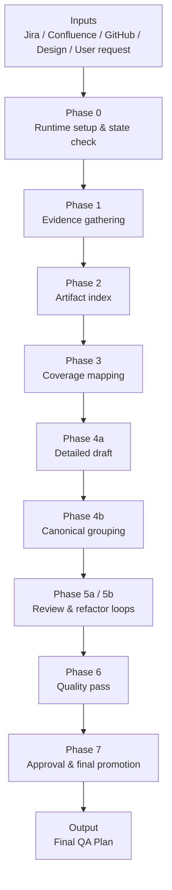

# QA Planning Project — Executive Summary (Version 1: Business-Facing)

## 1) Business Value

The QA Planning Project is a **structured QA planning system** that transforms fragmented feature information into a **consistent, reviewable, and execution-ready QA plan**.

### Background
In a typical delivery process, QA planning is often performed manually. Requirements are distributed across Jira, documentation, design references, engineering updates, and follow-up discussions. This creates common business problems:
- planning quality depends too heavily on individual experience,
- coverage depth varies from feature to feature,
- review cycles are slowed by missing context,
- and senior QA time is spent on repetitive planning work rather than higher-value risk analysis.

This project improves that operating model by converting QA planning into a **repeatable workflow with defined stages, traceable inputs, and controlled review gates**.

### How it improves the current way of working
Compared with ad hoc planning, this project improves delivery by:
- **bringing scattered inputs into one governed process**,
- **translating source evidence into structured coverage areas**,
- **standardizing plan output** for better readability and reviewability,
- **introducing review/refactor loops** before finalization,
- and **making planning progress visible** to managers and stakeholders.

### Saved cost
The primary cost benefit comes from reducing waste in planning and review:
- less time spent collecting context from multiple systems,
- less rework caused by incomplete or inconsistent plans,
- shorter review cycles due to clearer structure and better traceability,
- and lower downstream cost from missed scenarios that would otherwise surface later in testing or release.

In practical terms, the project helps move QA effort away from manual plan assembly and toward risk-based thinking and execution readiness.

### What it is good at
This project is especially strong at:
- producing **structured and repeatable QA plans**,
- handling **multi-source evidence gathering**,
- improving **coverage completeness and consistency**,
- supporting **management visibility and governance**,
- and planning **user-facing, workflow-heavy, and end-to-end feature scenarios** where the rubric-driven approach provides strong guidance.

### What it is not good at
This project is not designed to replace QA expertise or all testing-related judgment.

It is less suitable for:
- highly **backend-oriented workflows** where the primary value is in deep technical validation of services, data contracts, batch logic, or infrastructure behavior,
- situations where requirements are still highly unstable or poorly documented,
- replacing **human prioritization, architecture judgment, or defect triage**,
- or serving as a substitute for **test execution, bug investigation, or release approval**.

In short, the current workflow is strongest where **end-to-end product behavior** can be evaluated through clear scenarios and coverage rubrics. It is less optimized for low-visibility backend flows that require deeper system-level technical analysis.

### ROI
- **Efficiency ROI**: faster and more repeatable planning cycles
- **Quality ROI**: stronger scenario coverage and fewer avoidable gaps
- **Management ROI**: better transparency, governance, and plan readiness visibility
- **Scaling ROI**: a more portable planning model that reduces reliance on tribal knowledge

---

## 2) Overall Architecture

The project follows a **phase-based orchestration model**. It does not generate a QA plan in one step. Instead, it moves through controlled stages so that the final output is evidence-backed, reviewed, and ready for approval.

### Architecture principles
- **Evidence-first**
- **Phase-gated**
- **Review-driven**
- **Traceable**

---

## 3) Simple Explanation of How It Works

1. **Collect context** — check current state and gather approved source inputs
2. **Organize evidence** — index artifacts and map them into coverage areas
3. **Draft the plan** — generate the plan in structured layers
4. **Review and refine** — improve quality through review/refactor loops
5. **Finalize** — approve and promote the final QA plan

---

## 4) One-Line Summary

**The QA Planning Project makes QA planning more structured, more visible, and more scalable by turning manual planning into a repeatable, evidence-driven workflow.**
