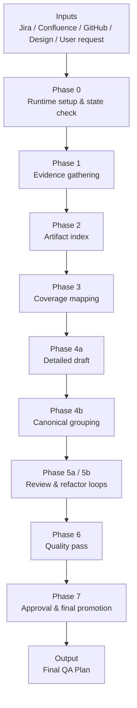

# QA Planning Project — Executive Summary (Version 2: APO-Focused)

## 1) Business Value

The QA Planning Project is a **QA planning acceleration and governance system** that turns scattered feature inputs into a **high-quality, execution-ready QA plan**.

### Background
Without a structured planning system, QA teams typically lose time in four places:
- collecting requirements across Jira, docs, code references, and design materials,
- interpreting the same feature repeatedly during review cycles,
- rewriting plans to address missing coverage,
- and compensating later for planning gaps discovered during execution or release preparation.

That creates hidden cost: senior QA capacity is consumed by repetitive setup work, plan quality varies, and defects tied to missed scenarios become more expensive to catch later.

### How it improves the current way of working
This project improves the process by operationalizing QA planning into a **multi-phase workflow with evidence gathering, coverage mapping, draft generation, review loops, and final approval gates**.

The result is a planning model that is:
- **faster** than fully manual planning,
- **more consistent** across features,
- **more auditable** for managers,
- and **better aligned with execution needs** for downstream QA teams.

### Saved cost
This project creates cost savings in both direct and indirect ways.

#### Direct savings
- Reduces manual planning hours spent collecting and structuring inputs
- Reduces rewrite cycles caused by incomplete first drafts
- Reduces review effort by making plan logic and coverage easier to inspect

#### Indirect savings
- Reduces the chance of missed end-to-end scenarios
- Improves release confidence for workflow-heavy features
- Shortens the path from feature understanding to executable QA scope

#### Example
If a senior QA lead normally spends significant time per feature consolidating Jira context, checking related artifacts, drafting structure, and revising after review, this workflow can shift a meaningful portion of that effort from document assembly to actual quality decision-making.

That means the organization gets **more planning throughput from the same QA capacity**.

### What it is good at
This project is especially strong at:
- generating **repeatable QA plans for end-to-end product features**,
- covering **user-facing workflows, screen-to-screen journeys, and interaction-heavy scenarios**,
- consolidating **multi-source evidence** into a single planning output,
- improving **coverage consistency** across similar features,
- and giving leadership a **clearer governance layer** over QA planning readiness.

#### Best-fit examples
- report creation/editing workflows
- cross-page feature journeys
- role-based user interactions
- scenario-driven regression planning
- release-readiness planning for customer-visible functionality

### What it is not good at
This project is not optimized for every QA planning problem.

It is less effective for:
- deeply **backend-oriented workflows** where quality depends on service internals, data pipelines, async jobs, event chains, or infrastructure-level validation,
- features with very weak documentation and no reliable evidence base,
- replacing **technical architecture review or engineering diagnostics**,
- or serving as a substitute for **real execution, performance testing, defect root-cause analysis, or final release signoff**.

#### Less-suitable examples
- validating queue retry logic in distributed services
- verifying low-level data reconciliation behavior
- planning around internal-only service orchestration with limited user-visible workflow
- infrastructure-heavy changes where the key risk is operational rather than end-to-end behavioral

The reason is simple: the current rubric structure is strongest for **scenario-based, end-to-end feature planning**, not for highly technical backend validation where deeper engineering analysis is required.

### ROI
- **Efficiency ROI**: more QA planning output with the same team capacity
- **Quality ROI**: better scenario coverage and fewer late-discovered planning gaps
- **Execution ROI**: clearer plans for downstream testers, which improves handoff quality
- **Leadership ROI**: improved visibility into whether a feature is truly planning-ready
- **Scale ROI**: a repeatable process that can be reused across teams and feature types

---

## 2) Overall Architecture

The project follows a **phase-based orchestration model** that builds QA plans progressively rather than generating them in a single step.

### Why this architecture matters
- It separates **evidence collection** from **coverage design**
- It separates **draft creation** from **quality review**
- It adds **approval discipline** before final output
- It creates a clearer path from feature input to execution-ready QA artifact

---

## 3) Simple Explanation of How It Works

1. **Collect the evidence** from approved sources
2. **Translate evidence into test coverage**
3. **Generate the draft plan in layers**
4. **Review and strengthen the draft** through iterative passes
5. **Approve and promote** the final QA plan

---

## 4) One-Line Summary

**The QA Planning Project helps APO see a scalable QA planning model: faster plan creation, stronger end-to-end coverage, and better ROI from existing QA capacity.**
