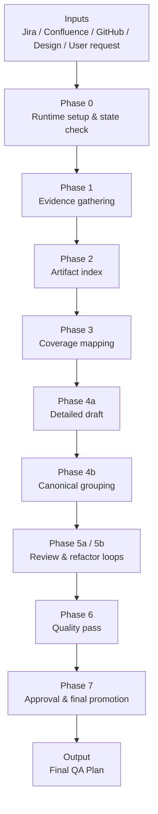

# QA Planning Project — Executive Summary

## 1) Business Value

The QA Planning Project is a **structured QA plan generation system** that converts scattered product inputs into a **clear, reviewable, and execution-ready QA plan**.

### Background
In many organizations, QA planning is still highly manual. Requirements are often spread across Jira tickets, design files, engineering discussions, documentation, and ad hoc clarifications. As a result:
- planning quality varies by person,
- important scenarios can be missed,
- review cycles take longer,
- and senior QA time is consumed by repetitive planning work.

This project addresses that problem by turning QA planning into a **repeatable workflow** rather than a one-off document-writing exercise.

### How it improves the current way of working
Compared with traditional manual planning, this project improves the process by:
- **centralizing source inputs** into one structured workflow,
- **mapping evidence to coverage** so test scope is more complete,
- **standardizing output structure** so plans are easier to read and review,
- **adding review/refactor loops** so draft quality improves before execution,
- and **making the process traceable** so managers can understand how a final plan was produced.

### What value it creates
- **Improves quality**: reduces coverage gaps by grounding plans in real source evidence.
- **Saves time**: cuts manual effort in collecting context, organizing requirements, and rewriting drafts.
- **Standardizes planning**: creates more consistent plan quality across features and team members.
- **Increases visibility**: gives managers a clearer view of plan status, review stage, and readiness.
- **Scales better**: reduces dependence on tribal knowledge from a few senior QA contributors.

### Saved cost
The main cost savings come from reducing high-value manual effort and avoiding downstream quality issues.

Typical savings areas:
- **Less senior QA planning time** spent gathering information from multiple systems
- **Less rework** caused by incomplete or unclear test plans
- **Shorter review cycles** because artifacts are more structured and easier to audit
- **Lower defect escape risk** from missed scenarios during planning
- **Faster onboarding** for new QA contributors because the workflow is standardized

In management terms, the project helps shift effort from repetitive plan assembly into higher-value review and risk-based thinking.

### What it is good at
This project is especially strong at:
- creating **structured and repeatable QA plans**,
- handling **multi-source input gathering**,
- improving **coverage completeness and consistency**,
- supporting **manager visibility and governance**,
- and producing plans that are easier for downstream QA execution teams to use.

### What it is not good at
This project is not intended to replace all QA judgment or execution work.

It is less suitable for:
- situations where **requirements are highly unclear or still changing rapidly**,
- features that require deep **domain intuition without enough source documentation**,
- replacing **human prioritization and tradeoff decisions**,
- or acting as a substitute for **actual test execution, bug analysis, or product signoff**.

In short, it is strongest as a **planning acceleration and quality-governance system**, not as a replacement for QA expertise.

### ROI
- **Efficiency ROI**: faster planning turnaround
- **Quality ROI**: fewer missed scenarios and lower downstream defect risk
- **Management ROI**: better governance and traceability
- **Scaling ROI**: repeatable planning model for more teams and more features

---

## 2) Overall Architecture

The project follows a **phase-based orchestration model**. It does not generate a QA plan in one step. Instead, it moves through controlled stages so that the final output is evidence-backed, reviewed, and ready for approval.

### High-level architecture

### Architecture principles
- **Evidence-first**: plans are built from source material, not assumption.
- **Phase-gated**: each stage has a defined purpose and expected output.
- **Review-driven**: drafts are improved through controlled review loops.
- **Traceable**: planning artifacts can be tracked across the workflow.

---

## 3) Simple Explanation of How It Works

### Step 1 — Collect context
The system first checks whether there is already an existing plan or draft, then gathers the latest information from approved sources.

### Step 2 — Organize evidence
It creates an index of the collected artifacts and maps them into test coverage areas.

### Step 3 — Draft the QA plan
It generates a structured draft in layers:
- first detailed subcategories,
- then a cleaner top-level grouping.

### Step 4 — Review and refine
The plan goes through review and refactor loops to improve clarity, completeness, and readiness while preserving important coverage.

### Step 5 — Finalize
After the quality pass and approval checkpoint, the final QA plan is promoted as the official output.

---

## 4) Manager-Level Positioning

If explaining this to APO or leadership, the message is simple:

> This project turns QA planning into a repeatable operating model instead of a manual one-off task.

It helps the team:
- produce stronger QA plans faster,
- improve consistency across work,
- reduce planning risk,
- and create a more scalable QA process.

---

## 5) One-Line Summary

**The QA Planning Project is a structured, evidence-driven workflow that makes QA planning faster, more consistent, and easier to scale.**
