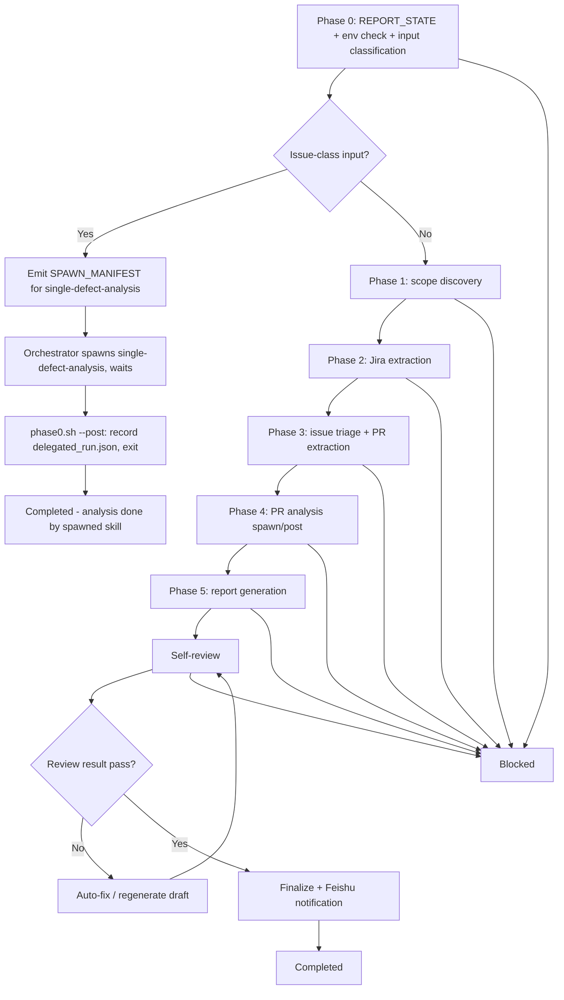

# Defect Analysis Skill - Agent Design

> **Design ID:** `defects-analysis-skill-2026-03-13`
> **Date:** 2026-03-13
> **Status:** Draft
> **Scope:** Redesign reporter defect analysis as a workspace-local, skill-first workflow that performs Phase 0 env and scope routing, delegates issue-class inputs to the shared `single-defect-analysis` skill, keeps non-issue analysis in reporter scope, removes routine human approval gates, and finalizes via Feishu only.
>
> **Constraint:** This is a design artifact. Do not implement until approved.

---

## Overview

This design defines `workspace-reporter/skills/defects-analysis` as the canonical entrypoint for reporter-owned defect analysis.

Entrypoint skill path:
- `workspace-reporter/skills/defects-analysis/SKILL.md`

Key outcomes:
- Transform `workspace-reporter/.agents/workflows/defect-analysis.md` from a prose workflow into a skill-first package with script-owned phases.
- Make Phase 0 responsible for both runtime env validation and scope routing before any expensive downstream work.
- Route exact single-issue inputs whose Jira issue type is `Issue`, `Bug`, or `Defect` to the shared `.agents/skills/single-defect-analysis` skill for the rest of the analysis lifecycle.
- Keep reporter-local ownership for non-issue scopes: `Story`, `Feature`, `Epic`, JQL queries, and release-version runs.
- Remove the old mandatory human confirmation and approval gates; block only when the workflow cannot safely proceed or when a destructive refresh choice requires explicit confirmation under idempotency rules.
- Remove Confluence publishing from this workflow entirely.
- Use Feishu as the only final notification channel.
- Reuse existing shared skills directly: `jira-cli`, `github`, `feishu-notify`, and `single-defect-analysis`.
- Reuse existing reporter-local skills directly: `defect-analysis-reporter` and `report-quality-reviewer`.

Assumptions:
- The reporter workspace remains the correct owner for feature/JQL/release-oriented defect analysis because the report format, self-review contract, and final report artifact naming are reporter-specific.
- The shared `.agents/skills/single-defect-analysis` contract from `workspace-reporter/docs/SINGLE_DEFECT_ANALYSIS_SKILL_DESIGN.md` is the canonical issue-analysis path and must not be duplicated locally.
- A "single Jira issue input" may still resolve to a `Story`, `Feature`, or `Epic`; in that case the reporter-local flow remains in scope.
- "No human in the loop unless block happens" means the workflow must choose safe default resume/refresh actions automatically whenever the state is non-destructive and unambiguous.

Why this placement:
- `workspace-reporter/skills/defects-analysis` is workspace-local because it owns reporter-specific report generation, reviewer integration, release/JQL discovery behavior, and reporter-facing artifact shapes.
- `.agents/skills/single-defect-analysis` remains shared because the issue-class path is already designed as a reusable cross-workspace analysis package.
- `feishu-notify` stays shared because delivery configuration is already standardized through `TOOLS.md`.

Primary deltas from current reporter workflow:
- Replace workflow prose with a skill package and script-driven orchestrator.
- Replace "always confirm with user" with automated default routing and automated default idempotency selection.
- Replace approval + Confluence publish with a **self-review + finalize loop** and Feishu notification. The loop iterates until the review result is `pass`; only then does the workflow finalize and send Feishu.
- Keep current non-issue analysis logic, but move it behind phase scripts with explicit artifacts and run-state tracking.

## Architecture

### Workflow chart



Status transitions:

| From | Event | To |
|---|---|---|
| `in_progress` | phase0 passes and non-issue path selected | `analysis_in_progress` |
| `in_progress` | phase0 delegates to shared single-issue skill | `delegated` |
| `analysis_in_progress` | reporter draft exists and self-review loop started | `review_in_progress` |
| `review_in_progress` | self-review returns `pass` | `reviewed` |
| `review_in_progress` | self-review returns non-pass, auto-fix applied, loop continues | `review_in_progress` |
| `reviewed` | final report persisted and Feishu attempted | `completed` |
| any | required env source unavailable or unresolved ambiguity | `blocked` |
| any | unrecoverable script failure | `failed` |

Automation policy:
- `FINAL_EXISTS` defaults to `use_existing`.
- `DRAFT_EXISTS` defaults to `resume`.
- `CONTEXT_ONLY` defaults to `generate_from_cache`.
- `FRESH` proceeds immediately.
- Explicit `refresh_mode` input may override the default.
- If the override is destructive and the most recent fetch is less than one hour old, the workflow blocks for explicit re-confirmation instead of silently regenerating.

### Folder structure

```text
workspace-reporter/skills/defects-analysis/
├── SKILL.md
├── reference.md
├── runs/
│   └── <run-key>/
│       ├── context/
│       │   ├── phase0_delegation_manifest.json (optional, issue-class only)
│       │   ├── route_decision.json
│       │   ├── jira_raw.json
│       │   └── ...
│       ├── drafts/
│       ├── reports/
│       ├── archive/
│       ├── task.json
│       ├── run.json
│       ├── phase4_spawn_manifest.json (optional)
│       ├── <run-key>_REPORT_DRAFT.md (non-issue path only)
│       ├── <run-key>_REVIEW_SUMMARY.md (non-issue path only)
│       └── <run-key>_REPORT_FINAL.md (non-issue path only)
└── scripts/
    ├── orchestrate.sh
    ├── check_resume.sh
    ├── archive_run.sh
    ├── check_runtime_env.sh
    ├── check_runtime_env.mjs
    ├── phase0.sh
    ├── phase1.sh
    ├── phase2.sh
    ├── phase3.sh
    ├── phase4.sh
    ├── phase5.sh
    ├── notify_feishu.sh
    ├── spawn_from_manifest.mjs
    ├── lib/
    │   ├── classify_input.mjs
    │   └── report_bundle_validator.mjs
    └── test/
```

Runtime output rule:
- All runtime artifacts must remain under `workspace-reporter/skills/defects-analysis/runs/<run-key>/`.
- **Reporter-local flow** (Story/Feature/Epic/JQL/release): the defects-analysis skill's scripts must not write under `projects/defects-analysis/`. Output goes to `skills/defects-analysis/runs/<run-key>/`.
- **Delegated flow** (Issue/Bug/Defect): single-defect-analysis is spawned and owns its output. Per its current contract, it writes to `.agents/skills/single-defect-analysis/runs/<issue_key>/` and optionally to `workspace-reporter/projects/defects-analysis/<issue_key>/` for legacy tester/planner handoff. This design does not change single-defect-analysis. The constraint applies only to defects-analysis skill's own phase scripts.
- The compatibility shim may continue to exist at `workspace-reporter/.agents/workflows/defect-analysis.md`, but it may only invoke the skill orchestrator and must not own state or outputs.

Run-key derivation:
- Single Jira issue or feature key: `<ISSUE_KEY>`
- Release version: `release_<VERSION>`
- JQL query: `jql_<sha1_12>`

## Skills Content Specification

### 3.1 skill-SKILL.md (exact content)

The following is the exact content to be written to `workspace-reporter/skills/defects-analysis/SKILL.md`:

```markdown
---
name: defect-analysis
description: Runs reporter-owned defect analysis for a Jira issue, feature, story, epic, JQL query, or release version. Use this whenever the task is to analyze defects and produce a reporter-style QA risk report. Phase 0 must classify the input: single Jira Issue/Bug/Defect inputs are delegated to the shared `single-defect-analysis` skill, while Story/Feature/Epic/JQL/release inputs stay in this skill. Phase 5 runs a self-review + finalize loop until the review result is pass; only then does it finalize and send Feishu. This workflow does not publish to Confluence and does not pause for routine human approval; it only blocks when safe automated progress is impossible.
---

# Defect Analysis Skill

This skill is the canonical reporter-owned entrypoint for defect analysis. It preserves the current non-issue analysis path, adds mandatory Phase 0 scope routing, and removes routine human approval gates.

The orchestrator has exactly three responsibilities:

1. Call `phaseN.sh`
2. Handle blocking user interaction only when a phase returns a blocked condition that cannot be resolved safely by defaults
3. When any phase prints `SPAWN_MANIFEST: <path>`, spawn subagents from that manifest, wait for completion, then call that same phase with `--post` (e.g. `phase0.sh --post` for delegation, `phase4.sh --post` for PR analysis)

The orchestrator does not perform Jira classification, report generation, or notification logic inline. Scripts own artifacts, validators, and state transitions. For issue-class inputs, the defects-analysis skill **uses single-defect-analysis directly** by spawning it (same pattern as phase4 PR spawn), waiting for completion, then recording the delegated run.

## Required References

Always read:

- `reference.md`

When the route decision is `issue_class`, also respect:

- shared skill: `single-defect-analysis`

## Runtime Layout

All artifacts for one run live under `<skill-root>/runs/<run-key>/`:

```text
<skill-root>/runs/<run-key>/
  context/
  drafts/
  reports/
  archive/
  task.json
  run.json
  phase4_spawn_manifest.json
  <run-key>_REPORT_DRAFT.md
  <run-key>_REVIEW_SUMMARY.md
  <run-key>_REPORT_FINAL.md
```

Issue-class delegated runs still use this run root for routing evidence and delegation metadata, but the downstream analysis artifacts remain owned by `.single-defect-analysis` in shared skills folder.

## Orchestrator Loop

For each phase N (0..5):

1. Run `scripts/phaseN.sh <raw-input> <run-dir>` (or `phaseN.sh <raw-input> <run-dir> --post` after subagent completion)
2. If stdout includes `SPAWN_MANIFEST: <path>`:
   - read `<path>`
   - run `node scripts/spawn_from_manifest.mjs <path> [--cwd <run-dir>]` (copy from `.agents/skills/openclaw-agent-design/examples/spawn_from_manifest.mjs` into the skill)
   - wait for spawn to complete
   - run `scripts/phaseN.sh <raw-input> <run-dir> --post` (same phase that emitted the manifest)
   - if phase0 --post prints `DELEGATED_RUN: <path>`, record it and stop successfully
3. If stdout includes `DELEGATED_RUN: <path>` (from phase0 --post after delegation spawn):
   - record the delegated path in the session summary
   - stop the local reporter skill successfully (analysis was performed by spawned single-defect-analysis)
4. If the script exits non-zero, stop immediately

## Input Contract

Provide exactly one primary input:

- `issue_key` or `issue_url`
- `feature_key`
- `release_version`
- `jql_query`

Optional inputs:

- `refresh_mode` — `use_existing`, `resume`, `generate_from_cache`, `smart_refresh`, `full_regenerate`
- `invoked_by` — caller identity
- `skip_notification` — `true` or `false`
- `notification_target` — optional override for Feishu delivery metadata

## Output Contract

Always:

- `<skill-root>/runs/<run-key>/task.json`
- `<skill-root>/runs/<run-key>/run.json`
- `<skill-root>/runs/<run-key>/context/runtime_setup_<run-key>.json`
- `<skill-root>/runs/<run-key>/context/route_decision.json`

On delegated issue-class runs:

- `<skill-root>/runs/<run-key>/context/delegated_run.json`

On non-issue runs:

- `<skill-root>/runs/<run-key>/<run-key>_REPORT_DRAFT.md`
- `<skill-root>/runs/<run-key>/<run-key>_REVIEW_SUMMARY.md`
- `<skill-root>/runs/<run-key>/<run-key>_REPORT_FINAL.md`

## Shared Skill Reuse

- Direct reuse: `jira-cli`, `github`, `feishu-notify`, `single-defect-analysis`
- Reporter-local reuse: `defect-analysis-reporter`, `report-quality-reviewer`
- Explicit non-use: `confluence`

## Phase Contract

### Phase 0

- Entry: `scripts/phase0.sh` (and `phase0.sh --post` after delegation spawn completes)
- Work: classify `REPORT_STATE`, run env validation (`jira`, `github`), derive run key, classify input kind and Jira issue type when applicable, choose safe default resume mode. If `issue_class`: emit `SPAWN_MANIFEST` for single-defect-analysis (one spawn request with `issue_key`); orchestrator spawns it, waits, then runs `phase0.sh --post`. On `--post`: write `context/delegated_run.json`, print `DELEGATED_RUN: <path>`, exit. If reporter-local scope: initialize reporter-local state and continue.
- Output: `context/runtime_setup_<run-key>.json`, `context/route_decision.json`, `task.json`, `run.json`; when delegation: `context/phase0_delegation_manifest.json` (spawn manifest), then `context/delegated_run.json` (after spawn completes)
- User interaction: only when a required source is blocked, the input cannot be classified, or a destructive refresh needs explicit confirmation because the existing data is newer than one hour

### Phase 1

- Entry: `scripts/phase1.sh`
- Work: normalize non-issue scope into a feature list, including release discovery and JQL expansion, and persist per-feature default action matrix without pausing unless the scope is empty or ambiguous
- Output: `context/scope.json`, `context/feature_keys.json`, `context/feature_state_matrix.json`

### Phase 2

- Entry: `scripts/phase2.sh`
- Work: fetch Jira defects for each selected feature scope and persist raw issue payloads
- Output: `context/jira_raw.json`, `context/jira_issues/`, updated `task.json`

### Phase 3

- Entry: `scripts/phase3.sh`
- Work: parse defect records, extract structured issue metadata, collect PR URLs, and persist normalized issue summaries
- Output: `context/defect_index.json`, `context/pr_links.json`, `context/jira_issues/<issue_key>.json`

### Phase 4

- Entry: `scripts/phase4.sh`
- Work: generate `phase4_spawn_manifest.json` when PR analysis is required; on `--post`, consolidate PR impact outputs and persist feature-level risk inputs
- Output: `phase4_spawn_manifest.json`, `context/prs/<pr_id>_impact.md`, `context/pr_impact_summary.json`, or `context/no_pr_links.md`

### Phase 5

- Entry: `scripts/phase5.sh`
- Work: invoke `defect-analysis-reporter`, then run a **self-review + finalize loop** until the review result is `pass`. Each iteration: invoke `report-quality-reviewer`; if result is `pass`, promote draft to final and send Feishu; if not, apply bounded auto-fix and re-run the loop. Exit gate: review result `pass`.
- Output: `<run-key>_REPORT_DRAFT.md`, `<run-key>_REVIEW_SUMMARY.md`, `<run-key>_REPORT_FINAL.md`, `task.json`, `run.json`
- User interaction: only when the loop cannot converge to `pass` after bounded auto-fix attempts, or when notification retry policy is exhausted and the workflow must leave `notification_pending`

## Automated Resume Policy

This skill does not stop for routine approval. It applies these defaults unless the caller overrides them:

- `FINAL_EXISTS` -> `use_existing`
- `DRAFT_EXISTS` -> `resume`
- `CONTEXT_ONLY` -> `generate_from_cache`
- `FRESH` -> proceed

`smart_refresh` and `full_regenerate` remain supported, but destructive choices must be explicit.

## Boundary Exclusions

- No Confluence publishing
- No QA summary generation
- No tester callback ownership
- No Jira mutation as part of normal completion
```

### 3.2 skill-reference.md (exact content)

The following is the exact content to be written to `workspace-reporter/skills/defects-analysis/reference.md`:

````markdown
# Defect Analysis Skill - Reference

## Ownership

- `SKILL.md` defines orchestrator behavior
- `reference.md` defines route classification, runtime state, artifact naming, automated default policy, and phase gates

## Route Classification

| Condition | Route |
|---|---|
| exactly one Jira key or Jira URL resolves to issue type `Issue`, `Bug`, or `Defect` | `issue_class` -> delegate to `.agents/skills/single-defect-analysis` |
| exactly one Jira key or Jira URL resolves to issue type `Story`, `Feature`, or `Epic` | `reporter_scope_single_key` |
| explicit `feature_key` input | `reporter_scope_single_key` |
| explicit `release_version` input | `reporter_scope_release` |
| explicit `jql_query` input | `reporter_scope_jql` |
| input cannot be resolved confidently | `blocked` |

`Task`, `Sub-task`, and other custom types default to `reporter_scope_single_key` unless the workspace later adds a stricter mapping table.

## Input Classification Heuristics (classify_input.mjs)

When `jiraIssueType` is absent, use these heuristics to distinguish input kinds before optional Jira lookup:

| Pattern | Route | Examples |
|---------|-------|----------|
| Release version: `^\d+(\.\d+)*$` (digits and dots only) | `reporter_scope_release` | `26.03`, `1.0.0`, `2` |
| JQL: contains `project`, `=`, `AND`, `OR`, `IN`, `issuetype`, `order by` (case-insensitive) | `reporter_scope_jql` | `project = BCIN AND issuetype = Defect` |
| Jira URL: contains `jira`, `browse`, `atlassian` | resolve key from URL, then use `jiraIssueType` if fetched | `https://jira.example.com/browse/BCIN-9000` |
| Jira key: `^[A-Z][A-Z0-9]{1,10}-\d+$` | use `jiraIssueType` when available; else fetch minimal metadata | `BCIN-5809`, `BUG-123` |
| Ambiguous (e.g. `26.03` vs `ABC-26`): prefer release if matches `^\d+\.\d+` with no hyphen; else treat as potential Jira key and fetch | — | `26.03` → release; `ABC-26` → Jira key |

When both patterns could match, explicit input flags (`feature_key`, `release_version`, `jql_query`) take precedence. If heuristics cannot resolve confidently, return `blocked`.

## State Machine: REPORT_STATE Handling

| REPORT_STATE | Default action | Block condition |
|---|---|---|
| `FINAL_EXISTS` | `use_existing` | block only if caller explicitly requested destructive regenerate on fresh data |
| `DRAFT_EXISTS` | `resume` | block only if draft metadata is corrupted |
| `CONTEXT_ONLY` | `generate_from_cache` | block only if required cached files are missing |
| `FRESH` | proceed | none |

This preserves canonical `REPORT_STATE` semantics while removing unnecessary approval pauses.

## Self-Review + Finalize Loop (Phase 5)

Phase 5 runs a loop until the review result is `pass`:

1. Generate draft via `defect-analysis-reporter`.
2. Invoke `report-quality-reviewer`.
3. If result is `pass`: promote draft to final, send Feishu, exit (exit gate satisfied).
4. If result is non-pass and auto-fix is applicable: apply fix, regenerate draft if needed, go to step 2.
5. If loop cannot reach `pass` after bounded iterations (e.g. 3): block and surface blocker.

The exit gate is: **review result is pass**. No finalization or Feishu occurs until the gate is satisfied.

## selected_mode

| Value | Effect |
|---|---|
| `use_existing` | Return previously completed final output without new external calls |
| `resume` | Continue from the latest incomplete phase |
| `generate_from_cache` | Rebuild outputs from cached context without Jira/GitHub refetch |
| `smart_refresh` | Archive draft/final outputs, keep valid cache, and continue from the earliest stale phase |
| `full_regenerate` | Archive all prior outputs and refetch all external data |

## Run Root Convention

All reporter skill artifacts live under:

```text
workspace-reporter/skills/defects-analysis/runs/<run-key>/
```

Run-key derivation:

- `<ISSUE_KEY>` for single Jira key input
- `release_<VERSION>` for release input
- `jql_<sha1_12>` for JQL input

## Artifact Families

- `context/` -> runtime setup, route decision, scope discovery, Jira raw payloads, issue summaries, PR summaries; `phase0_delegation_manifest.json` (issue-class only, before spawn)
- `drafts/` -> intermediate repair drafts during report generation or review auto-fix
- `reports/` -> optional report-support artifacts emitted by reporter/reviewer helpers
- `archive/` -> previous drafts/finals moved before destructive refresh
- `task.json`, `run.json`
- `phase4_spawn_manifest.json`
- `<run-key>_REPORT_DRAFT.md`, `<run-key>_REVIEW_SUMMARY.md`, `<run-key>_REPORT_FINAL.md`

## task.json Additive Schema

Required fields:

- `run_key`
- `raw_input`
- `route_kind`
- `selected_mode`
- `overall_status` (values include `review_in_progress` when Phase 5 loop is running)
- `current_phase`
- `feature_keys`
- `processed_features`
- `processed_defects`
- `processed_prs`
- `delegated_skill`
- `delegated_run_dir`
- `notification_status`
- `updated_at`

Example:

```json
{
  "run_key": "BCIN-5809",
  "raw_input": "BCIN-5809",
  "route_kind": "reporter_scope_single_key",
  "selected_mode": "resume",
  "overall_status": "analysis_in_progress",
  "current_phase": "phase3_triage",
  "feature_keys": ["BCIN-5809"],
  "processed_features": 1,
  "processed_defects": 12,
  "processed_prs": 4,
  "delegated_skill": null,
  "delegated_run_dir": null,
  "notification_status": "pending",
  "updated_at": "2026-03-13T00:00:00Z"
}
```

## run.json Additive Schema

Required fields:

- `data_fetched_at`
- `scope_discovered_at`
- `pr_analysis_completed_at`
- `output_generated_at`
- `review_completed_at` (set when self-review loop exits with `pass`)
- `notification_pending`
- `spawn_history`
- `auto_selected_defaults`
- `updated_at`

Example:

```json
{
  "data_fetched_at": null,
  "scope_discovered_at": null,
  "pr_analysis_completed_at": null,
  "output_generated_at": null,
  "review_completed_at": null,
  "notification_pending": null,
  "spawn_history": {},
  "auto_selected_defaults": {
    "report_state": "DRAFT_EXISTS",
    "selected_mode": "resume"
  },
  "updated_at": "2026-03-13T00:00:00Z"
}
```

## Blocking Conditions

The workflow pauses only when one of these is true:

1. `jira` or `github` auth check fails in Phase 0
2. the input cannot be mapped to exactly one route policy
3. a destructive refresh is requested against data fresher than one hour and no explicit confirmation is present
4. required cache files are missing for `resume` or `generate_from_cache`
5. the self-review + finalize loop cannot reach `pass` after bounded auto-fix attempts (exit gate not satisfied)
6. notification delivery fails and retry policy is exhausted

## Release/JQL Default Plan

When the run expands to multiple feature keys:

- features with existing finals -> `use_existing`
- features with drafts -> `resume`
- features with context only -> `generate_from_cache`
- fresh features -> full run

Persist the matrix to `context/feature_state_matrix.json` and proceed automatically. Only block when the resulting feature list is empty, malformed, or requires destructive override.

## Notification Contract

Primary path for agent-orchestrated runs:

1. resolve `chat_id` from `workspace-reporter/TOOLS.md`
2. set `FEISHU_CHAT_ID`
3. phase 5 emits:

```text
FEISHU_NOTIFY: chat_id=<id> run_key=<run-key> final=<path>
```

4. the agent sends the message through the gateway message tool

Fallback path for non-agent execution:

- `scripts/notify_feishu.sh` calls shared `feishu-notify`
- on failure, persist the complete retry payload under `run.json.notification_pending`

## Validation Commands

- `bash workspace-reporter/skills/defects-analysis/scripts/check_runtime_env.sh <run-key> jira,github <out-dir>`
- `node --test workspace-reporter/skills/defects-analysis/scripts/test/check_resume.test.js`
- `node --test workspace-reporter/skills/defects-analysis/scripts/test/phase0.test.js`
- `node --test workspace-reporter/skills/defects-analysis/scripts/test/phase4.test.js`
- `node --test workspace-reporter/skills/defects-analysis/scripts/test/phase5.test.js`
- `node --test workspace-reporter/skills/defects-analysis/scripts/test/orchestrate.integration.test.js`

## Compatibility Shim Rule

`workspace-reporter/.agents/workflows/defect-analysis.md` remains a routing shim after implementation. It may document triggers and invoke `scripts/orchestrate.sh`, but it must not retain independent phase logic, approval gates, Confluence publishing steps, or output ownership.
````

### 3.3 compatibility-shim update (exact content)

The following is the exact content to be written to `workspace-reporter/.agents/workflows/defect-analysis.md` once implementation starts:

```markdown
---
description: Compatibility shim for reporter defect analysis. Routes to the workspace-local `workspace-reporter/skills/defects-analysis` skill package.
---

# Defect Analysis Workflow (Compatibility Shim)

This workflow document is now a routing shim. The canonical implementation lives in:

- `workspace-reporter/skills/defects-analysis/SKILL.md`
- `workspace-reporter/skills/defects-analysis/reference.md`

## Trigger

- Input is a Jira issue key/URL, feature key, JQL query, or release version
- The task is to perform defect analysis

## Runtime Behavior

Use the skill orchestrator:

```bash
bash workspace-reporter/skills/defects-analysis/scripts/orchestrate.sh <INPUT>
```

## Routing Rule

- Single Jira `Issue`/`Bug`/`Defect` inputs are delegated in Phase 0 to `.agents/skills/single-defect-analysis`
- `Story`/`Feature`/`Epic`, JQL, and release inputs stay in reporter scope

## Scope Boundary

- Confluence publishing is out of scope
- Phase 5 uses a self-review + finalize loop; exit gate is review result `pass`
- Final delivery is Feishu notification only
- The workflow blocks only when automated progress is unsafe or impossible
```

## Functions

### Library Module Pattern (CLI + Export)

The following modules must support **dual use**: (1) invoked as CLI by phase scripts, (2) imported as libraries by tests. Implement each as an ES module that exports the core logic and runs the CLI when executed directly.

| Module | Exported function | CLI invocation | Test usage |
|--------|-------------------|----------------|------------|
| `scripts/check_runtime_env.mjs` | `buildRuntimeSetup(runKey, sources, outDir)` | `node check_runtime_env.mjs <run-key> jira,github <out-dir>` | `import { buildRuntimeSetup } from '...'` |
| `scripts/lib/classify_input.mjs` | `deriveRouteDecision({ rawInput, jiraIssueType })` | `node classify_input.mjs <raw-input> [issue-type]` → JSON to stdout | `import { deriveRouteDecision } from '...'` |
| `scripts/lib/report_bundle_validator.mjs` | `validateReportBundle(runKey, runDir)` | `node report_bundle_validator.mjs <run-key> <run-dir>` → JSON to stdout | `import { validateReportBundle } from '...'` |

Implementation pattern: put pure logic in the exported function; at the bottom of the file, detect `process.argv[1]` matching the script path and, if so, parse args, call the function, and write result to stdout (or write files for `buildRuntimeSetup`). Tests import and call the function directly for fast, deterministic unit tests.

Script inventory and ownership:

| Script | Responsibility | Notes |
|---|---|---|
| `scripts/orchestrate.sh` | phase sequencing, blocked-state handling, and spawn/post loop only | no business logic |
| `scripts/check_resume.sh` | classify `REPORT_STATE` from skill-local run root | canonical Phase 0 gate |
| `scripts/archive_run.sh` | archive draft/final artifacts before destructive refresh | no deletion |
| `scripts/check_runtime_env.sh` | shell wrapper around runtime env validator | copy-ready from design examples |
| `scripts/check_runtime_env.mjs` | validate `jira` and `github` access, write runtime setup artifacts | `confluence` intentionally excluded |
| `scripts/phase0.sh` | route classification, idempotency defaulting, env check, delegation handoff | may short-circuit run |
| `scripts/phase1.sh` | scope discovery for feature/JQL/release reporter flow | no pause unless blocked |
| `scripts/phase2.sh` | Jira extraction for selected feature scopes | shared `jira-cli` reuse |
| `scripts/phase3.sh` | defect triage and PR URL extraction | normalizes defect records |
| `scripts/phase4.sh` | PR analysis spawn/post consolidation | max 5 concurrent child requests |
| `scripts/phase5.sh` | report generation, self-review + finalize loop (exit gate: review pass), Feishu marker emission | reporter-local finalize phase |
| `scripts/notify_feishu.sh` | fallback Feishu sender and `notification_pending` updater | non-agent fallback only |
| `scripts/spawn_from_manifest.mjs` | spawn subagents from manifest; copy from openclaw-agent-design/examples | invoked by orchestrator on SPAWN_MANIFEST |
| `scripts/lib/classify_input.mjs` | convert raw input and optional Jira metadata into one route decision | pure logic helper |
| `scripts/lib/report_bundle_validator.mjs` | validate draft/review/final output bundle before completion | pure logic helper |

Function specification table:

| function | responsibility | inputs | outputs | side effects | failure mode |
|---|---|---|---|---|---|
| `deriveRouteDecision` | map input + issue type to route policy | raw input, optional issue type, explicit input flags | route object | none | throws on ambiguous input |
| `selectDefaultMode` | choose safe automated idempotency action | `REPORT_STATE`, freshness, explicit override | selected mode | none | throws when destructive override needs confirmation |
| `runPhase` | execute phase and optional post-spawn continuation | phase id, raw input, run dir | exit code, artifact pointer | writes phase state | non-zero on phase failure |
| `validateReportBundle` | assert final reporter bundle is complete | run dir, run key | validation summary object | none | non-zero or thrown error when artifacts are missing |

`selectDefaultMode` is implemented in `scripts/lib/select_default_mode.mjs` (exported for reuse) or inline in `phase0.sh`; the design leaves this choice to the implementer.

### `scripts/orchestrate.sh`

Path:
- `workspace-reporter/skills/defects-analysis/scripts/orchestrate.sh`

Invocation:
- `bash scripts/orchestrate.sh <INPUT>`

Responsibilities:
- derive the raw input and run root
- execute phases in order
- stop immediately on `DELEGATED_RUN:`
- react to `SPAWN_MANIFEST:` by spawning subagents and calling that same phase with `--post` (e.g. `phase0.sh --post` for delegation, `phase4.sh --post` for PR analysis)
- surface blocked states to the user only when the phase returned a blocking payload

Inputs:
- raw input string

Outputs:
- stdout phase transcript
- final exit code

User interaction:
- present blocked payloads returned by phase scripts
- otherwise no approval prompts

Detailed implementation:

```bash
1. Parse raw input and export WORKSPACE_ROOT.
2. For phases 0..5:
   - run phaseN.sh (or phaseN.sh --post if returning from spawn)
   - if SPAWN_MANIFEST appears: read manifest, spawn children, wait, run that same phaseN.sh --post
   - if phase0 --post prints DELEGATED_RUN, record path and exit 0
   - if BLOCKED_PAYLOAD appears, stop and surface the blocking reason
3. Exit 0 only when final state is completed or delegated.
```

### `scripts/check_resume.sh`

Path:
- `workspace-reporter/skills/defects-analysis/scripts/check_resume.sh`

Invocation:
- `bash scripts/check_resume.sh <run-key> <run-dir>`

Responsibilities:
- classify `REPORT_STATE` from existing artifacts in `runs/<run-key>/`

Inputs:
- run key
- run dir

Outputs:
- stdout line `REPORT_STATE=<value>`

User interaction:
- none

Detailed implementation:

```bash
1. If <run-key>_REPORT_FINAL.md exists -> FINAL_EXISTS.
2. Else if draft or review summary exists -> DRAFT_EXISTS.
3. Else if context/jira_raw.json, context/feature_keys.json, or context/route_decision.json exists -> CONTEXT_ONLY.
4. Else -> FRESH.
```

### `scripts/archive_run.sh`

Path:
- `workspace-reporter/skills/defects-analysis/scripts/archive_run.sh`

Invocation:
- `bash scripts/archive_run.sh <run-dir> <mode>`

Responsibilities:
- move prior draft/final outputs into `archive/` before destructive refresh
- leave context intact for `smart_refresh`

Inputs:
- run dir
- destructive mode

Outputs:
- archived files under `archive/`

User interaction:
- none

Detailed implementation:

```bash
1. Create archive/ if missing.
2. Timestamp-copy prior draft, review summary, and final outputs into archive/.
3. For smart_refresh, preserve context/ and remove only downstream report artifacts.
4. For full_regenerate, preserve archive and clear generated context artifacts that will be re-fetched.
5. Never delete archive entries.
```

### `scripts/check_runtime_env.sh`

Path:
- `workspace-reporter/skills/defects-analysis/scripts/check_runtime_env.sh`

Invocation:
- `bash scripts/check_runtime_env.sh <run-key> jira,github <output-dir>`

Responsibilities:
- shell wrapper that calls `check_runtime_env.mjs`

Inputs:
- run key
- comma-separated source list
- output dir

Outputs:
- `runtime_setup_<run-key>.json`
- `runtime_setup_<run-key>.md`

User interaction:
- none

Detailed implementation:

```bash
1. Validate CLI args.
2. Resolve script dir.
3. Execute `node check_runtime_env.mjs`.
4. Exit with the helper status code.
```

### `scripts/check_runtime_env.mjs`

Path:
- `workspace-reporter/skills/defects-analysis/scripts/check_runtime_env.mjs`

Invocation:
- `node scripts/check_runtime_env.mjs <run-key> jira,github <output-dir>`

Responsibilities:
- validate Jira and GitHub auth before Phase 1 or any spawn work
- write JSON and Markdown setup artifacts

Inputs:
- run key
- sources list
- output dir

Outputs:
- `runtime_setup_<run-key>.json`
- `runtime_setup_<run-key>.md`

User interaction:
- none

Detailed implementation:

```javascript
1. Parse args and normalize requested sources.
2. For Jira, run workspace-safe auth check via jira-cli conventions.
3. For GitHub, run `gh auth status`.
4. Build `setup_entries[]` with `status`, `command`, `message`.
5. Write both json and markdown artifacts.
6. Exit non-zero if any required source is blocked.
```

### `scripts/phase0.sh`

Path:
- `workspace-reporter/skills/defects-analysis/scripts/phase0.sh`

Invocation:
- `bash scripts/phase0.sh <INPUT> <run-dir>`

Responsibilities:
- derive run key
- run `check_resume.sh`
- auto-select safe resume mode
- run env checks
- classify input route
- delegate issue-class runs to shared skill or initialize local reporter run

Inputs:
- raw input
- run dir

Outputs:
- `context/runtime_setup_<run-key>.json`
- `context/route_decision.json`
- `context/delegated_run.json` when applicable
- updated `task.json`
- updated `run.json`

User interaction:
- only for blocked conditions

Detailed implementation:

```bash
1. If --post: (delegation spawn has completed)
   - write context/delegated_run.json with delegated_skill, delegated_run_dir (from single-defect-analysis run root)
   - print DELEGATED_RUN: <delegated_run_dir>
   - exit 0
2. Derive run key from raw input.
3. Run check_resume.sh and parse REPORT_STATE.
4. Call selectDefaultMode(REPORT_STATE, freshness, explicit override).
5. If destructive override requires confirmation, emit BLOCKED_PAYLOAD and exit non-zero.
6. Run check_runtime_env.sh for jira,github.
7. If raw input looks like one Jira key/URL, fetch minimal issue metadata and call classify_input.mjs.
8. If route_kind == issue_class:
   - if TEST_SKIP_DELEGATE_SPAWN=1 (integration test mode): write delegated_run.json with test path, print DELEGATED_RUN: <path>, exit 0
   - else: build spawn manifest with one request (task, label, mode, runtime per spawn_from_manifest.mjs schema), write context/phase0_delegation_manifest.json, print SPAWN_MANIFEST: <path>, exit 0
9. Otherwise initialize reporter-local task.json/run.json and continue.
```

### `scripts/phase1.sh`

Path:
- `workspace-reporter/skills/defects-analysis/scripts/phase1.sh`

Invocation:
- `bash scripts/phase1.sh <INPUT> <run-dir>`

Responsibilities:
- expand non-issue scope into canonical feature list
- persist auto-selected per-feature action matrix

Inputs:
- raw input
- run dir

Outputs:
- `context/scope.json`
- `context/feature_keys.json`
- `context/feature_state_matrix.json`

User interaction:
- only when the expanded scope is empty, malformed, or inaccessible

Detailed implementation:

```bash
1. Read route_decision.json.
2. If route is single key, feature list is one item.
3. If route is release, query Jira for release features and write raw scope results.
4. If route is JQL, execute paginated issue query and normalize feature keys.
5. For each feature key, classify prior REPORT_STATE and assign default action.
6. Persist matrix and update task.json.
7. Exit non-zero only when no actionable feature keys remain.
```

### `scripts/phase2.sh`

Path:
- `workspace-reporter/skills/defects-analysis/scripts/phase2.sh`

Invocation:
- `bash scripts/phase2.sh <INPUT> <run-dir>`

Responsibilities:
- fetch defects for the reporter-local feature scope

Inputs:
- raw input
- run dir

Outputs:
- `context/jira_raw.json`
- `context/jira_issues/*.json`
- updated `task.json`

User interaction:
- none

Detailed implementation:

```bash
1. Read feature_keys.json.
2. For each actionable feature key, reuse the existing defect-fetch logic through jira-cli.
3. Merge results into one jira_raw.json payload.
4. Persist per-defect issue files under context/jira_issues/.
5. Update counts in task.json and timestamps in run.json.
```

### `scripts/phase3.sh`

Path:
- `workspace-reporter/skills/defects-analysis/scripts/phase3.sh`

Invocation:
- `bash scripts/phase3.sh <INPUT> <run-dir>`

Responsibilities:
- normalize defect records and extract PR URLs

Inputs:
- raw input
- run dir

Outputs:
- `context/defect_index.json`
- `context/pr_links.json`
- updated per-defect JSON

User interaction:
- none

Detailed implementation:

```bash
1. Parse jira_raw.json.
2. Extract issue fields: key, summary, status, priority, assignee, fixed date, description, comments.
3. Write normalized entries into defect_index.json.
4. Extract PR URLs from description and comments.
5. Persist a deduplicated pr_links.json list.
```

### `scripts/phase4.sh`

Path:
- `workspace-reporter/skills/defects-analysis/scripts/phase4.sh`

Invocation:
- `bash scripts/phase4.sh <INPUT> <run-dir>`
- `bash scripts/phase4.sh <INPUT> <run-dir> --post`

Responsibilities:
- emit spawn manifest for PR analysis when PR links exist
- consolidate PR impact outputs after children finish

Inputs:
- raw input
- run dir
- optional `--post`

Outputs:
- `phase4_spawn_manifest.json`
- `context/prs/*_impact.md`
- `context/pr_impact_summary.json`
- `context/no_pr_links.md`

User interaction:
- only when required PR analysis artifacts are missing after spawn completion

Detailed implementation:

```bash
1. If not --post:
   - load pr_links.json
   - if empty, write context/no_pr_links.md and exit 0
   - build requests[] for max 5 concurrent GitHub analysis children
   - write phase4_spawn_manifest.json
   - print SPAWN_MANIFEST: <path>
2. If --post:
   - verify every expected impact artifact exists or mark failed_prs
   - synthesize pr_impact_summary.json
   - update task.json and run.json timestamps
```

### `scripts/phase5.sh`

Path:
- `workspace-reporter/skills/defects-analysis/scripts/phase5.sh`

Invocation:
- `bash scripts/phase5.sh <INPUT> <run-dir>`

Responsibilities:
- invoke `defect-analysis-reporter`
- run **self-review + finalize loop** until review result is `pass` (exit gate)
- within loop: invoke `report-quality-reviewer`; if `pass`, finalize and send Feishu; if not, apply bounded auto-fix and iterate
- promote draft to final only when loop exits with `pass`
- emit Feishu marker or call notify fallback

Inputs:
- raw input
- run dir

Outputs:
- `<run-key>_REPORT_DRAFT.md`
- `<run-key>_REVIEW_SUMMARY.md`
- `<run-key>_REPORT_FINAL.md`
- updated `task.json`
- updated `run.json`

User interaction:
- only when the loop cannot reach `pass` after bounded auto-fix attempts, or when notification retry policy is exhausted

Detailed implementation:

```bash
1. Call defect-analysis-reporter with jira_raw.json and PR artifacts.
2. Write draft report.
3. LOOP (max iterations bounded, e.g. 3):
   a. Call report-quality-reviewer.
   b. If review result is pass:
      - exit loop (exit gate satisfied)
      - goto step 4
   c. If review result is non-pass and auto-fix is applicable:
      - apply bounded auto-fix
      - regenerate draft if needed
      - continue loop
   d. Else: exit loop with blocked state
4. Validate final bundle with report_bundle_validator.mjs.
5. Copy draft to final.
6. If FEISHU_CHAT_ID is set, emit FEISHU_NOTIFY marker.
7. Otherwise call notify_feishu.sh and persist notification_pending on failure.
8. Mark run completed.
```

### `scripts/notify_feishu.sh`

Path:
- `workspace-reporter/skills/defects-analysis/scripts/notify_feishu.sh`

Invocation:
- `bash scripts/notify_feishu.sh <run-dir> <final-report-path>`

Responsibilities:
- send final report summary through shared `feishu-notify` in non-agent contexts
- persist retry payload on failure

Inputs:
- run dir
- final report path

Outputs:
- updated `run.json`

User interaction:
- none

Detailed implementation:

```bash
1. Resolve workspace root.
2. Call shared feishu-notify entrypoint with the final report file.
3. On success, clear run.json.notification_pending.
4. On failure, persist notification_pending payload and exit non-zero.
```

### `scripts/lib/classify_input.mjs`

Path:
- `workspace-reporter/skills/defects-analysis/scripts/lib/classify_input.mjs`

Invocation:
- `node scripts/lib/classify_input.mjs <raw-input> [issue-type]`

Responsibilities:
- map one raw input into one route decision object

Inputs:
- raw input
- optional Jira issue type

Outputs:
- route decision JSON to stdout

User interaction:
- none

Detailed implementation:

```javascript
1. Apply heuristics from reference.md "Input Classification Heuristics": release (^\d+(\.\d+)*$), JQL (project, =, AND, etc.), Jira URL, Jira key (^[A-Z][A-Z0-9]{1,10}-\d+$).
2. If Jira issue type is present (from fetch), map Issue/Bug/Defect -> issue_class.
3. Map Story/Feature/Epic -> reporter_scope_single_key.
4. Map release and JQL inputs directly per heuristics.
5. Explicit input flags (feature_key, release_version, jql_query) override heuristics.
6. Throw on unresolved or conflicting signals.
```

### `scripts/lib/report_bundle_validator.mjs`

Path:
- `workspace-reporter/skills/defects-analysis/scripts/lib/report_bundle_validator.mjs`

Invocation:
- `node scripts/lib/report_bundle_validator.mjs <run-key> <run-dir>`

Responsibilities:
- verify that the final reporter bundle is complete before completion

Inputs:
- run key
- run dir

Outputs:
- validation JSON to stdout

User interaction:
- none

Detailed implementation:

```javascript
1. Require draft, review summary, and final files.
2. Require task.json and run.json.
3. Require route_decision.json and runtime setup outputs.
4. Return { ok: true } when all required files exist.
5. Exit non-zero with missing path list otherwise.
```

## Data Models

`task.json` (`workspace-reporter/skills/defects-analysis/runs/<run-key>/task.json`) additive schema:

```json
{
  "run_key": "BCIN-5809",
  "raw_input": "BCIN-5809",
  "route_kind": "reporter_scope_single_key",
  "selected_mode": "resume",
  "overall_status": "analysis_in_progress",
  "current_phase": "phase3_triage",
  "feature_keys": ["BCIN-5809"],
  "processed_features": 1,
  "processed_defects": 0,
  "processed_prs": 0,
  "failed_prs": [],
  "delegated_skill": null,
  "delegated_run_dir": null,
  "notification_status": "pending",
  "updated_at": "2026-03-13T00:00:00Z"
}
```

`run.json` (`workspace-reporter/skills/defects-analysis/runs/<run-key>/run.json`) additive schema:

```json
{
  "data_fetched_at": null,
  "scope_discovered_at": null,
  "pr_analysis_completed_at": null,
  "output_generated_at": null,
  "review_completed_at": null,
  "spawn_history": {},
  "notification_pending": null,
  "auto_selected_defaults": {
    "report_state": "DRAFT_EXISTS",
    "selected_mode": "resume"
  },
  "updated_at": "2026-03-13T00:00:00Z"
}
```

`context/route_decision.json` contract:

```json
{
  "run_key": "BCIN-5809",
  "raw_input": "BCIN-5809",
  "route_kind": "reporter_scope_single_key",
  "jira_issue_type": "Feature",
  "delegates_to": null,
  "reason": "Feature keys remain in reporter-local defect analysis scope"
}
```

`context/delegated_run.json` contract for issue-class inputs:

```json
{
  "run_key": "BCIN-9999",
  "route_kind": "issue_class",
  "delegated_skill": ".agents/skills/single-defect-analysis",
  "delegated_run_dir": ".agents/skills/single-defect-analysis/runs/BCIN-9999",
  "delegated_at": "2026-03-13T00:00:00Z"
}
```

`context/jira_raw.json` schema (Phase 2 output; Jira-cli / REST API compatible):

```json
{
  "issues": [
    {
      "key": "BUG-123",
      "fields": {
        "summary": "Bug summary",
        "description": "Issue description with optional PR links",
        "status": { "name": "Resolved" },
        "priority": { "name": "High" },
        "assignee": { "displayName": "User Name" },
        "resolutiondate": "2026-03-10T12:00:00.000+0000",
        "comment": {
          "comments": []
        }
      }
    }
  ]
}
```

Phase 3 reads `issues[]` and extracts: `key`, `summary`, `status`, `priority`, `assignee`, `resolutiondate`, `description`, and PR URLs from `description` and `comment.comments[].body`.

`context/feature_state_matrix.json` schema (Phase 1 output):

```json
{
  "features": [
    {
      "feature_key": "BCIN-5809",
      "report_state": "FINAL_EXISTS",
      "default_action": "use_existing"
    },
    {
      "feature_key": "BCIN-5810",
      "report_state": "FRESH",
      "default_action": "proceed"
    }
  ]
}
```

`report_state` values: `FINAL_EXISTS`, `DRAFT_EXISTS`, `CONTEXT_ONLY`, `FRESH`. `default_action` values: `use_existing`, `resume`, `generate_from_cache`, `proceed`.

## Spawn Manifest Schema

Spawn manifests follow the format consumed by `scripts/spawn_from_manifest.mjs`. Copy that script from `.agents/skills/openclaw-agent-design/examples/spawn_from_manifest.mjs` into the skill (per openclaw-agent-design SKILL.md); do not reinvent spawn logic.

Manifest format:

```json
{
  "requests": [
    {
      "openclaw": {
        "args": {
          "task": "Run single-defect-analysis for BCIN-9000",
          "label": "single-defect-BCIN-9000",
          "mode": "run",
          "runtime": "subagent"
        }
      }
    }
  ]
}
```

- `requests[]` — array of spawn requests
- `openclaw.args` — passed to `openclaw sessions spawn`. Required: `task`, `label`, `mode`, `runtime`. Optional: `attachments`, `thread`, `--cwd`.

Phase 0 delegation manifest (`context/phase0_delegation_manifest.json`): one request with `task` invoking single-defect-analysis for the issue key. Phase 4 PR manifest (`phase4_spawn_manifest.json`): up to 5 requests for PR analysis subagents.

## Functional Design 1

### Goal
Make Phase 0 deterministic, idempotent, and capable of routing issue-class inputs to the shared skill without any later reporter-local branching.

### Required Change for Each Phase

| Phase | Required change | User interaction checkpoints (`done` / `blocked` / `questions`) |
|---|---|---|
| Phase 0 | Run canonical `REPORT_STATE` check, apply safe automated defaults, validate Jira/GitHub access, classify whether the input is issue-class or reporter-local scope, and delegate issue-class runs immediately | `done`: route selected and runtime setup passed. `blocked`: auth failure, ambiguous input, corrupted cache, destructive override on fresh data. `questions`: explicit regenerate confirmation when needed. |

### Files expected to change/create in implementation phase

- `workspace-reporter/skills/defects-analysis/SKILL.md`
- `workspace-reporter/skills/defects-analysis/reference.md`
- `workspace-reporter/skills/defects-analysis/scripts/orchestrate.sh`
- `workspace-reporter/skills/defects-analysis/scripts/check_resume.sh`
- `workspace-reporter/skills/defects-analysis/scripts/archive_run.sh`
- `workspace-reporter/skills/defects-analysis/scripts/check_runtime_env.sh`
- `workspace-reporter/skills/defects-analysis/scripts/check_runtime_env.mjs`
- `workspace-reporter/skills/defects-analysis/scripts/phase0.sh`
- `workspace-reporter/skills/defects-analysis/scripts/lib/classify_input.mjs`

## Functional Design 2

### Goal
Preserve the current non-issue defect-analysis flow, but move it into explicit script phases with reporter-owned artifacts and no mandatory manual approval gate.

### Required Change for Each Phase

| Phase | Required change | User interaction checkpoints (`done` / `blocked` / `questions`) |
|---|---|---|
| Phase 1 | Expand reporter-local scope into one feature list, compute the per-feature default action matrix, and proceed automatically | `done`: actionable feature list persisted. `blocked`: empty or malformed scope. `questions`: only when the user must clarify ambiguous input. |
| Phase 2 | Fetch Jira defects for all selected features and persist raw payloads | `done`: jira_raw.json and per-issue files exist. `blocked`: auth/permission failure or zero accessible issues. `questions`: corrected scope if Jira returns no usable features. |
| Phase 3 | Normalize defects and extract PR links | `done`: defect_index and pr_links written. `blocked`: jira_raw payload missing or malformed. `questions`: none for nominal flow. |
| Phase 4 | Spawn PR analysis workers and consolidate returned impact artifacts | `done`: PR impact summary persisted or explicit no-PR marker written. `blocked`: missing required spawned artifacts after retry budget. `questions`: retry spawn batch only if automatic retry budget is exhausted. |

### Files expected to change/create in implementation phase

- `workspace-reporter/skills/defects-analysis/scripts/phase1.sh`
- `workspace-reporter/skills/defects-analysis/scripts/phase2.sh`
- `workspace-reporter/skills/defects-analysis/scripts/phase3.sh`
- `workspace-reporter/skills/defects-analysis/scripts/phase4.sh`

## Functional Design 3

### Goal
Finalize reporter outputs automatically through a **self-review + finalize loop** and Feishu notification, with no Confluence step and no manual approval checkpoint. The loop iterates until the review result is `pass`; that is the exit gate.

### Required Change for Each Phase

| Phase | Required change | User interaction checkpoints (`done` / `blocked` / `questions`) |
|---|---|---|
| Phase 5 | Generate draft, run self-review + finalize loop (review → if pass: finalize + Feishu; if not: auto-fix → re-review until pass), validate output bundle, promote to final, and send Feishu | `done`: loop exited with `pass`, final report exists, and notification succeeded or `notification_pending` was persisted. `blocked`: loop cannot reach `pass` after bounded auto-fix attempts, or final notification retry budget is exhausted. `questions`: only when user input is required to resolve a persistent blocker. |

### Files expected to change/create in implementation phase

- `workspace-reporter/skills/defects-analysis/scripts/phase5.sh`
- `workspace-reporter/skills/defects-analysis/scripts/notify_feishu.sh`
- `workspace-reporter/skills/defects-analysis/scripts/lib/report_bundle_validator.mjs`
- `workspace-reporter/.agents/workflows/defect-analysis.md`

## Tests

OpenClaw script-bearing exception is applied: tests live in `scripts/test/`.

Script-to-test stub coverage:

| Script path | Test stub path | Validation expectation |
|---|---|---|
| `scripts/orchestrate.sh` | `scripts/test/orchestrate.test.js` | phase ordering + delegation and spawn/post handling (unit) |
| `scripts/orchestrate.sh` | `scripts/test/orchestrate.integration.test.js` | integration: real orchestrate.sh with TEST_SKIP_DELEGATE_SPAWN |
| `scripts/check_resume.sh` | `scripts/test/check_resume.test.js` | canonical reporter state detection |
| `scripts/archive_run.sh` | `scripts/test/archive_run.test.js` | archive-before-overwrite behavior |
| `scripts/check_runtime_env.sh` | `scripts/test/check_runtime_env_sh.test.js` | wrapper invokes runtime env validator |
| `scripts/check_runtime_env.mjs` | `scripts/test/check_runtime_env_mjs.test.js` | writes runtime setup outputs and fails on blocked source |
| `scripts/phase0.sh` | `scripts/test/phase0.test.js` | env setup, route classification, and delegation behavior |
| `scripts/phase1.sh` | `scripts/test/phase1.test.js` | scope expansion and auto-selected per-feature plan |
| `scripts/phase2.sh` | `scripts/test/phase2.test.js` | Jira extraction and artifact persistence |
| `scripts/phase3.sh` | `scripts/test/phase3.test.js` | defect normalization and PR extraction |
| `scripts/phase4.sh` | `scripts/test/phase4.test.js` | spawn manifest and post-consolidation logic |
| `scripts/phase5.sh` | `scripts/test/phase5.test.js` | report bundle generation, self-review loop (exit gate pass), validation, and notification marker |
| `scripts/notify_feishu.sh` | `scripts/test/notify_feishu.test.js` | `notification_pending` set/clear behavior |
| `scripts/lib/classify_input.mjs` | `scripts/test/classify_input.test.js` | deterministic route mapping |
| `scripts/lib/report_bundle_validator.mjs` | `scripts/test/report_bundle_validator.test.js` | required report bundle enforcement |

Validation evidence (design-time smoke command plan):

| Script path | Smoke Command |
|---|---|
| `scripts/check_resume.sh` | `node --test workspace-reporter/skills/defects-analysis/scripts/test/check_resume.test.js` |
| `scripts/check_runtime_env.mjs` | `node --test workspace-reporter/skills/defects-analysis/scripts/test/check_runtime_env_mjs.test.js` |
| `scripts/phase0.sh` | `node --test workspace-reporter/skills/defects-analysis/scripts/test/phase0.test.js` |
| `scripts/phase1.sh` | `node --test workspace-reporter/skills/defects-analysis/scripts/test/phase1.test.js` |
| `scripts/phase4.sh` | `node --test workspace-reporter/skills/defects-analysis/scripts/test/phase4.test.js` |
| `scripts/phase5.sh` | `node --test workspace-reporter/skills/defects-analysis/scripts/test/phase5.test.js` |
| `scripts/lib/classify_input.mjs` | `node --test workspace-reporter/skills/defects-analysis/scripts/test/classify_input.test.js` |
| `scripts/lib/report_bundle_validator.mjs` | `node --test workspace-reporter/skills/defects-analysis/scripts/test/report_bundle_validator.test.js` |

Detailed test stub implementations (exact code to be written):

#### `scripts/test/check_resume.test.js`

```javascript
import test from 'node:test';
import assert from 'node:assert/strict';
import { mkdtemp, mkdir, writeFile, rm } from 'node:fs/promises';
import { join } from 'node:path';
import { tmpdir } from 'node:os';
import { spawnSync } from 'node:child_process';

const SCRIPT = join(process.cwd(), 'workspace-reporter/skills/defects-analysis/scripts/check_resume.sh');

function runCheckResume(runKey, runDir) {
  const r = spawnSync('bash', [SCRIPT, runKey, runDir], { encoding: 'utf8' });
  const line = r.stdout.split('\n').find(l => l.startsWith('REPORT_STATE='));
  return line ? line.split('=')[1] : null;
}

test('returns FINAL_EXISTS when final report is present', async () => {
  const tmp = await mkdtemp(join(tmpdir(), 'reporter-check-resume-'));
  await writeFile(join(tmp, 'BCIN-5809_REPORT_FINAL.md'), '# Final\n');
  const result = runCheckResume('BCIN-5809', tmp);
  assert.equal(result, 'FINAL_EXISTS');
  await rm(tmp, { recursive: true, force: true });
});

test('returns DRAFT_EXISTS when draft exists without final', async () => {
  const tmp = await mkdtemp(join(tmpdir(), 'reporter-check-resume-'));
  await writeFile(join(tmp, 'BCIN-5809_REPORT_DRAFT.md'), '# Draft\n');
  const result = runCheckResume('BCIN-5809', tmp);
  assert.equal(result, 'DRAFT_EXISTS');
  await rm(tmp, { recursive: true, force: true });
});

test('returns CONTEXT_ONLY when context files exist without draft or final', async () => {
  const tmp = await mkdtemp(join(tmpdir(), 'reporter-check-resume-'));
  await mkdir(join(tmp, 'context'), { recursive: true });
  await writeFile(join(tmp, 'context', 'route_decision.json'), '{}');
  const result = runCheckResume('BCIN-5809', tmp);
  assert.equal(result, 'CONTEXT_ONLY');
  await rm(tmp, { recursive: true, force: true });
});

test('returns FRESH when no relevant artifacts exist', async () => {
  const tmp = await mkdtemp(join(tmpdir(), 'reporter-check-resume-'));
  const result = runCheckResume('BCIN-5809', tmp);
  assert.equal(result, 'FRESH');
  await rm(tmp, { recursive: true, force: true });
});
```

#### `scripts/test/check_runtime_env_mjs.test.js`

```javascript
import test from 'node:test';
import assert from 'node:assert/strict';
import { mkdtemp, readFile, rm } from 'node:fs/promises';
import { join } from 'node:path';
import { tmpdir } from 'node:os';
import { buildRuntimeSetup } from '../check_runtime_env.mjs';

test('writes runtime setup json and markdown artifacts for jira and github', async () => {
  const outDir = await mkdtemp(join(tmpdir(), 'reporter-runtime-'));
  const result = await buildRuntimeSetup('BCIN-5809', ['jira', 'github'], outDir);
  assert.ok(Array.isArray(result.setup_entries));
  const json = JSON.parse(await readFile(join(outDir, 'runtime_setup_BCIN-5809.json'), 'utf8'));
  const md = await readFile(join(outDir, 'runtime_setup_BCIN-5809.md'), 'utf8');
  assert.ok(Array.isArray(json.setup_entries));
  assert.ok(md.includes('Runtime Setup'));
  await rm(outDir, { recursive: true, force: true });
});

test('fails when required arguments are missing', async () => {
  const { spawnSync } = await import('node:child_process');
  const script = join(process.cwd(), 'workspace-reporter/skills/defects-analysis/scripts/check_runtime_env.mjs');
  const r = spawnSync('node', [script], { encoding: 'utf8' });
  assert.equal(r.status, 1);
});
```

#### `scripts/test/classify_input.test.js`

```javascript
import test from 'node:test';
import assert from 'node:assert/strict';
import { deriveRouteDecision } from '../lib/classify_input.mjs';

test('maps issue type Issue to delegated issue_class route', () => {
  const result = deriveRouteDecision({ rawInput: 'BCIN-9000', jiraIssueType: 'Issue' });
  assert.equal(result.route_kind, 'issue_class');
  assert.equal(result.delegates_to, '.agents/skills/single-defect-analysis');
});

test('maps issue type Feature to reporter local single-key route', () => {
  const result = deriveRouteDecision({ rawInput: 'BCIN-5809', jiraIssueType: 'Feature' });
  assert.equal(result.route_kind, 'reporter_scope_single_key');
});

test('maps release-like input to release route', () => {
  const result = deriveRouteDecision({ rawInput: '26.03' });
  assert.equal(result.route_kind, 'reporter_scope_release');
});

test('throws on ambiguous input without usable route hints', () => {
  assert.throws(() => deriveRouteDecision({ rawInput: 'unclear value' }));
});

test('heuristic: release-like input 26.03 maps to reporter_scope_release without jiraIssueType', () => {
  const result = deriveRouteDecision({ rawInput: '26.03' });
  assert.equal(result.route_kind, 'reporter_scope_release');
});

test('heuristic: JQL-like input maps to reporter_scope_jql', () => {
  const result = deriveRouteDecision({ rawInput: 'project = BCIN AND issuetype = Defect' });
  assert.equal(result.route_kind, 'reporter_scope_jql');
});

test('heuristic: Jira key pattern without jiraIssueType returns route or blocked', () => {
  const result = deriveRouteDecision({ rawInput: 'BCIN-5809' });
  assert.ok(result && ['reporter_scope_single_key', 'issue_class', 'blocked'].includes(result.route_kind));
});
```

#### `scripts/test/phase0.test.js`

```javascript
import test from 'node:test';
import assert from 'node:assert/strict';
import { mkdtemp, mkdir, writeFile, readFile, rm } from 'node:fs/promises';
import { join } from 'node:path';
import { tmpdir } from 'node:os';
import { spawnSync } from 'node:child_process';

const SCRIPT = join(process.cwd(), 'workspace-reporter/skills/defects-analysis/scripts/phase0.sh');

test('emits SPAWN_MANIFEST for issue-class input to spawn single-defect-analysis', async () => {
  const runDir = await mkdtemp(join(tmpdir(), 'reporter-phase0-'));
  await mkdir(join(runDir, 'context'), { recursive: true });
  const r = spawnSync('bash', [SCRIPT, 'BCIN-9000', runDir], {
    encoding: 'utf8',
    env: { ...process.env, TEST_JIRA_ISSUE_TYPE: 'Issue', TEST_RUNTIME_SETUP_OK: '1' }
  });
  assert.equal(r.status, 0);
  assert.ok(r.stdout.includes('SPAWN_MANIFEST:'));
  const manifest = JSON.parse(await readFile(join(runDir, 'context', 'phase0_delegation_manifest.json'), 'utf8'));
  assert.ok(manifest.requests?.length >= 1);
  assert.ok(manifest.requests[0].openclaw?.args?.includes('BCIN-9000'));
  await rm(runDir, { recursive: true, force: true });
});

test('phase0 --post writes delegated_run.json after spawn completes', async () => {
  const runDir = await mkdtemp(join(tmpdir(), 'reporter-phase0-'));
  await mkdir(join(runDir, 'context'), { recursive: true });
  await writeFile(join(runDir, 'context', 'route_decision.json'), JSON.stringify({
    route_kind: 'issue_class',
    run_key: 'BCIN-9000'
  }));
  const r = spawnSync('bash', [SCRIPT, 'BCIN-9000', runDir, '--post'], {
    encoding: 'utf8',
    env: { ...process.env, TEST_DELEGATED_RUN_DIR: '.agents/skills/single-defect-analysis/runs/BCIN-9000' }
  });
  assert.equal(r.status, 0);
  assert.ok(r.stdout.includes('DELEGATED_RUN:'));
  const delegated = JSON.parse(await readFile(join(runDir, 'context', 'delegated_run.json'), 'utf8'));
  assert.equal(delegated.delegated_skill, '.agents/skills/single-defect-analysis');
  await rm(runDir, { recursive: true, force: true });
});

test('keeps Feature input in reporter-local flow', async () => {
  const runDir = await mkdtemp(join(tmpdir(), 'reporter-phase0-'));
  await mkdir(join(runDir, 'context'), { recursive: true });
  const r = spawnSync('bash', [SCRIPT, 'BCIN-5809', runDir], {
    encoding: 'utf8',
    env: { ...process.env, TEST_JIRA_ISSUE_TYPE: 'Feature', TEST_RUNTIME_SETUP_OK: '1' }
  });
  assert.equal(r.status, 0);
  const route = JSON.parse(await readFile(join(runDir, 'context', 'route_decision.json'), 'utf8'));
  assert.equal(route.route_kind, 'reporter_scope_single_key');
  await rm(runDir, { recursive: true, force: true });
});

test('blocks destructive regenerate on fresh data without explicit confirmation', async () => {
  const runDir = await mkdtemp(join(tmpdir(), 'reporter-phase0-'));
  await mkdir(join(runDir, 'context'), { recursive: true });
  await writeFile(join(runDir, 'run.json'), JSON.stringify({
    data_fetched_at: new Date().toISOString()
  }));
  const r = spawnSync('bash', [SCRIPT, 'BCIN-5809', runDir], {
    encoding: 'utf8',
    env: { ...process.env, TEST_JIRA_ISSUE_TYPE: 'Feature', TEST_FORCE_MODE: 'full_regenerate', TEST_RUNTIME_SETUP_OK: '1' }
  });
  assert.notEqual(r.status, 0);
  assert.ok(r.stdout.includes('BLOCKED_PAYLOAD:') || r.stderr.includes('confirmation'));
  await rm(runDir, { recursive: true, force: true });
});
```

#### `scripts/test/phase1.test.js`

```javascript
import test from 'node:test';
import assert from 'node:assert/strict';
import { mkdtemp, mkdir, writeFile, readFile, rm } from 'node:fs/promises';
import { join } from 'node:path';
import { tmpdir } from 'node:os';
import { spawnSync } from 'node:child_process';

const SCRIPT = join(process.cwd(), 'workspace-reporter/skills/defects-analysis/scripts/phase1.sh');

test('expands release input into feature matrix with automated defaults', async () => {
  const runDir = await mkdtemp(join(tmpdir(), 'reporter-phase1-'));
  await mkdir(join(runDir, 'context'), { recursive: true });
  await writeFile(join(runDir, 'context', 'route_decision.json'), JSON.stringify({
    route_kind: 'reporter_scope_release',
    run_key: 'release_26.03'
  }));
  const r = spawnSync('bash', [SCRIPT, '26.03', runDir], {
    encoding: 'utf8',
    env: { ...process.env, TEST_FEATURE_KEYS: 'BCIN-5809,BCIN-5810' }
  });
  assert.equal(r.status, 0);
  const matrix = JSON.parse(await readFile(join(runDir, 'context', 'feature_state_matrix.json'), 'utf8'));
  assert.equal(matrix.features.length, 2);
  await rm(runDir, { recursive: true, force: true });
});

test('fails when no actionable feature keys are discovered', async () => {
  const runDir = await mkdtemp(join(tmpdir(), 'reporter-phase1-'));
  await mkdir(join(runDir, 'context'), { recursive: true });
  await writeFile(join(runDir, 'context', 'route_decision.json'), JSON.stringify({
    route_kind: 'reporter_scope_jql',
    run_key: 'jql_deadbeef'
  }));
  const r = spawnSync('bash', [SCRIPT, 'project = NONE', runDir], {
    encoding: 'utf8',
    env: { ...process.env, TEST_FEATURE_KEYS: '' }
  });
  assert.notEqual(r.status, 0);
  await rm(runDir, { recursive: true, force: true });
});
```

#### `scripts/test/phase2.test.js`

```javascript
import test from 'node:test';
import assert from 'node:assert/strict';
import { mkdtemp, mkdir, writeFile, access, rm } from 'node:fs/promises';
import { constants } from 'node:fs';
import { join } from 'node:path';
import { tmpdir } from 'node:os';
import { spawnSync } from 'node:child_process';

const SCRIPT = join(process.cwd(), 'workspace-reporter/skills/defects-analysis/scripts/phase2.sh');

test('writes jira_raw and per-issue payloads for selected features', async () => {
  const runDir = await mkdtemp(join(tmpdir(), 'reporter-phase2-'));
  await mkdir(join(runDir, 'context'), { recursive: true });
  await writeFile(join(runDir, 'context', 'feature_keys.json'), JSON.stringify(['BCIN-5809']));
  const r = spawnSync('bash', [SCRIPT, 'BCIN-5809', runDir], {
    encoding: 'utf8',
    env: { ...process.env, TEST_JIRA_RAW_OK: '1' }
  });
  assert.equal(r.status, 0);
  await access(join(runDir, 'context', 'jira_raw.json'), constants.F_OK);
  await rm(runDir, { recursive: true, force: true });
});
```

#### `scripts/test/phase3.test.js`

```javascript
import test from 'node:test';
import assert from 'node:assert/strict';
import { mkdtemp, mkdir, writeFile, readFile, rm } from 'node:fs/promises';
import { join } from 'node:path';
import { tmpdir } from 'node:os';
import { spawnSync } from 'node:child_process';

const SCRIPT = join(process.cwd(), 'workspace-reporter/skills/defects-analysis/scripts/phase3.sh');

test('extracts deduplicated PR links from jira raw payload', async () => {
  const runDir = await mkdtemp(join(tmpdir(), 'reporter-phase3-'));
  await mkdir(join(runDir, 'context'), { recursive: true });
  await writeFile(join(runDir, 'context', 'jira_raw.json'), JSON.stringify({
    issues: [{
      key: 'BUG-1',
      fields: {
        summary: 'Bug',
        description: 'PR: https://github.com/acme/repo/pull/10',
        comment: { comments: [{ body: 'same https://github.com/acme/repo/pull/10' }] }
      }
    }]
  }));
  const r = spawnSync('bash', [SCRIPT, 'BCIN-5809', runDir], { encoding: 'utf8' });
  assert.equal(r.status, 0);
  const links = JSON.parse(await readFile(join(runDir, 'context', 'pr_links.json'), 'utf8'));
  assert.equal(links.length, 1);
  await rm(runDir, { recursive: true, force: true });
});
```

#### `scripts/test/phase4.test.js`

```javascript
import test from 'node:test';
import assert from 'node:assert/strict';
import { mkdtemp, mkdir, writeFile, readFile, rm } from 'node:fs/promises';
import { join } from 'node:path';
import { tmpdir } from 'node:os';
import { spawnSync } from 'node:child_process';

const SCRIPT = join(process.cwd(), 'workspace-reporter/skills/defects-analysis/scripts/phase4.sh');

test('emits spawn manifest when PR links exist', async () => {
  const runDir = await mkdtemp(join(tmpdir(), 'reporter-phase4-'));
  await mkdir(join(runDir, 'context'), { recursive: true });
  await writeFile(join(runDir, 'context', 'pr_links.json'), JSON.stringify([
    'https://github.com/acme/repo/pull/10'
  ]));
  const r = spawnSync('bash', [SCRIPT, 'BCIN-5809', runDir], { encoding: 'utf8' });
  assert.equal(r.status, 0);
  assert.ok(r.stdout.includes('SPAWN_MANIFEST:'));
  await rm(runDir, { recursive: true, force: true });
});

test('writes no_pr_links marker when no PRs exist', async () => {
  const runDir = await mkdtemp(join(tmpdir(), 'reporter-phase4-'));
  await mkdir(join(runDir, 'context'), { recursive: true });
  await writeFile(join(runDir, 'context', 'pr_links.json'), JSON.stringify([]));
  const r = spawnSync('bash', [SCRIPT, 'BCIN-5809', runDir], { encoding: 'utf8' });
  assert.equal(r.status, 0);
  const marker = await readFile(join(runDir, 'context', 'no_pr_links.md'), 'utf8');
  assert.ok(marker.includes('No PR links'));
  await rm(runDir, { recursive: true, force: true });
});
```

#### `scripts/test/phase5.test.js`

```javascript
import test from 'node:test';
import assert from 'node:assert/strict';
import { mkdtemp, mkdir, writeFile, access, readFile, rm } from 'node:fs/promises';
import { constants } from 'node:fs';
import { join } from 'node:path';
import { tmpdir } from 'node:os';
import { spawnSync } from 'node:child_process';

const SCRIPT = join(process.cwd(), 'workspace-reporter/skills/defects-analysis/scripts/phase5.sh');

test('self-review loop exits with pass, creates final report bundle, and emits Feishu marker in agent mode', async () => {
  const runDir = await mkdtemp(join(tmpdir(), 'reporter-phase5-'));
  await mkdir(join(runDir, 'context', 'prs'), { recursive: true });
  await writeFile(join(runDir, 'context', 'jira_raw.json'), JSON.stringify({ issues: [] }));
  await writeFile(join(runDir, 'run.json'), JSON.stringify({ notification_pending: null }));
  await writeFile(join(runDir, 'task.json'), JSON.stringify({ run_key: 'BCIN-5809' }));
  const r = spawnSync('bash', [SCRIPT, 'BCIN-5809', runDir], {
    encoding: 'utf8',
    env: { ...process.env, FEISHU_CHAT_ID: 'oc_test_chat', TEST_REPORTER_OK: '1', TEST_REVIEW_OK: '1' }
  });
  assert.equal(r.status, 0);
  assert.ok(r.stdout.includes('FEISHU_NOTIFY:'));
  await access(join(runDir, 'BCIN-5809_REPORT_FINAL.md'), constants.F_OK);
  await rm(runDir, { recursive: true, force: true });
});

test('fails when self-review loop cannot reach pass and report bundle validation fails', async () => {
  const runDir = await mkdtemp(join(tmpdir(), 'reporter-phase5-'));
  await mkdir(join(runDir, 'context'), { recursive: true });
  await writeFile(join(runDir, 'run.json'), JSON.stringify({ notification_pending: null }));
  await writeFile(join(runDir, 'task.json'), JSON.stringify({ run_key: 'BCIN-5809' }));
  const r = spawnSync('bash', [SCRIPT, 'BCIN-5809', runDir], {
    encoding: 'utf8',
    env: { ...process.env, TEST_REPORTER_OK: '1', TEST_REVIEW_OK: '1', TEST_FORCE_BUNDLE_INVALID: '1' }
  });
  assert.notEqual(r.status, 0);
  await rm(runDir, { recursive: true, force: true });
});
```

#### `scripts/test/report_bundle_validator.test.js`

```javascript
import test from 'node:test';
import assert from 'node:assert/strict';
import { mkdtemp, writeFile, mkdir, rm } from 'node:fs/promises';
import { join } from 'node:path';
import { tmpdir } from 'node:os';
import { validateReportBundle } from '../lib/report_bundle_validator.mjs';

test('returns ok when draft, review, final, and metadata files exist', async () => {
  const runDir = await mkdtemp(join(tmpdir(), 'report-bundle-'));
  await mkdir(join(runDir, 'context'), { recursive: true });
  for (const file of [
    'BCIN-5809_REPORT_DRAFT.md',
    'BCIN-5809_REVIEW_SUMMARY.md',
    'BCIN-5809_REPORT_FINAL.md',
    'task.json',
    'run.json'
  ]) {
    await writeFile(join(runDir, file), 'x');
  }
  await writeFile(join(runDir, 'context', 'route_decision.json'), '{}');
  await writeFile(join(runDir, 'context', 'runtime_setup_BCIN-5809.json'), '{}');
  const result = await validateReportBundle('BCIN-5809', runDir);
  assert.equal(result.ok, true);
  await rm(runDir, { recursive: true, force: true });
});

test('returns missing path list when required files are absent', async () => {
  const runDir = await mkdtemp(join(tmpdir(), 'report-bundle-'));
  const result = await validateReportBundle('BCIN-5809', runDir);
  assert.equal(result.ok, false);
  assert.ok(result.missing.length > 0);
  await rm(runDir, { recursive: true, force: true });
});
```

#### `scripts/test/notify_feishu.test.js`

```javascript
import test from 'node:test';
import assert from 'node:assert/strict';
import { mkdtemp, writeFile, readFile, rm } from 'node:fs/promises';
import { join } from 'node:path';
import { tmpdir } from 'node:os';
import { spawnSync } from 'node:child_process';

const SCRIPT = join(process.cwd(), 'workspace-reporter/skills/defects-analysis/scripts/notify_feishu.sh');

test('persists notification_pending when fallback send fails', async () => {
  const runDir = await mkdtemp(join(tmpdir(), 'reporter-notify-'));
  await writeFile(join(runDir, 'run.json'), JSON.stringify({ notification_pending: null }));
  const reportPath = join(runDir, 'BCIN-5809_REPORT_FINAL.md');
  await writeFile(reportPath, '# Final');
  const r = spawnSync('bash', [SCRIPT, runDir, reportPath], {
    encoding: 'utf8',
    env: { ...process.env, TEST_FEISHU_FAIL: '1' }
  });
  assert.notEqual(r.status, 0);
  const run = JSON.parse(await readFile(join(runDir, 'run.json'), 'utf8'));
  assert.ok(run.notification_pending);
  await rm(runDir, { recursive: true, force: true });
});
```

#### `scripts/test/orchestrate.test.js`

```javascript
import test from 'node:test';
import assert from 'node:assert/strict';
import { mkdtemp, mkdir, writeFile, chmod, rm } from 'node:fs/promises';
import { join } from 'node:path';
import { tmpdir } from 'node:os';
import { spawnSync } from 'node:child_process';

test('stops successfully when phase0 returns a delegated run marker', async () => {
  const root = await mkdtemp(join(tmpdir(), 'reporter-orchestrate-'));
  const scriptsDir = join(root, 'scripts');
  await mkdir(scriptsDir, { recursive: true });
  await writeFile(join(scriptsDir, 'phase0.sh'), '#!/usr/bin/env bash\necho \"DELEGATED_RUN: delegated.json\"\nexit 0\n');
  await chmod(join(scriptsDir, 'phase0.sh'), 0o755);
  await writeFile(join(scriptsDir, 'orchestrate.sh'), '#!/usr/bin/env bash\nbash \"$(dirname \"$0\")/phase0.sh\" \"$@\"\n');
  await chmod(join(scriptsDir, 'orchestrate.sh'), 0o755);
  const r = spawnSync('bash', [join(scriptsDir, 'orchestrate.sh'), 'BCIN-9000'], { encoding: 'utf8' });
  assert.equal(r.status, 0);
  assert.ok(r.stdout.includes('DELEGATED_RUN:'));
  await rm(root, { recursive: true, force: true });
});
```

#### `scripts/test/orchestrate.integration.test.js`

Integration test against the real `orchestrate.sh`. Uses `TEST_SKIP_DELEGATE_SPAWN=1` so phase0 skips the actual spawn and writes `delegated_run.json` directly, allowing verification of orchestrate flow without spawning subagents.

```javascript
import test from 'node:test';
import assert from 'node:assert/strict';
import { readFile, rm } from 'node:fs/promises';
import { join } from 'node:path';
import { tmpdir } from 'node:os';
import { spawnSync } from 'node:child_process';

const SKILL_ROOT = join(process.cwd(), 'workspace-reporter/skills/defects-analysis');
const ORCHESTRATE = join(SKILL_ROOT, 'scripts/orchestrate.sh');

test('integration: real orchestrate.sh stops on DELEGATED_RUN when phase0 uses TEST_SKIP_DELEGATE_SPAWN', async () => {
  const runKey = 'BCIN-9000';
  const runsDir = join(SKILL_ROOT, 'runs', runKey);
  const env = {
    ...process.env,
    TEST_SKIP_DELEGATE_SPAWN: '1',
    TEST_JIRA_ISSUE_TYPE: 'Issue',
    TEST_RUNTIME_SETUP_OK: '1',
    WORKSPACE_ROOT: join(process.cwd(), 'workspace-reporter'),
  };
  const r = spawnSync('bash', [ORCHESTRATE, runKey], {
    encoding: 'utf8',
    cwd: join(process.cwd(), 'workspace-reporter'),
    env,
  });
  assert.equal(r.status, 0, `orchestrate should exit 0: ${r.stderr || r.stdout}`);
  assert.ok(r.stdout.includes('DELEGATED_RUN:'), 'orchestrate should see DELEGATED_RUN');
  const delegatedPath = join(runsDir, 'context', 'delegated_run.json');
  const delegated = JSON.parse(await readFile(delegatedPath, 'utf8'));
  assert.equal(delegated.delegated_skill, '.agents/skills/single-defect-analysis');
  await rm(runsDir, { recursive: true, force: true }).catch(() => {});
});
```

#### `scripts/test/archive_run.test.js`

```javascript
import test from 'node:test';
import assert from 'node:assert/strict';
import { mkdtemp, mkdir, writeFile, readdir, rm } from 'node:fs/promises';
import { join } from 'node:path';
import { tmpdir } from 'node:os';
import { spawnSync } from 'node:child_process';

const SCRIPT = join(process.cwd(), 'workspace-reporter/skills/defects-analysis/scripts/archive_run.sh');

test('moves prior draft and final into archive during smart refresh', async () => {
  const runDir = await mkdtemp(join(tmpdir(), 'reporter-archive-'));
  await mkdir(join(runDir, 'archive'), { recursive: true });
  await writeFile(join(runDir, 'BCIN-5809_REPORT_DRAFT.md'), 'draft');
  await writeFile(join(runDir, 'BCIN-5809_REPORT_FINAL.md'), 'final');
  const r = spawnSync('bash', [SCRIPT, runDir, 'smart_refresh'], { encoding: 'utf8' });
  assert.equal(r.status, 0);
  const archived = await readdir(join(runDir, 'archive'));
  assert.ok(archived.length >= 2);
  await rm(runDir, { recursive: true, force: true });
});
```

#### `scripts/test/check_runtime_env_sh.test.js`

```javascript
import test from 'node:test';
import assert from 'node:assert/strict';
import { spawnSync } from 'node:child_process';
import { join } from 'node:path';

test('fails fast when wrapper args are missing', () => {
  const script = join(process.cwd(), 'workspace-reporter/skills/defects-analysis/scripts/check_runtime_env.sh');
  const r = spawnSync('bash', [script], { encoding: 'utf8' });
  assert.notEqual(r.status, 0);
});
```

## Evals

This section is required because the design materially redesigns a script-bearing workspace-local skill.

Planned eval files:
- `workspace-reporter/skills/defects-analysis/evals/evals.json`
- `workspace-reporter/skills/defects-analysis/evals/README.md`

Planned eval prompts:
1. Single Jira key that resolves to issue type `Issue` and must delegate to `.agents/skills/single-defect-analysis`.
2. Single Jira key that resolves to `Feature` and must stay in reporter-local scope without blocking for manual approval.
3. Release version input with mixed prior states (`FINAL_EXISTS`, `DRAFT_EXISTS`, `CONTEXT_ONLY`, `FRESH`) and automatic default plan selection.
4. JQL input with PR links that requires `phase4` spawn/post behavior and final Feishu notification.
5. Fresh non-issue run where the self-review + finalize loop finds objective fixable problems, auto-fixes, re-reviews, and exits with pass before finalization and Feishu.

Acceptance criteria:
- Reviewer returns `pass` or `pass_with_advisories`.
- Phase 0 route classification proves both the delegated and reporter-local branches.
- The design contains exact `SKILL.md` and `reference.md` content.
- The design explicitly removes Confluence from this workflow.
- Every script has a matching `scripts/test/` stub.

Expected review artifacts:
- `projects/agent-design-review/defect-analysis-skill-2026-03-13/design_review_report.md`
- `projects/agent-design-review/defect-analysis-skill-2026-03-13/design_review_report.json`

Note:
- No implementation runtime eval execution is included in this design-only task.

## Migration Impact

Downstream consumers that read defect analysis outputs must be updated when the reporter-local flow moves from `projects/defects-analysis/` to `skills/defects-analysis/runs/`.

| Consumer | Artifacts read | Old path | New path (reporter-local) | Required change |
|----------|----------------|----------|---------------------------|-----------------|
| **qa-summary** | `REPORT_FINAL`, `jira_raw.json`, `prs/*.md` | `projects/defects-analysis/<KEY>/` | `skills/defects-analysis/runs/<run-key>/` | Update `workspace-reporter/skills/qa-summary/SKILL.md` to resolve run dir via `skills/defects-analysis/runs/<KEY>/` when that path exists |
| **qa-summary-review** | `REPORT_FINAL`, `jira_raw.json` | `projects/defects-analysis/<KEY>/` | `skills/defects-analysis/runs/<run-key>/` | Same: resolve from new run root |
| **planner** (check_resume, defect integration) | `REPORT_FINAL`, `task.json`, `jira_raw.json` | `workspace-reporter/projects/defects-analysis/<KEY>/` | `workspace-reporter/skills/defects-analysis/runs/<KEY>/` | Update `workspace-planner/projects/feature-plan/scripts/check_resume.sh` and `workspace-planner/docs/QA_PLAN_DEFECT_ANALYSIS_INTEGRATION_DESIGN.md` to probe new path first, fall back to old during transition |
| **tester** (defect-test) | `TESTING_PLAN`, `tester_handoff.json` | `workspace-reporter/projects/defects-analysis/<ISSUE_KEY>/` | Unchanged for delegated runs | single-defect-analysis still writes legacy artifacts to `projects/defects-analysis/<issue_key>/`; no change needed |

Implementation order: (1) implement defects-analysis skill with new run root; (2) update qa-summary and qa-summary-review to read from new path; (3) update planner to probe new path; (4) deprecate old `projects/defects-analysis/` for reporter-local flows. Delegated runs (Issue/Bug/Defect) continue to populate `projects/defects-analysis/` via single-defect-analysis for tester/planner handoff until a future single-defect-analysis migration.

## Documentation Changes

### AGENTS.md

Expected implementation-time updates:
- `workspace-reporter/AGENTS.md`
  - replace the existing defect-analysis workflow table with the skill-first entrypoint
  - remove the "always confirm with user" requirement for defect analysis
  - remove the approval + Confluence publish path; document the self-review + finalize loop with pass exit gate and Feishu-only delivery
  - document the Phase 0 route rule: `Issue`/`Bug`/`Defect` -> `single-defect-analysis`; `Story`/`Feature`/`Epic`/JQL/release -> reporter-local `defect-analysis`

No root `AGENTS.md` change is required because the shared-vs-local placement rule already supports this design.

### README

Expected implementation-time updates:
- `workspace-reporter/scripts/README.md`
  - add one short section pointing operators to `workspace-reporter/skills/defects-analysis/scripts/orchestrate.sh`
  - mark `workspace-reporter/.agents/workflows/defect-analysis.md` as a compatibility shim, not the canonical workflow body

No additional workspace README is required for this design-only change.

## Implementation Checklist

- [ ] Create `workspace-reporter/skills/defects-analysis` as the canonical reporter entrypoint.
- [ ] Preserve canonical Phase 0 `REPORT_STATE` semantics while adding automated safe defaults.
- [ ] Run Jira and GitHub env validation before any Phase 1 fetch or Phase 4 spawn.
- [ ] Route exact `Issue`/`Bug`/`Defect` inputs to `.agents/skills/single-defect-analysis`.
- [ ] Keep `Story`/`Feature`/`Epic`, JQL, and release inputs in reporter-local scope.
- [ ] Remove Confluence publishing from this workflow entirely.
- [ ] Implement Phase 5 self-review + finalize loop with exit gate (review result `pass`).
- [ ] Finalize through Feishu notification only (after loop exits with pass).
- [ ] Use marker-based Feishu delivery when agent-orchestrated and persist `notification_pending` on fallback failure.
- [ ] Keep runtime output strictly under `workspace-reporter/skills/defects-analysis/runs/<run-key>/`.
- [ ] Keep the compatibility shim free of independent phase logic.
- [ ] Copy `spawn_from_manifest.mjs` from `.agents/skills/openclaw-agent-design/examples/` into `scripts/` and invoke it for spawn.
- [ ] Reuse `jira-cli`, `github`, `feishu-notify`, `single-defect-analysis`, `defect-analysis-reporter`, and `report-quality-reviewer` directly instead of adding wrappers.
- [ ] Keep one-to-one script-to-test coverage under `scripts/test/`.
- [ ] Pass `openclaw-agent-design-review` with no P0/P1 findings.

## References

- `AGENTS.md`
- `workspace-reporter/AGENTS.md`
- `workspace-reporter/.agents/workflows/defect-analysis.md`
- `workspace-reporter/.agents/workflows/single-defect-analysis.md`
- `workspace-reporter/docs/SINGLE_DEFECT_ANALYSIS_SKILL_DESIGN.md`
- `.agents/skills/openclaw-agent-design/SKILL.md`
- `.agents/skills/openclaw-agent-design/reference.md`
- `.agents/skills/openclaw-agent-design-review/SKILL.md`
- `.agents/skills/agent-idempotency/SKILL.md`
- `.agents/skills/code-structure-quality/SKILL.md`
- `.agents/skills/clawddocs/SKILL.md`
- `.agents/skills/feishu-notify/SKILL.md`
- `.agents/skills/openclaw-agent-design/examples/spawn_from_manifest.mjs`
- `.agents/skills/spawn-agent-session/SKILL.md`
- `/Users/xuyin/.agents/skills/skill-creator/SKILL.md`
