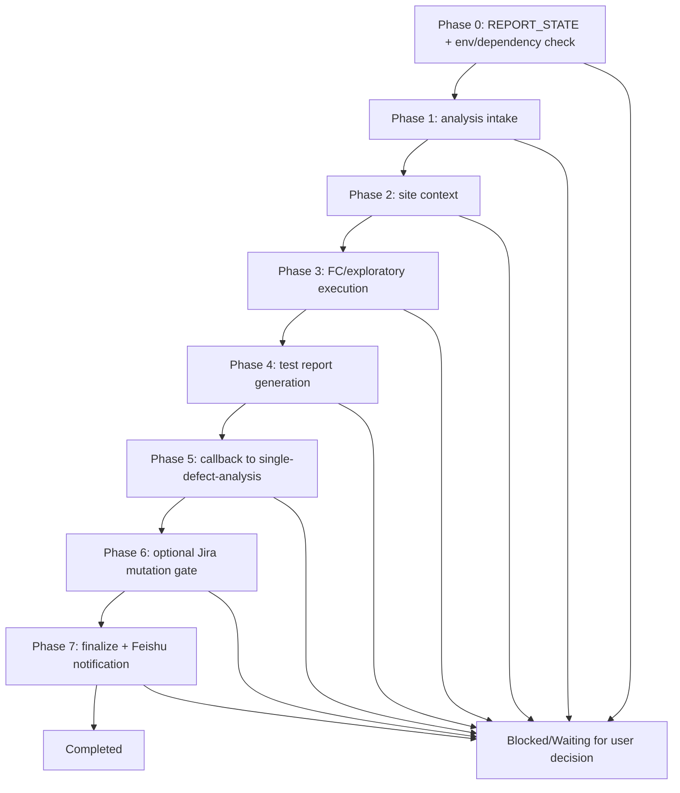

# Defect Test Skill - Agent Design

> **Design ID:** `defect-test-skill-2026-03-12`
> **Date:** 2026-03-12
> **Status:** Draft
> **Scope:** Redesign single-defect test execution as a workspace-local, script-driven skill that consumes shared single-defect analysis artifacts and returns execution outcomes.
>
> **Constraint:** This is a design artifact. Do not implement until approved.

---

## Overview

This design defines `workspace-tester/skills/defect-test` as the canonical skill-first entrypoint for single-defect FC and exploratory execution.

Entrypoint skill path:
- `workspace-tester/skills/defect-test/SKILL.md`

Key outcomes:
- Keep canonical Phase 0 idempotency (`REPORT_STATE`) and archive-before-overwrite behavior.
- Keep runtime artifacts under `runs/<issue_key>/` only.
- Reuse shared skills directly (`jira-cli`, `feishu-notify`) and use shared single-defect-analysis artifacts instead of duplicating analysis logic.
- Keep explicit approval gates for destructive Jira mutations and preserve notification fallback (`run.json.notification_pending`).

Assumptions:
- This skill remains workspace-local (`workspace-tester/skills`) because execution tooling and evidence contracts are tester-specific.
- Shared analysis artifacts are produced by `.agents/skills/single-defect-analysis/runs/<issue_key>/`.
- This document refactor changes design clarity only; it does not implement or modify runtime scripts.

Why this placement:
- `workspace-tester/skills/defect-test` is workspace-local because runtime execution dependencies, evidence capture contracts, and callback flow ownership belong to the tester workspace, while analysis generation stays in shared `.agents/skills`.

## Architecture

### Workflow chart



Status transitions:

| From | Event | To |
|---|---|---|
| `in_progress` | analysis dependencies satisfied | `testing` |
| `testing` | execution artifacts persisted | `test_complete` |
| `test_complete` | callback accepted | `callback_complete` |
| `callback_complete` | finalize succeeded | `completed` |
| any | unrecoverable phase failure | `failed` |

### Folder structure

```text
workspace-tester/skills/defect-test/
├── SKILL.md
├── reference.md
├── runs/
│   └── <issue_key>/
│       ├── context/
│       ├── reports/
│       ├── screenshots/
│       ├── task.json
│       ├── run.json
│       └── phase0_spawn_manifest.json (optional)
└── scripts/
    ├── orchestrate.sh
    ├── check_resume.sh
    ├── archive_run.sh
    ├── phase0.sh ... phase7.sh
    ├── notify_feishu.sh
    ├── check_runtime_env.sh
    ├── check_runtime_env.mjs
    └── test/
```

Runtime output rule:
- All runtime artifacts must be created only under `workspace-tester/skills/defect-test/runs/<issue_key>/`.
- No runtime files may be written outside `runs/`.

## Skills Content Specification

### 3.1 skill-SKILL.md (detailed)

Target path:
- `workspace-tester/skills/defect-test/SKILL.md`

Purpose:
- Execute single-defect FC + exploratory tests and produce execution evidence plus callback status.

Trigger conditions:
- Input is one Jira issue key/URL and single-defect execution is requested.
- A tester run is resumed or regenerated for the same `issue_key`.
- Shared analysis output exists or must be refreshed.

Input contract:
- `issue_key` (required)
- `issue_url` (optional)
- `refresh_mode` (optional: `use_existing`, `smart_refresh`, `full_regenerate`, `generate_from_cache`, `resume`)
- `analysis_mode` (optional: `reuse_existing_analysis`, `refresh_analysis`)
- `callback_target` (optional object)

Output contract:
- `<skill-root>/runs/<issue_key>/reports/execution-summary.md`
- `<skill-root>/runs/<issue_key>/raw_results.json`
- `<skill-root>/runs/<issue_key>/task.json`
- `<skill-root>/runs/<issue_key>/run.json`
- `<skill-root>/runs/<issue_key>/phase0_spawn_manifest.json` (when analysis refresh is required)

Shared-skill reuse:
- Direct reuse: `jira-cli`, `feishu-notify`
- Direct reuse: `site-knowledge-search`, `test-report` (existing OpenClaw skill capabilities already used in current flow)
- Explicit non-use: `confluence` (not required for tester execution flow)

### 3.2 skill-reference.md (detailed)

Target path:
- `workspace-tester/skills/defect-test/reference.md`

Required content:
- `state machine / invariants`
- `schemas or field-level contracts`
- `path conventions`
- `validation commands`
- `failure examples and recovery rules`
- Canonical `REPORT_STATE` mapping and option table (`FINAL_EXISTS`, `DRAFT_EXISTS`, `CONTEXT_ONLY`, `FRESH`)
- Path derivation and run-root invariants
- Dependency invariant to shared analysis run artifacts
- Approval-gate invariant for destructive Jira mutation steps
- Notification fallback invariant:
  - on send failure, persist full payload to `run.json.notification_pending`
  - on success, clear `notification_pending`
- Validation and recovery commands for each phase

### Functions

Script inventory and ownership:

| Script | Responsibility | Notes |
|---|---|---|
| `orchestrate.sh` | phase sequencing + spawn/post loop only | no business logic |
| `check_resume.sh` | classify `REPORT_STATE` | canonical Phase 0 gate |
| `archive_run.sh` | archive-before-overwrite | no deletion |
| `phase0.sh` | idempotency + env check + analysis dependency resolution | may emit spawn manifest |
| `phase1.sh` | shared-analysis artifact intake and validation | blocks on schema mismatch |
| `phase2.sh` | site knowledge enrichment | writes `site_context.md` |
| `phase3.sh` | FC/exploratory execution orchestration | writes `raw_results.json` + evidence |
| `phase4.sh` | report generation | uses test-report conventions |
| `phase5.sh` | callback dispatch to single-defect-analysis | sets pending on failure |
| `phase6.sh` | explicit approval-gated Jira mutation actions | destructive side effects only with approval |
| `phase7.sh` | finalize + Feishu send | notification pending fallback required |
| `notify_feishu.sh` | send wrapper and `run.json` pending-field update | reusable finalize helper |

Function specification table:

| function | responsibility | inputs | outputs | side effects | failure mode |
|---|---|---|---|---|---|
| `run_phase` | Execute one phase and optional spawn/post follow-up | `phase_id`, `run_dir` | phase status and manifest pointer | writes phase state, may spawn subagents | non-zero exit when phase/post validation fails |
| `update_notification_pending` | Persist/clear `run.json.notification_pending` | `run_dir`, payload object or null | updated `run.json` | modifies run metadata | invalid JSON path or write failure |

## Data Models

`task.json` (`runs/<issue_key>/task.json`) additive schema:

```json
{
  "run_key": "BCIN-7890",
  "overall_status": "in_progress",
  "current_phase": "phase0_prepare",
  "analysis_run_dir": ".agents/skills/single-defect-analysis/runs/BCIN-7890",
  "analysis_mode": "reuse_existing_analysis",
  "result": null,
  "evidence_path": null,
  "reporter_notification_pending": false,
  "mutation_actions": [],
  "updated_at": "2026-03-12T00:00:00Z"
}
```

`run.json` (`runs/<issue_key>/run.json`) additive schema:

```json
{
  "data_fetched_at": null,
  "site_context_generated_at": null,
  "output_generated_at": null,
  "spawn_history": {},
  "notification_pending": null,
  "updated_at": "2026-03-12T00:00:00Z"
}
```

Callback payload contract (to shared single-defect-analysis phase6):

```json
{
  "issue_key": "BCIN-7890",
  "tester_run_dir": "workspace-tester/skills/defect-test/runs/BCIN-7890",
  "result": "PASS",
  "evidence_path": "workspace-tester/skills/defect-test/runs/BCIN-7890/reports/execution-summary.md",
  "sent_at": "2026-03-12T00:00:00Z"
}
```

## Functional Design 1

### Goal
Idempotent startup and dependency resolution before execution work starts.

### Required Change for Each Phase

| Phase | Required change | User interaction checkpoints (`done` / `blocked` / `questions`) |
|---|---|---|
| Phase 0 | Run `check_resume.sh`, apply canonical options, run env checks before dependency spawn, resolve shared-analysis artifacts, archive if destructive mode selected | `done`: mode + dependency ready. `blocked`: waiting for mode/refresh decision or env setup failure. `questions`: whether to reuse or refresh analysis; whether to proceed after stale cache warning. |
| Phase 1 | Ingest `<issue_key>_TESTING_PLAN.md` + `tester_handoff.json`, validate schema and required fields | `done`: handoff validated. `blocked`: missing/malformed artifacts. `questions`: refresh stale shared analysis or continue with existing artifact set. |
| Phase 2 | Create site context artifact and freshness metadata | `done`: `site_context.md` written. `blocked`: no resolvable domain context. `questions`: proceed with fallback context source or stop. |

### Files expected to change/create in implementation phase

- `workspace-tester/skills/defect-test/scripts/phase0.sh`
- `workspace-tester/skills/defect-test/scripts/phase1.sh`
- `workspace-tester/skills/defect-test/scripts/phase2.sh`
- `workspace-tester/skills/defect-test/scripts/check_runtime_env.sh`
- `workspace-tester/skills/defect-test/scripts/check_runtime_env.mjs`

## Functional Design 2

### Goal
Execute tests and generate consistent evidence artifacts.

### Required Change for Each Phase

| Phase | Required change | User interaction checkpoints (`done` / `blocked` / `questions`) |
|---|---|---|
| Phase 3 | Execute FC + exploratory queue, store screenshots/logs and `raw_results.json` | `done`: all executable steps recorded. `blocked`: mandatory step not executable. `questions`: retry unstable step or mark blocked. |
| Phase 4 | Render execution summary from raw results and evidence index | `done`: report generated and validated. `blocked`: malformed raw results contract. `questions`: rerun partial execution set or finalize with blocker. |
| Phase 5 | Dispatch callback payload to shared analysis workflow, persist pending state on failure | `done`: callback acknowledged. `blocked`: callback endpoint unavailable. `questions`: retry now or leave pending for resume. |

### Files expected to change/create in implementation phase

- `workspace-tester/skills/defect-test/scripts/phase3.sh`
- `workspace-tester/skills/defect-test/scripts/phase4.sh`
- `workspace-tester/skills/defect-test/scripts/phase5.sh`
- `workspace-tester/skills/defect-test/scripts/lib/callback_client.sh`
- `workspace-tester/skills/defect-test/scripts/lib/execution_runner.sh`

## Functional Design 3

### Goal
Gate destructive actions and close runs safely.

### Required Change for Each Phase

| Phase | Required change | User interaction checkpoints (`done` / `blocked` / `questions`) |
|---|---|---|
| Phase 6 | Apply explicit approval gate for Jira comment/create/transition operations | `done`: approved action completed or explicitly skipped. `blocked`: waiting for approval. `questions`: choose mutation action and target issue key(s). |
| Phase 7 | Send final Feishu summary; persist full payload in `run.json.notification_pending` on failure; set terminal task state | `done`: completion state written. `blocked`: notification send failure. `questions`: retry send now or leave pending for resume. |

### Files expected to change/create in implementation phase

- `workspace-tester/skills/defect-test/scripts/phase6.sh`
- `workspace-tester/skills/defect-test/scripts/phase7.sh`
- `workspace-tester/skills/defect-test/scripts/notify_feishu.sh`

## Tests

OpenClaw script-bearing exception is applied: tests live under `scripts/test/`, not top-level `tests/`.

Script-to-test stub coverage:

| Script path | Test stub path | Validation expectation |
|---|---|---|
| `scripts/orchestrate.sh` | `scripts/test/orchestrate.test.js` | phase order and stop-on-error behavior |
| `scripts/check_resume.sh` | `scripts/test/check_resume.test.js` | four canonical `REPORT_STATE` classifications |
| `scripts/archive_run.sh` | `scripts/test/archive_run.test.js` | archive-before-overwrite and collision naming |
| `scripts/check_runtime_env.sh` | `scripts/test/check_runtime_env_sh.test.js` | wrapper invokes runtime env validator and writes runtime setup outputs |
| `scripts/check_runtime_env.mjs` | `scripts/test/check_runtime_env_mjs.test.js` | validates Jira/GitHub/Confluence env checks and `runtime_setup_<run-key>.json` contract |
| `scripts/phase0.sh` | `scripts/test/phase0.test.js` | mode-gate and analysis dependency resolution |
| `scripts/phase1.sh` | `scripts/test/phase1.test.js` | handoff schema validation |
| `scripts/phase2.sh` | `scripts/test/phase2.test.js` | site context generation path + fallback |
| `scripts/phase3.sh` | `scripts/test/phase3.test.js` | FC/exploratory execution artifact contract |
| `scripts/phase4.sh` | `scripts/test/phase4.test.js` | report generation contract |
| `scripts/phase5.sh` | `scripts/test/phase5.test.js` | callback success/failure pending behavior |
| `scripts/phase6.sh` | `scripts/test/phase6.test.js` | approval gate for destructive mutation |
| `scripts/phase7.sh` | `scripts/test/phase7.test.js` | terminal state + notify fallback |
| `scripts/notify_feishu.sh` | `scripts/test/notify_feishu.test.js` | `notification_pending` set/clear contract |

Validation evidence (design-time smoke command plan):

| Script path | Smoke Command |
|---|---|
| `scripts/check_resume.sh` | `node --test workspace-tester/skills/defect-test/scripts/test/check_resume.test.js` |
| `scripts/check_runtime_env.sh` | `node --test workspace-tester/skills/defect-test/scripts/test/check_runtime_env_sh.test.js` |
| `scripts/check_runtime_env.mjs` | `node --test workspace-tester/skills/defect-test/scripts/test/check_runtime_env_mjs.test.js` |
| `scripts/phase0.sh` | `node --test workspace-tester/skills/defect-test/scripts/test/phase0.test.js` |
| `scripts/phase3.sh` | `node --test workspace-tester/skills/defect-test/scripts/test/phase3.test.js` |
| `scripts/notify_feishu.sh` | `node --test workspace-tester/skills/defect-test/scripts/test/notify_feishu.test.js` |

## Evals (when applicable)

This section is required because the design materially redesigns a script-bearing skill.

Planned eval scope:
- Run design evidence check for this artifact.
- Run skill-level eval fixtures (idempotency paths, dependency refresh, callback retry path, notification fallback path) using `skill-creator`-compatible eval format.
- Acceptance: no P0/P1 findings from design review and all required script-to-test rows are present.
- Review artifact outputs expected from `openclaw-agent-design-review`:
  - `projects/agent-design-review/defect-test-skill-2026-03-12/design_review_report.md`
  - `projects/agent-design-review/defect-test-skill-2026-03-12/design_review_report.json`

Note:
- No runtime implementation evals are executed in this document-only refactor.

## Documentation Changes

### AGENTS.md

No file edit is included in this refactor scope. Expected downstream alignment after implementation:
- `workspace-tester/AGENTS.md` should reference `workspace-tester/skills/defect-test/SKILL.md` as canonical single-defect test entrypoint.
- Existing root `AGENTS.md` shared/local skill placement rules remain unchanged.

### README

No README update is required for this documentation-only refactor.
Justification:
- This artifact updates design intent only.
- README changes should be bundled with actual skill package creation to avoid stale operational instructions.

## Implementation Checklist

- [ ] Preserve canonical Phase 0 `REPORT_STATE` handling and option semantics.
- [ ] Add Phase 0 env check artifact output (`runtime_setup_<run-key>.json`) before dependency spawn where required.
- [ ] Keep all runtime artifacts under `runs/<issue_key>/`.
- [ ] Reuse shared skills directly; do not introduce wrappers without clear contract gaps.
- [ ] Preserve additive-only changes to `task.json` and `run.json`.
- [ ] Enforce explicit approval for destructive Jira mutations only.
- [ ] Enforce final notification fallback to `run.json.notification_pending` with full payload.
- [ ] Keep one-to-one script-to-test stub mapping in `scripts/test/`.
- [ ] Pass `openclaw-agent-design-review` with no P0/P1 findings.

## References

- `.agents/skills/openclaw-agent-design/SKILL.md`
- `.agents/skills/openclaw-agent-design/reference.md`
- `.agents/skills/openclaw-agent-design-review/SKILL.md`
- `.agents/skills/agent-idempotency/SKILL.md`
- `.agents/skills/code-structure-quality/SKILL.md`
- `skill-creator` (system skill; session-managed reference, no repo-local path)
- `workspace-reporter/AGENTS.md`
- `AGENTS.md`
