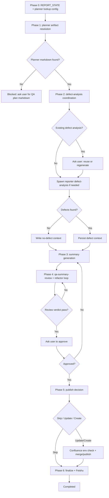

# QA Summary Skill - Agent Design

> **Design ID:** `qa-summary-skill-redesign-2026-03-16`
> **Date:** 2026-03-16
> **Status:** Draft
> **Scope:** Redesign `workspace-reporter/skills/qa-summary` from a docs-only formatting guide into a reporter-owned, script-driven skill that resolves planner artifacts, coordinates defect-analysis reuse or regeneration, generates a QA summary draft, optionally publishes to Confluence, and sends Feishu notification.
>
> **Constraint:** This is a design artifact. Do not implement until approved.

---

## Overview

This design turns the legacy workflow file at `workspace-reporter/.agents/workflows/qa-summary.md` into a project-level reporter skill package rooted at `workspace-reporter/skills/qa-summary/`.

Entrypoint skill path: `workspace-reporter/skills/qa-summary/SKILL.md`

The redesign keeps the reporter workspace as the canonical owner because the workflow is tightly coupled to reporter-local artifacts, reporter-local `defects-analysis`, reporter-local `qa-summary-review`, and reporter-specific publication behavior.

Key outcomes:

- `workspace-reporter/skills/qa-summary` becomes the only reporter-owned entrypoint for QA summary generation and optional publication.
- The skill resolves planner-produced QA artifacts from a configurable planner run root. The default lookup root is `workspace-planner/skills/qa-plan-orchestrator/runs/<feature-key>/`.
- The skill prefers direct artifact reuse instead of duplicating planner or defect-analysis logic.
- If the planner artifact cannot be found, the workflow blocks and asks the user to provide the QA plan in Markdown.
- If reporter defect-analysis artifacts already exist, the workflow explicitly asks the user whether to reuse them or regenerate them.
- If no defects are found, the workflow still generates the QA summary and uses the formatting contract to render no-defect states rather than failing.
- Confluence mutation is never automatic. After draft generation and review, the workflow asks the user whether to skip publish, update an existing page, or create a new page. Existing-page updates require a Confluence link or exact page ID from the user.
- Final notification uses the shared `feishu-notify` skill with `notification_pending` fallback.

Direct reuse is sufficient for shared integrations (`confluence`, `feishu-notify`) and reporter-local defect aggregation (`defects-analysis`). No wrapper is proposed because no contract gap requires one.

Why this placement:

- `workspace-reporter/skills/qa-summary` is workspace-local because it depends on reporter-local `defects-analysis`, the reporter review gate, and reporter publication conventions.
- Shared integrations remain shared:
  - `.agents/skills/confluence`
  - `.agents/skills/feishu-notify`
- Reporter-local reuse remains reporter-local:
  - `workspace-reporter/skills/defects-analysis`
  - `workspace-reporter/skills/qa-summary-review`

Primary redesign decisions:

- The existing `workspace-reporter/skills/qa-summary/SKILL.md` is no longer only a section-formatting guide. It becomes the orchestrator contract.
- The oversized `workspace-reporter/skills/qa-summary/reference.md` is split into a small index plus atomic files under `workspace-reporter/skills/qa-summary/references/`.
- Runtime artifacts move under `workspace-reporter/skills/qa-summary/runs/<feature-key>/`.
- The legacy workflow markdown becomes a thin compatibility wrapper or redirect, not the source of workflow truth.
- Phase 4 is a mandatory `qa-summary-review` review-and-refactor loop. The workflow stays inside the gate until the review verdict is `pass`, and only then asks the user to approve the reviewed draft.
- The workflow uses planner-sourced Section 1 plus reporter-generated sections 2 through 10 in one draft artifact:
  - planner artifacts provide the source data for Section `1` (`Feature Overview`)
  - Phase 1 extracts and persists a normalized feature table under `runs/<feature-key>/context/feature_overview_table.md`
  - Phase 3 always renders sections `1` through `10` into the draft so report-draft mode is self-contained
  - publish/create logic composes the planner base markdown with the full reviewed QA Summary draft when needed

Assumptions locked by this design:

- The canonical planner artifact is `qa_plan_final.md`.
- If present, `context/final_plan_summary_<feature-key>.md` is a useful metadata companion but not a substitute for the full Markdown plan.
- The summary workflow must not fetch Jira or GitHub directly. Those concerns remain inside `defects-analysis`.
- The summary review gate remains a separate reporter-local skill and only needs function-level path updates to operate on the new run root.

---

## Architecture

### Workflow chart



Status transitions:

| From | Event | To |
|---|---|---|
| `not_started` | phase0 initializes task/run state | `in_progress` |
| `in_progress` | planner artifact missing | `blocked` |
| `in_progress` | phase1 planner artifacts and feature overview table resolved | `in_progress` |
| `in_progress` | phase2 defect context or no-defect marker persisted | `in_progress` |
| `in_progress` | phase3 draft generated | `review_in_progress` |
| `review_in_progress` | review verdict is not `pass` and the draft is refactored for another review round | `review_in_progress` |
| `review_in_progress` | review verdict is `pass` and the reviewed draft is rendered for user approval | `awaiting_approval` |
| `awaiting_approval` | user requests revision | `in_progress` |
| `awaiting_approval` | user approves | `approved` |
| `approved` | publish skipped or publish succeeds | `completed` |
| any | unrecoverable script failure | `failed` |

**Note:** The terms `context_ready`, `analysis_in_progress`, and `draft_ready` are derived workflow labels (log-only) inferred from `current_phase` and `overall_status`. They are not persisted in `task.json.overall_status`.

### Folder structure

```text
workspace-reporter/skills/qa-summary/
├── SKILL.md
├── reference.md
├── config/
│   └── runtime-sources.json
├── references/
│   ├── runtime-and-state.md
│   ├── planner-and-defects.md
│   ├── summary-formatting.md
│   └── publish-and-notification.md
├── README.md
├── evals/
│   ├── README.md
│   └── evals.json
├── runs/
│   └── <feature-key>/
│       ├── context/
│       │   ├── planner_artifact_lookup.json
│       │   ├── planner_artifact_lookup.md
│       │   ├── planner_summary_seed.md
│       │   ├── feature_overview_table.md
│       │   ├── feature_overview_source.json
│       │   ├── defect_context_state.json
│       │   ├── defect_summary.json
│       │   ├── no_defects.json
│       │   ├── review_result.json
│       │   ├── publish_choice.json
│       │   ├── confluence_target.json
│       │   ├── runtime_setup_<feature-key>.json
│       │   └── runtime_setup_<feature-key>.md
│       ├── drafts/
│       │   └── <feature-key>_QA_SUMMARY_DRAFT.md
│       ├── archive/
│       ├── task.json
│       ├── run.json
│       ├── phase2_spawn_manifest.json
│       ├── phase4_spawn_manifest.json
│       ├── <feature-key>_QA_SUMMARY_REVIEW.md
│       ├── <feature-key>_QA_SUMMARY_MERGED.md
│       └── <feature-key>_QA_SUMMARY_FINAL.md
└── scripts/
    ├── orchestrate.sh
    ├── check_resume.sh
    ├── archive_run.sh
    ├── check_runtime_env.sh
    ├── check_runtime_env.mjs
    ├── phase0.sh
    ├── phase1.sh
    ├── phase2.sh
    ├── phase3.sh
    ├── phase4.sh
    ├── phase5.sh
    ├── phase6.sh
    ├── notify_feishu.sh
    ├── spawn_from_manifest.mjs
    ├── lib/
    │   ├── detectReportState.mjs
    │   ├── resolveResumePhase.mjs
    │   ├── resolvePlannerArtifact.mjs
    │   ├── persistPlannerResolution.mjs
    │   ├── buildFeatureOverviewTable.mjs
    │   ├── buildDefectSummary.mjs
    │   ├── buildSummaryDraft.mjs
    │   └── mergeConfluenceMarkdown.mjs
    └── test/
```

Runtime output rule:

- All runtime artifacts live under `workspace-reporter/skills/qa-summary/runs/<feature-key>/`.
- No runtime summary artifacts are written under `projects/qa-summaries/`.
- Compatibility shims may remain in `workspace-reporter/.agents/workflows/qa-summary.md`, but they only invoke the skill and do not own runtime state.

---

## Skills Content Specification

### 3.1 `workspace-reporter/skills/qa-summary/SKILL.md` (exact content)

The following is the exact content to be written to `workspace-reporter/skills/qa-summary/SKILL.md`:

```markdown
---
name: qa-summary
description: Builds QA summary drafts and optional Confluence updates for a feature. Use this whenever the task is to write a QA summary for a feature. 
---

# QA Summary Skill

This skill is the canonical entrypoint for QA summary generation and optional publication.

The orchestrator has exactly three responsibilities:

1. Call `phaseN.sh`
2. Handle blocking user interaction only when a phase requires a `REPORT_STATE` decision, a missing-artifact handoff, a defect-analysis reuse/regenerate choice, a publish choice, or final summary approval
3. When any phase prints `SPAWN_MANIFEST: <path>`, spawn subagents from that manifest, wait for completion, then call the same phase with `--post`

The orchestrator does not resolve planner files inline, does not generate summary content inline, and does not mutate Confluence inline. Scripts own those behaviors.

## Required References

Always read:

- `reference.md`
- `references/runtime-and-state.md`

Load phase-specific references only when the phase needs them:

- `references/planner-and-defects.md` for Phase 1 and Phase 2
- `references/summary-formatting.md` for Phase 3
- `references/publish-and-notification.md` for Phase 5 and Phase 6

## Required Runtime Config

Always load:

- `config/runtime-sources.json`

This file is the source of truth for default planner and defect-analysis run roots. Caller-provided path overrides may replace these defaults for one run, but the skill must always load the config file first and persist the resolved values into `task.json`.

When Phase 2 delegates or refreshes defect state, also respect skill: `defects-analysis`

When Phase 4 reviews and refactors the draft, also respect skill: `qa-summary-review`

## Resume Flow

The orchestrator must resume from the phase implied by `task.json.current_phase` and `task.json.overall_status` instead of always restarting useful completed work.

Required behavior:

- `not_started` or missing `task.json` -> start at Phase 0
- `in_progress` with `current_phase = phase0|phase1|phase2|phase3|phase4|phase5|phase6` -> rerun that phase
- `review_in_progress` -> resume at Phase 4
- `awaiting_approval` -> render the reviewed draft and wait for approval; do not rerun Phases 0-3 unless the user requests revision
- `approved` -> resume at Phase 5
- `completed` with `selected_mode = use_existing` -> return final output

Phase scripts are shell entrypoints that invoke Node modules under `scripts/lib/` (e.g. `phase0.sh` calls `node scripts/lib/phase0.mjs` or equivalent). The `.sh` files are orchestration boundaries; pure extraction and transformation logic belongs in the `.mjs` helpers. `check_resume.sh` is a thin shell wrapper around `scripts/lib/detectReportState.mjs`.

## Runtime Layout

All artifacts for one run live under `<skill-root>/runs/<feature-key>/`:

```text
<skill-root>/runs/<feature-key>/
  context/
  drafts/
  archive/
  task.json
  run.json
  phase2_spawn_manifest.json
  phase4_spawn_manifest.json
  <feature-key>_QA_SUMMARY_REVIEW.md
  <feature-key>_QA_SUMMARY_MERGED.md
  <feature-key>_QA_SUMMARY_FINAL.md
```

## Input Contract

Required:

- `feature_key`

Optional:

- `planner_run_root` — optional per-run override; default is loaded from `config/runtime-sources.json`
- `planner_plan_path` — direct Markdown override supplied by the caller or the user
- `defects_run_root` — optional per-run override; default is loaded from `config/runtime-sources.json`
- `refresh_mode` — `use_existing`, `resume`, `generate_from_cache`, `smart_refresh`, `full_regenerate`
- `publish_mode` — `skip`, `update_existing`, `create_new`
- `confluence_page_url`
- `confluence_page_id`
- `notification_target`
- `skip_notification`

## Output Contract

Always:

- `<skill-root>/runs/<feature-key>/task.json`
- `<skill-root>/runs/<feature-key>/run.json`
- `<skill-root>/runs/<feature-key>/context/planner_artifact_lookup.json`
- `<skill-root>/runs/<feature-key>/context/feature_overview_table.md`
- `<skill-root>/runs/<feature-key>/drafts/<feature-key>_QA_SUMMARY_DRAFT.md`
- `<skill-root>/runs/<feature-key>/<feature-key>_QA_SUMMARY_REVIEW.md`
- `<skill-root>/runs/<feature-key>/<feature-key>_QA_SUMMARY_FINAL.md`

Conditional:

- `<skill-root>/runs/<feature-key>/context/no_defects.json`
- `<skill-root>/runs/<feature-key>/context/feature_overview_source.json`
- `<skill-root>/runs/<feature-key>/phase2_spawn_manifest.json`
- `<skill-root>/runs/<feature-key>/phase4_spawn_manifest.json`
- `<skill-root>/runs/<feature-key>/<feature-key>_QA_SUMMARY_MERGED.md`

## Shared Skill Reuse

- Direct shared reuse: `confluence`, `feishu-notify`
- Reporter-local reuse: `defects-analysis`, `qa-summary-review`
- Explicit non-use: direct `jira-cli` and `github` access inside this skill. Those remain owned by `defects-analysis`.

## Phase Contract

### Phase 0

- Entry: `scripts/phase0.sh`
- Work: load `config/runtime-sources.json`, resolve the effective planner and defect-analysis run roots, classify `REPORT_STATE`, initialize run state, apply archive-before-overwrite rules, capture planner lookup configuration, and record whether planner artifacts must come from config defaults or per-run overrides
- Reference: `references/runtime-and-state.md`
- Output:
  - `task.json`
  - `run.json`
  - `context/planner_artifact_lookup.json`
  - `context/planner_artifact_lookup.md`
- User interaction:
  - when `REPORT_STATE` is `FINAL_EXISTS`, `DRAFT_EXISTS`, or `CONTEXT_ONLY`, present the canonical options from `references/runtime-and-state.md`
  - if the user selects a destructive mode, archive current draft/final artifacts before continuing

### Phase 1

- Entry: `scripts/phase1.sh`
- Work: resolve planner artifacts from the config-backed planner run root or the direct override, persist the exact source paths used for generation, write a planner seed artifact for later draft generation, and extract a normalized Section 1 Feature Overview table for draft mode
- Reference: `references/planner-and-defects.md`
- Output:
  - `context/planner_artifact_lookup.json`
  - `context/planner_artifact_lookup.md`
  - `context/planner_summary_seed.md`
  - `context/feature_overview_table.md`
  - `context/feature_overview_source.json`
- User interaction:
  - if neither `planner_plan_path` nor the default planner artifact exists, stop and ask the user to provide a QA plan in Markdown

### Phase 2

- Entry: `scripts/phase2.sh`
- Work: inspect existing reporter defect-analysis artifacts from the resolved config-backed run root, ask the user whether to reuse or regenerate when prior analysis exists, spawn `defects-analysis` only when needed, then consolidate defect context into summary-friendly metadata, including both defect-fix PRs and feature-level PRs
- Reference: `references/planner-and-defects.md`
- Output:
  - `context/defect_context_state.json`
  - `context/defect_summary.json`
  - `context/no_defects.json` when zero defects are found
  - `phase2_spawn_manifest.json` when defect-analysis must run
- User interaction:
  - when prior defect-analysis artifacts exist, ask the user to choose `reuse_existing_defects` or `regenerate_defects`

### Phase 3

- Entry: `scripts/phase3.sh`
- Work: build the draft by combining the planner-sourced Section 1 table with defect context sections 2 through 10 and applying the section, placeholder, and table rules from `references/summary-formatting.md`
- Reference: `references/summary-formatting.md`
- Output:
  - `drafts/<feature-key>_QA_SUMMARY_DRAFT.md`
  - `context/summary_generation.json`
- User interaction:
  - none

### Phase 4

- Entry: `scripts/phase4.sh`
- Work: when `task.json.overall_status = awaiting_approval`, re-render the already reviewed draft and block for approval; otherwise run the `qa-summary-review` quality gate, persist the review output, apply a refactor pass when the verdict is not `pass`, rerun `qa-summary-review`, and only render the draft to the user once the review verdict is `pass`
- Reference: `workspace-reporter/skills/qa-summary-review/SKILL.md`
- Output:
  - `<feature-key>_QA_SUMMARY_REVIEW.md`
  - `context/review_result.json`
  - `phase4_spawn_manifest.json` when the review is delegated through a spawn manifest
- User interaction:
  - no approval prompt is shown until `qa-summary-review` returns `pass`
  - print the reviewed draft in chat only after a passing review
  - require explicit `APPROVE` or revision feedback before continuing

### Phase 5

- Entry: `scripts/phase5.sh`
- Work: ask the user whether to skip publish, update an existing Confluence page, or create a new Confluence page; if publish is selected, validate Confluence access, merge Markdown, and publish according to `references/publish-and-notification.md`
- Reference: `references/publish-and-notification.md`
- Output:
  - `context/publish_choice.json`
  - `context/confluence_target.json`
  - `context/runtime_setup_<feature-key>.json`
  - `context/runtime_setup_<feature-key>.md`
  - `<feature-key>_QA_SUMMARY_MERGED.md` when publish is selected
- User interaction:
  - `skip`
  - `update_existing` — requires a Confluence link or exact page ID from the user
  - `create_new` — may optionally accept a parent page link or destination details from the user

### Phase 6

- Entry: `scripts/phase6.sh`
- Work: finalize local artifacts by copying the reviewed draft (post-Phase 4 auto-fix loop) to final output, update terminal timestamps, and send Feishu notification or record `notification_pending`
- Reference: `references/publish-and-notification.md`
- Output:
  - `<feature-key>_QA_SUMMARY_FINAL.md`
  - `task.json`
  - `run.json`
- User interaction:
  - none unless notification delivery fails and the caller chooses to retry immediately

## Automated Resume Policy

Unless the caller explicitly overrides the mode:

- `FINAL_EXISTS` -> `use_existing`
- `DRAFT_EXISTS` -> `resume`
- `CONTEXT_ONLY` -> `generate_from_cache`
- `FRESH` -> `proceed`

## Boundary Exclusions

- No direct Jira or GitHub fetching in this skill
- No silent Confluence publish
- No summary generation without a planner Markdown source
- No deletion of historical summary artifacts; archive only


### 3.2 `workspace-reporter/skills/qa-summary/reference.md` (exact content)

The following is the exact content to be written to `workspace-reporter/skills/qa-summary/reference.md`:

````markdown
# QA Summary Skill - Reference

## Ownership

- `SKILL.md` defines how the orchestrator behaves
- `reference.md` is an index and ownership entrypoint only
- Atomic contracts live in:
  - `references/runtime-and-state.md`
  - `references/planner-and-defects.md`
  - `references/summary-formatting.md`
  - `references/publish-and-notification.md`

## Required References

Always read:

- `references/runtime-and-state.md`

Load phase-specific references only when needed:

- `references/planner-and-defects.md` for planner resolution and defect coordination
- `references/summary-formatting.md` for summary generation
- `references/publish-and-notification.md` for publish and notification behavior

## Boundary Rule

Do not duplicate normative rules in `reference.md`.
All runtime, schema, formatting, publish, and notification contracts are maintained in the atomic references listed above.
````

### 3.2a `workspace-reporter/skills/qa-summary/config/runtime-sources.json` (exact content)

The following is the exact content to be written to `workspace-reporter/skills/qa-summary/config/runtime-sources.json`:

```json
{
  "planner_run_root": "workspace-planner/skills/qa-plan-orchestrator/runs",
  "defects_run_root": "workspace-reporter/skills/defects-analysis/runs"
}
```

### 3.3 `workspace-reporter/skills/qa-summary/references/runtime-and-state.md` (exact content)

The following is the exact content to be written to `workspace-reporter/skills/qa-summary/references/runtime-and-state.md`:

````markdown
# QA Summary Runtime And State

## Runtime Source Config

Default upstream run roots are loaded from:

```text
<skill-root>/config/runtime-sources.json
```

Rules:

- The config file is the source of truth for default planner and defect-analysis run roots.
- Caller-supplied `planner_run_root` and `defects_run_root` are optional per-run overrides.
- Phase 0 must load the config file first, apply any explicit overrides second, and persist the resolved roots into `task.json`.

## Runtime Root Convention

All per-feature runtime artifacts live under:

```text
<skill-root>/runs/<feature-key>/
```

Artifact families:

- `context/` -> planner lookup results, defect context, publish choices, review state, Confluence readback
- `drafts/` -> working QA summary draft
- `archive/` -> archived prior draft/final artifacts
- `task.json`, `run.json`
- `phase2_spawn_manifest.json`, `phase4_spawn_manifest.json`
- `<feature-key>_QA_SUMMARY_REVIEW.md`
- `<feature-key>_QA_SUMMARY_MERGED.md`
- `<feature-key>_QA_SUMMARY_FINAL.md`

## REPORT_STATE

| Value | Meaning | User interaction |
|---|---|---|
| `FINAL_EXISTS` | `<feature-key>_QA_SUMMARY_FINAL.md` already exists | offer `use_existing`, `smart_refresh`, `full_regenerate` |
| `DRAFT_EXISTS` | draft exists but no final | offer `resume`, `smart_refresh`, `full_regenerate` |
| `CONTEXT_ONLY` | planner or defect context exists but no draft/final | offer `generate_from_cache`, `smart_refresh`, `full_regenerate` |
| `FRESH` | no prior summary artifacts exist | continue with `selected_mode = proceed` |

## selected_mode

| Value | Effect |
|---|---|
| `proceed` | start a new run with config-resolved defaults and no reuse behavior |
| `use_existing` | return previously completed final summary without new work |
| `resume` | continue from the latest incomplete phase |
| `generate_from_cache` | rebuild draft/final from planner and defect context already on disk |
| `smart_refresh` | archive downstream outputs, keep reusable context, and continue from the earliest stale phase |
| `full_regenerate` | archive prior outputs and rebuild from the beginning |

## task.json Additive Schema

Required fields:

- `feature_key`
- `run_key`
- `config_path`
- `report_state`
- `selected_mode`
- `planner_run_root`
- `planner_plan_path`
- `planner_plan_resolved_path`
- `planner_summary_path`
- `feature_overview_table_path`
- `feature_overview_source`
- `defects_run_root`
- `defect_context_state`
- `defect_reuse_mode`
- `publish_mode`
- `confluence_target`
- `overall_status`
- `current_phase`
- `review_status`
- `notification_status`
- `updated_at`

Allowed `overall_status` values:

- `not_started`
- `in_progress`
- `blocked`
- `review_in_progress`
- `awaiting_approval`
- `approved`
- `completed`
- `failed`

Derived workflow tags (`context_ready`, `analysis_in_progress`, `draft_ready`) are log-only labels derived from `current_phase` and are not persisted in `overall_status`.

## run.json Additive Schema

Required fields:

- `planner_context_resolved_at`
- `defect_context_resolved_at`
- `output_generated_at`
- `review_completed_at`
- `confluence_published_at`
- `notification_pending`
- `subtask_timestamps`
- `updated_at`

## `phase2_spawn_manifest.json` Schema

```json
{
  "version": 1,
  "phase": "phase2",
  "requests": [
    {
      "kind": "defects-analysis",
      "feature_key": "BCIN-7289",
      "openclaw": {
        "args": [
          "--skill",
          "defects-analysis",
          "--feature-key",
          "BCIN-7289"
        ]
      }
    }
  ]
}
```

## `phase4_spawn_manifest.json` Schema

```json
{
  "version": 1,
  "phase": "phase4",
  "requests": [
    {
      "kind": "qa-summary-review",
      "feature_key": "BCIN-7289",
      "openclaw": {
        "args": [
          "--skill",
          "qa-summary-review",
          "--feature-key",
          "BCIN-7289",
          "--draft",
          "drafts/BCIN-7289_QA_SUMMARY_DRAFT.md"
        ]
      }
    }
  ]
}
```

Path rule:

- `spawn_from_manifest.mjs` is invoked with `--cwd <skill-root>/runs/<feature-key>`.
- Manifest paths in `openclaw.args` must be relative to that run directory (for example `drafts/<feature-key>_QA_SUMMARY_DRAFT.md`), not repo-root-relative.

## `review_result.json` Schema

```json
{
  "verdict": "pass",
  "autoFixesApplied": 2,
  "warnings": [
    "Performance section uses pending placeholder."
  ],
  "requiresRefactor": false,
  "reviewOutputPath": "BCIN-7289_QA_SUMMARY_REVIEW.md",
  "updatedDraftPath": "drafts/BCIN-7289_QA_SUMMARY_DRAFT.md"
}
```

Rules:

- `verdict` is one of `pass` or `fail`.
- `requiresRefactor` is `true` when Phase 4 should apply a refactor pass and requeue review.
- `qa-summary-review` is responsible for producing this file before Phase 4 `--post` runs.

## `run.json.notification_pending` Schema

```json
{
  "channel": "feishu",
  "chat_id": "oc_xxx",
  "feature_key": "BCIN-7289",
  "final_path": "runs/BCIN-7289/BCIN-7289_QA_SUMMARY_FINAL.md",
  "page_url": "https://company.atlassian.net/wiki/...",
  "payload_file": "runs/BCIN-7289/context/notification_payload.json",
  "last_error": "network timeout",
  "recorded_at": "2026-03-16T08:30:00Z"
}
```
````

### 3.4 `workspace-reporter/skills/qa-summary/references/planner-and-defects.md` (exact content)

The following is the exact content to be written to `workspace-reporter/skills/qa-summary/references/planner-and-defects.md`:

````markdown
# QA Summary Planner And Defects

## Planner Artifact Lookup

The workflow must resolve planner artifacts in this order:

1. `planner_plan_path` provided explicitly by the caller or the user
2. `<planner_run_root>/<feature-key>/qa_plan_final.md`
3. metadata companion: `<planner_run_root>/<feature-key>/context/final_plan_summary_<feature-key>.md`

Rules:

- `qa_plan_final.md` is the canonical required Markdown source for summary generation.
- `final_plan_summary_<feature-key>.md` is optional metadata only. It may enrich the summary header or publish note, but it never replaces `qa_plan_final.md`.
- `planner_run_root` comes from `config/runtime-sources.json` unless the caller provides an explicit per-run override.
- If `qa_plan_final.md` cannot be resolved, the workflow must stop and ask the user to provide the QA plan in Markdown.
- If both `final_plan_summary_<feature-key>.md` and `qa_plan_final.md` are missing, the workflow must block and request a QA plan Markdown file from the user.

## Feature Overview Extraction (Section 1)

Section 1 must be present in the draft artifact used for review and approval.

Rules:

- Phase 1 extracts `### 1. Feature Overview` from `qa_plan_final.md` into `context/feature_overview_table.md`.
- If the planner section exists but table rows are missing, normalize to required rows and fill missing values with `[PENDING — <field> not provided in planner artifact.]`.
- If the planner section does not exist, build a fallback table from available planner metadata (`final_plan_summary_<feature-key>.md`) and fill unknown values with `[PENDING]`.
- Phase 3 must block if `context/feature_overview_table.md` is missing to prevent generating a partial draft.

## `feature_overview_source.json` Schema

```json
{
  "source": "planner_section",
  "table_path": "runs/BCIN-7289/context/feature_overview_table.md",
  "fallback_used": false,
  "missing_fields": [],
  "updated_at": "2026-03-16T08:11:00Z"
}
```

`source` is one of `planner_section`, `planner_metadata`, or `fallback_default`.

## Defect Context State

| Value | Meaning | Required behavior |
|---|---|---|
| `defect_final_exists` | reporter defect-analysis final report exists under the resolved defect run root | ask user to reuse or regenerate |
| `defect_draft_exists` | defect-analysis draft or partial context exists | ask user to regenerate unless the user explicitly accepts draft-based reuse |
| `no_defect_artifacts` | no defect-analysis artifacts found | run `defects-analysis` or continue with no-defect mode if the delegated result explicitly states zero defects |
| `no_defects_found` | the chosen defect source confirms zero defects | continue to summary generation; do not fail |

## `defect_context_state.json` Schema

```json
{
  "kind": "defect_final_exists",
  "defects_run_dir": "workspace-reporter/skills/defects-analysis/runs/BCIN-7289",
  "defect_report_path": "workspace-reporter/skills/defects-analysis/runs/BCIN-7289/BCIN-7289_REPORT_FINAL.md",
  "userChoice": "reuse_existing_defects",
  "updated_at": "2026-03-16T08:15:00Z"
}
```

`kind` is one of `defect_final_exists`, `defect_draft_exists`, `no_defect_artifacts`, `no_defects_found`.
`userChoice` is one of `reuse_existing_defects`, `regenerate_defects`, or `null` when user input is still required.

## `defect_summary.json` Schema

```json
{
  "totalDefects": 3,
  "openDefects": 1,
  "resolvedDefects": 2,
  "noDefectsFound": false,
  "defects": [
    {
      "key": "BCIN-7001",
      "summary": "Filter state not cleared",
      "priority": "P1",
      "status": "Resolved",
      "resolution": "Done",
      "url": "https://jira.example/browse/BCIN-7001",
      "linkedPrs": [
        "https://github.com/org/repo/pull/123"
      ]
    }
  ],
  "prs": [
    {
      "url": "https://github.com/org/repo/pull/123",
      "repository": "org/repo",
      "number": 123,
      "sourceKind": "defect_fix",
      "extractionSource": "defect_comments",
      "linkedDefectKeys": [
        "BCIN-7001"
      ],
      "riskLevel": "MEDIUM",
      "notes": "Fixes defect behavior."
    },
    {
      "url": "https://github.com/org/repo/pull/150",
      "repository": "org/repo",
      "number": 150,
      "sourceKind": "feature_change",
      "extractionSource": "feature_comments",
      "linkedDefectKeys": [],
      "riskLevel": "LOW",
      "notes": "Feature-level implementation PR referenced by the feature."
    }
  ]
}
```

Rules:

- `prs` must include both defect-fix PRs and feature-level PRs.
- `feature_change` PRs may be extracted from feature comments or from the planner/QA summary context when feature comments are incomplete.
- `sourceKind` is one of `defect_fix` or `feature_change`.
- `extractionSource` is one of `defect_comments`, `feature_comments`, or `qa_summary`.

## `no_defects.json` Schema

```json
{
  "totalDefects": 0,
  "openDefects": 0,
  "resolvedDefects": 0,
  "noDefectsFound": true,
  "defects": [],
  "prs": [
    {
      "url": "https://github.com/org/repo/pull/150",
      "repository": "org/repo",
      "number": 150,
      "sourceKind": "feature_change",
      "extractionSource": "feature_comments",
      "linkedDefectKeys": [],
      "riskLevel": "LOW",
      "notes": "Feature-level PR still included for section 2 coverage."
    }
  ]
}
```

Section mapping:

- Section 2 "Code Changes Summary" uses all entries in `prs`, including both `defect_fix` and `feature_change`.
- Sections 3, 4, and 5 use the defect counters plus `defects`.
- Sections 6 through 10 may use either `defects` or `prs` depending on available evidence from planner and defect-analysis context.
````

### 3.5 `workspace-reporter/skills/qa-summary/references/summary-formatting.md` (exact content)

The following is the exact content to be written to `workspace-reporter/skills/qa-summary/references/summary-formatting.md`:

````markdown
# QA Summary Formatting Contract

The composed QA Summary section is headed by:

```markdown
## 📊 QA Summary
```

Section `1` is planner-sourced context and must be materialized into the draft artifact during Phase 3. Sections `2` through `10` are generated from defect and planner context by reporter scripts.

Composed page structure:

```markdown
## 📊 QA Summary
### 1. Feature Overview ← TABLE REQUIRED
### 2. Code Changes Summary
### 3. Overall QA Status ← BULLET LIST REQUIRED
### 4. Defect Status Summary ← TABLE REQUIRED
### 5. Resolved Defects Detail ← TABLE REQUIRED
### 6. Test Coverage ← BULLET LIST REQUIRED
### 7. Performance ← BULLET LIST REQUIRED
### 8. Security / Compliance ← BULLET LIST REQUIRED
### 9. Regression Testing ← BULLET LIST REQUIRED
### 10. Automation Coverage ← BULLET LIST REQUIRED
```

Draft structure used in report-draft mode and review:

```markdown
## 📊 QA Summary
### 1. Feature Overview
### 2. Code Changes Summary
### 3. Overall QA Status
### 4. Defect Status Summary
### 5. Resolved Defects Detail
### 6. Test Coverage
### 7. Performance
### 8. Security / Compliance
### 9. Regression Testing
### 10. Automation Coverage
```

## Section Rules

### 1. Feature Overview

- Planner-sourced section materialized by `buildFeatureOverviewTable.mjs` and included by `buildSummaryDraft.mjs`.
- `qa-summary-review` must verify that the section is present and the table is populated (real values or `[PENDING]` placeholders).
- Markdown table required
- Rows: `Feature`, `Release`, `QA Owner`, `SE Design`, `UX Design`
- When no SE Design or UX Design is provided, use `[PENDING — No SE Design or UX Design available.]`

### 2. Code Changes Summary

- Markdown table required
- Columns: `Repository`, `PR`, `Type`, `Defects Fixed`, `Risk Level`, `Notes`
- The section must include both defect-fix PRs and feature-level PRs from `defect_summary.json` or `no_defects.json`.
- `Type` is `Defect Fix` when `sourceKind = defect_fix` and `Feature PR` when `sourceKind = feature_change`.
- When no github PRs exist, use one placeholder row explaining that no github prs were identified.

### 3. Overall QA Status

- Bullet list or short prose only
- Must state risk, total defects, open defects, and release recommendation
- When no defects exist, state that no feature defects were found in the chosen defect-analysis scope

### 4. Defect Status Summary

- Markdown table required
- Columns: `Status`, `P0 / Critical`, `P1 / High`, `P2 / Medium`, `P3 / Low`, `Total`
- When no defects exist, the table still renders with zero counts

### 5. Resolved Defects Detail

- Markdown table required
- Columns: `Defect ID`, `Summary`, `Priority`, `Resolution`, `Notes`
- Only P0 and P1 resolved defects appear in the table
- Append a trailing count line when P2/P3 resolved defects were omitted
- When no defects exist, render a single explanatory row

### 6. Test Coverage

- Bullet list or short prose only
- Use planner artifact plus defect-analysis context

### 7. Performance

- Bullet list or short prose only
- If data is missing: `[PENDING — No performance data available.]`

### 8. Security / Compliance

- Bullet list or short prose only
- If data is missing: `[PENDING — No security or compliance data available.]`

### 9. Regression Testing

- Bullet list or short prose only
- If no regression evidence exists: `[PENDING — Regression execution evidence was not provided.]`

### 10. Automation Coverage

- Bullet list or short prose only
- If no coverage data exists: `[PENDING — Automation coverage data is not available.]`

## Placeholder Policy

- Every section `1` through `10` must be present in the draft artifact.
- Missing data uses `[PENDING — <specific reason>]`.
- No section may be omitted.
- Placeholder table content must keep table structure valid.
````

### 3.6 `workspace-reporter/skills/qa-summary/references/publish-and-notification.md` (exact content)

The following is the exact content to be written to `workspace-reporter/skills/qa-summary/references/publish-and-notification.md`:

````markdown
# QA Summary Publish And Notification

## Publish Composition Rules

- `qa_plan_final.md` remains the planner-owned base Markdown.
- The reporter draft is merged into the target page or page-body artifact as the full QA Summary portion, including the planner-sourced Section 1 table.
- When updating an existing Confluence page:
  - preserve content outside the QA Summary section
  - replace the entire QA Summary section with the latest reviewed draft
  - preserve existing Confluence content for an individual row only when the user explicitly rejects replacing a row that would otherwise downgrade to `[PENDING]`
- When creating a new Confluence page:
  - use the planner Markdown as the base document
  - append the reviewed full QA Summary section after the planner content
  - **Merge deduplication:** If the planner Markdown already contains a `## 📊 QA Summary` block, the merge logic must **replace** that block with the reporter summary (do not concatenate). Use the same replacement logic as `update_existing`: locate the `## 📊 QA Summary` heading and replace from that heading through the next `##` or end-of-document with the reporter summary content.

## Publish Rules

| Publish mode | Required input | Behavior |
|---|---|---|
| `skip` | none | finalize locally, do not call Confluence |
| `update_existing` | page URL or exact page ID from user | read page, merge summary, update page |
| `create_new` | user confirmation; optional parent link or page metadata | create a page from planner Markdown plus reporter summary |

Rules:

- Never publish without explicit user confirmation after the reviewed draft is shown.
- Existing-page updates require user-provided page identity. The workflow must not guess a target page.
- If Confluence access validation fails, stop and keep local final artifacts intact.

## Notification Contract

Preferred agent-orchestrated path:

```text
FEISHU_NOTIFY: chat_id=<id> feature=<feature-key> final=<path> page=<url-or-none>
```

Fallback path:

- `scripts/notify_feishu.sh` invokes the shared `feishu-notify` skill
- **Path resolution:** Resolve the shared skill path from `$CODEX_HOME/skills/feishu-notify` or `.agents/skills/feishu-notify` (relative to workspace root). The script calls `node <resolved-path>/scripts/send-feishu-notification.js`. When running from repo root, fallback to `.agents/skills/feishu-notify/scripts/send-feishu-notification.js`.
- on failure, persist the retry payload under `run.json.notification_pending`

## Validation Commands

- `node --test workspace-reporter/skills/qa-summary/scripts/test/`
````

### 3.7 qa-summary-review integration

Phase 4 invokes `workspace-reporter/skills/qa-summary-review` to review the draft. The following paths and assumptions apply.

**Input paths (resolved from qa-summary run root):**

- Draft: `drafts/<feature-key>_QA_SUMMARY_DRAFT.md`
- Defect report: `<defects_run_root>/<feature-key>/<feature-key>_REPORT_FINAL.md` (from `task.json.defects_run_root`)
- Jira raw: `<defects_run_root>/<feature-key>/context/jira_raw.json`
- Fallback (no-defect flow): `context/defect_summary.json` or `context/no_defects.json`

**Output path:** `<feature-key>_QA_SUMMARY_REVIEW.md`

**Required SKILL.md changes for qa-summary-review:**

- Path migration:
  - Draft input: `drafts/<feature-key>_QA_SUMMARY_DRAFT.md`
  - Defect report input: `<defects_run_root>/<feature-key>/<feature-key>_REPORT_FINAL.md`
  - Review output: `<feature-key>_QA_SUMMARY_REVIEW.md`
  - Machine-readable result output: `context/review_result.json`
- Section checks:
  - **C1:** Section 1 (`Feature Overview`) is planner-sourced but materialized in the draft by qa-summary Phase 1/3. The reviewer verifies it is present and populated (table required). Sections 2–10 are reporter-generated. The draft contains all 10 sections; check for sections 1–10.
  - **F2:** When the draft includes section 1 (as designed), subsections must use `### 1.` through `### 10.` numbering. Do not require 2-based numbering; the draft is self-contained with 1–10.
- Phase 4 behavior:
  - if review can be corrected by refactor, emit `review_result.json.requiresRefactor = true`
  - do not instruct the workflow to return to Phase 2
  - Phase 4 owns the review-refactor loop and reruns `qa-summary-review` until `verdict = pass`

**Required `qa-summary-review` enhancement:**

- The skill must write both:
  - `<feature-key>_QA_SUMMARY_REVIEW.md`
  - `context/review_result.json`
- `review_result.json` must follow the schema defined in section 3.3 and be treated as the control-plane output consumed by Phase 4.

**Verdict mapping:**

- `verdict = pass` -> Phase 4 renders the reviewed draft and asks the user to approve
- `verdict = fail` with `requiresRefactor = true` -> Phase 4 applies refactor and requeues review
- `verdict = fail` with `requiresRefactor = false` -> Phase 4 blocks and surfaces the failure for manual intervention

**Assumption:** For feature-scoped runs, `defects-analysis` uses `run_key === feature_key`; `_REPORT_FINAL.md` lives at `defects_run_root/<feature-key>/<feature-key>_REPORT_FINAL.md`.

---

## Data Models

### Run Key

- Run key: `<feature-key>`
- Runtime root: `workspace-reporter/skills/qa-summary/runs/<feature-key>/`

### `task.json`

Example:

```json
{
  "feature_key": "BCIN-7289",
  "run_key": "BCIN-7289",
  "config_path": "workspace-reporter/skills/qa-summary/config/runtime-sources.json",
  "report_state": "DRAFT_EXISTS",
  "selected_mode": "resume",
  "planner_run_root": "workspace-planner/skills/qa-plan-orchestrator/runs",
  "planner_plan_resolved_path": "workspace-planner/skills/qa-plan-orchestrator/runs/BCIN-7289/qa_plan_final.md",
  "planner_summary_path": "workspace-planner/skills/qa-plan-orchestrator/runs/BCIN-7289/context/final_plan_summary_BCIN-7289.md",
  "feature_overview_table_path": "workspace-reporter/skills/qa-summary/runs/BCIN-7289/context/feature_overview_table.md",
  "feature_overview_source": "planner_section",
  "defects_run_root": "workspace-reporter/skills/defects-analysis/runs",
  "defect_context_state": "defect_final_exists",
  "defect_reuse_mode": "reuse_existing_defects",
  "publish_mode": "update_existing",
  "confluence_target": {
    "page_id": "5949096102",
    "page_url": "https://company.atlassian.net/wiki/spaces/QA/pages/5949096102/Example"
  },
  "overall_status": "awaiting_approval",
  "current_phase": "phase4",
  "review_status": "pass",
  "notification_status": "pending",
  "updated_at": "2026-03-16T08:30:00Z"
}
```

### `run.json`

Example:

```json
{
  "planner_context_resolved_at": "2026-03-16T08:05:00Z",
  "defect_context_resolved_at": "2026-03-16T08:12:00Z",
  "output_generated_at": "2026-03-16T08:18:00Z",
  "review_completed_at": "2026-03-16T08:22:00Z",
  "confluence_published_at": null,
  "notification_pending": null,
  "subtask_timestamps": {
    "defects_analysis": "2026-03-16T08:12:00Z",
    "summary_review": "2026-03-16T08:22:00Z"
  },
  "updated_at": "2026-03-16T08:22:00Z"
}
```

Additive compatibility rule:

- The redesign only adds fields. It does not remove or repurpose canonical status semantics from the current workflow.

---

## Functional Design 1

### Runtime Initialization, Planner Resolution, and Idempotency

#### Script Path

`workspace-reporter/skills/qa-summary/scripts/orchestrate.sh`

#### Script Purpose

Drive the skill by calling each phase script, handling spawn manifests, and stopping on blocking states.

#### Script Inputs

- `feature_key`
- optional run dir

#### Script Outputs

- phase exit status
- printed markers such as `SPAWN_MANIFEST:` and `FEISHU_NOTIFY:`

#### Script User Interaction

- none directly; defers to phase scripts

#### Detailed Implementation

```bash
main() {
  feature_key="$1"
  run_dir="${2:-$(pwd)/workspace-reporter/skills/qa-summary/runs/$feature_key}"
  start_phase="$(node scripts/lib/resolveResumePhase.mjs "$run_dir")"

  for phase in $(phase_range_from "$start_phase"); do
    output="$(bash "scripts/phase${phase}.sh" "$feature_key" "$run_dir")" || return $?
    print "$output"

    manifest_path="$(extract_spawn_manifest "$output")"
    if [ -n "$manifest_path" ]; then
      node scripts/spawn_from_manifest.mjs "$manifest_path" --cwd "$run_dir"
      output="$(bash "scripts/phase${phase}.sh" "$feature_key" "$run_dir" --post)" || return $?
      print "$output"
    fi

    if has_block_marker "$output"; then
      return 2
    fi
  done
}
```

#### Script Path

`workspace-reporter/skills/qa-summary/scripts/lib/resolveResumePhase.mjs`

#### Script Purpose

Resolve the correct resume phase from `task.json` and current run state so the orchestrator can resume without repeating completed work.

#### Script Inputs

- `run_dir`
- `feature_key` (optional; defaults to basename of `run_dir`)
- `feature_key` (optional; defaults to basename of `run_dir`)

#### Script Outputs

- phase number to start from

#### Script User Interaction

- none

#### Detailed Implementation

```javascript
export function resolveResumePhase(runDir) {
  const task = safeReadTask(runDir);
  if (!task) return 0;
  if (task.overall_status === 'awaiting_approval') return 4;
  if (task.overall_status === 'approved') return 5;
  if (task.overall_status === 'review_in_progress') return 4;
  return phaseNumberFromTask(task.current_phase || 'phase0');
}
```

#### Script Path

`workspace-reporter/skills/qa-summary/scripts/check_resume.sh`

#### Script Purpose

Classify `REPORT_STATE` from existing run artifacts.

#### Script Inputs

- `run_dir`

#### Script Outputs

- stdout `FINAL_EXISTS`, `DRAFT_EXISTS`, `CONTEXT_ONLY`, or `FRESH`

#### Script User Interaction

- none

#### Detailed Implementation

```bash
#!/usr/bin/env bash
set -euo pipefail

run_dir="$1"
feature_key="${2:-$(basename "$run_dir")}"
node scripts/lib/detectReportState.mjs "$run_dir" "$feature_key"
```

#### Script Path

`workspace-reporter/skills/qa-summary/scripts/lib/detectReportState.mjs`

#### Script Purpose

Implement the artifact-based `REPORT_STATE` classifier used by `check_resume.sh` and Phase 0.

#### Script Inputs

- `run_dir`
- `feature_key` (optional; defaults to the basename of `run_dir`)

#### Script Outputs

- `FINAL_EXISTS`, `DRAFT_EXISTS`, `CONTEXT_ONLY`, or `FRESH`

#### Script User Interaction

- none

#### Detailed Implementation

```javascript
export function detectReportState(runDir, featureKey = basename(runDir)) {
  if (exists(`${runDir}/${featureKey}_QA_SUMMARY_FINAL.md`)) return 'FINAL_EXISTS';
  if (exists(`${runDir}/drafts/${featureKey}_QA_SUMMARY_DRAFT.md`)) return 'DRAFT_EXISTS';
  if (
    exists(`${runDir}/context/planner_artifact_lookup.json`) ||
    exists(`${runDir}/context/feature_overview_table.md`) ||
    exists(`${runDir}/context/defect_context_state.json`)
  ) {
    return 'CONTEXT_ONLY';
  }
  return 'FRESH';
}
```

#### Script Path

`workspace-reporter/skills/qa-summary/scripts/archive_run.sh`

#### Script Purpose

Archive current draft/final outputs before destructive refresh modes.

#### Script Inputs

- `run_dir`
- `feature_key`
- timestamp

#### Script Outputs

- archived files under `archive/`

#### Script User Interaction

- none

#### Detailed Implementation

```bash
archive_run() {
  mkdir -p "$run_dir/archive"
  if [ -f "$run_dir/${feature_key}_QA_SUMMARY_FINAL.md" ]; then
    mv "$run_dir/${feature_key}_QA_SUMMARY_FINAL.md" "$run_dir/archive/${feature_key}_QA_SUMMARY_FINAL_${timestamp}.md"
  fi
  if [ -f "$run_dir/drafts/${feature_key}_QA_SUMMARY_DRAFT.md" ]; then
    mv "$run_dir/drafts/${feature_key}_QA_SUMMARY_DRAFT.md" "$run_dir/archive/${feature_key}_QA_SUMMARY_DRAFT_${timestamp}.md"
  fi
}
```

#### Script Path

`workspace-reporter/skills/qa-summary/scripts/phase0.sh`

#### Script Purpose

Initialize `task.json` and `run.json`, load the runtime-sources config file, resolve effective upstream run roots, apply `REPORT_STATE`, and persist planner lookup configuration.

#### Script Inputs

- `feature_key`
- `run_dir`
- optional `--post` not used

#### Script Outputs

- `task.json`
- `run.json`
- resolved upstream roots persisted in `task.json`
- `context/planner_artifact_lookup.json`
- `context/planner_artifact_lookup.md`

#### Script User Interaction

- ask for canonical idempotency mode when state is not `FRESH`

#### Detailed Implementation

```javascript
function phase0(featureKey, runDir, input) {
  const configPath = join(skillRoot, 'config', 'runtime-sources.json');
  const runtimeSources = readJson(configPath);
  const plannerRunRoot = input.planner_run_root || runtimeSources.planner_run_root;
  const defectsRunRoot = input.defects_run_root || runtimeSources.defects_run_root;
  const reportState = detectReportState(runDir);
  const selectedMode = chooseMode(reportState, input.refresh_mode);
  if (selectedMode === 'smart_refresh' || selectedMode === 'full_regenerate') {
    archiveRun(runDir, featureKey);
  }

  writeTask(runDir, {
    feature_key: featureKey,
    config_path: configPath,
    report_state: reportState,
    selected_mode: selectedMode,
    planner_run_root: plannerRunRoot,
    planner_plan_path: input.planner_plan_path || null,
    defects_run_root: defectsRunRoot,
    overall_status: 'in_progress',
    current_phase: 'phase0'
  });

  writeRun(runDir, { updated_at: nowIso() });
  writeLookupSeed(runDir, featureKey, input);
}
```

#### Script Path

`workspace-reporter/skills/qa-summary/scripts/phase1.sh`

#### Script Purpose

Resolve the planner Markdown artifact and write generation seed artifacts.

#### Script Inputs

- `feature_key`
- `run_dir`

#### Script Outputs

- `context/planner_artifact_lookup.json`
- `context/planner_artifact_lookup.md`
- `context/planner_summary_seed.md`
- `context/feature_overview_table.md`
- `context/feature_overview_source.json`
- updated `task.json.planner_plan_resolved_path`
- updated `task.json.planner_summary_path`

#### Script User Interaction

- block and ask user for a Markdown QA plan if no planner artifact exists

#### Detailed Implementation

```javascript
async function phase1(featureKey, runDir, input) {
  const resolved = await resolvePlannerArtifact({
    featureKey,
    plannerRunRoot: readTask(runDir).planner_run_root,
    plannerPlanPath: readTask(runDir).planner_plan_path
  });

  if (!resolved.planPath) {
    print(`BLOCKED: Provide QA plan markdown for ${featureKey}`);
    return 2;
  }

  await writeFile(join(runDir, 'context', 'planner_artifact_lookup.json'), JSON.stringify(resolved, null, 2));
  await writeFile(join(runDir, 'context', 'planner_summary_seed.md'), resolved.seedMarkdown);
  const featureOverview = await buildFeatureOverviewTable({
    featureKey,
    planPath: resolved.planPath,
    summaryPath: resolved.summaryPath
  });
  resolved.featureOverviewSource = featureOverview.metadata.source;
  await writeFile(join(runDir, 'context', 'feature_overview_table.md'), featureOverview.markdown, 'utf8');
  await writeJson(join(runDir, 'context', 'feature_overview_source.json'), featureOverview.metadata);
  await persistPlannerResolution(runDir, resolved);
}
```

#### Script Path

`workspace-reporter/skills/qa-summary/scripts/lib/buildFeatureOverviewTable.mjs`

#### Script Purpose

Extract and normalize the Section 1 Feature Overview table from planner artifacts so the report draft is self-contained in draft mode, review, and publish.

#### Script Inputs

- `featureKey`
- `planPath`
- `summaryPath`

#### Script Outputs

- normalized markdown table content for Section 1
- metadata describing whether planner section or fallback metadata was used

#### Script User Interaction

- none

#### Detailed Implementation

```javascript
export async function buildFeatureOverviewTable({ featureKey, planPath, summaryPath }) {
  const planMarkdown = planPath ? await readFile(planPath, 'utf8') : '';
  const summaryMarkdown = summaryPath ? await readFile(summaryPath, 'utf8') : '';

  const section = extractHeadingSection(planMarkdown, '### 1. Feature Overview');
  const parsedRows = section ? parseFeatureOverviewTable(section) : null;
  const normalizedRows = normalizeFeatureOverviewRows({
    featureKey,
    parsedRows,
    summaryMarkdown
  });

  return {
    markdown: renderFeatureOverviewSection(normalizedRows),
    metadata: {
      source: section ? 'planner_section' : summaryMarkdown ? 'planner_metadata' : 'fallback_default',
      table_path: `runs/${featureKey}/context/feature_overview_table.md`,
      fallback_used: !section,
      missing_fields: normalizedRows.filter((row) => row.usedPending).map((row) => row.label),
      updated_at: new Date().toISOString()
    }
  };
}
```

#### Script Path

`workspace-reporter/skills/qa-summary/scripts/lib/resolvePlannerArtifact.mjs`

#### Script Purpose

Implement lookup ordering and seed generation for planner artifacts.

#### Script Inputs

- `featureKey`
- `plannerRunRoot`
- `plannerPlanPath`

#### Script Outputs

- resolved artifact paths and seed markdown

#### Script User Interaction

- none

#### Detailed Implementation

```javascript
export async function resolvePlannerArtifact({ featureKey, plannerRunRoot, plannerPlanPath }) {
  const runDir = join(plannerRunRoot, featureKey);
  const planPath = plannerPlanPath || join(runDir, 'qa_plan_final.md');
  const summaryPath = join(runDir, 'context', `final_plan_summary_${featureKey}.md`);

  const planExists = await fileExists(planPath);
  const summaryExists = await fileExists(summaryPath);

  return {
    featureKey,
    plannerRunRoot,
    planPath: planExists ? planPath : null,
    summaryPath: summaryExists ? summaryPath : null,
    seedMarkdown: buildSeedMarkdown({ featureKey, planPath: planExists ? planPath : null, summaryPath: summaryExists ? summaryPath : null })
  };
}
```

#### Script Path

`workspace-reporter/skills/qa-summary/scripts/lib/persistPlannerResolution.mjs`

#### Script Purpose

Persist resolved planner paths into `task.json` so later phases and resume flow do not need to recompute them.

#### Script Inputs

- `run_dir`
- resolved planner artifact object

#### Script Outputs

- updated `task.json`

#### Script User Interaction

- none

#### Detailed Implementation

```javascript
export async function persistPlannerResolution(runDir, resolved) {
  const task = await readJson(join(runDir, 'task.json'));
  task.planner_plan_resolved_path = resolved.planPath;
  task.planner_summary_path = resolved.summaryPath;
  task.feature_overview_table_path = join(runDir, 'context', 'feature_overview_table.md');
  task.feature_overview_source = resolved.featureOverviewSource || null;
  task.updated_at = new Date().toISOString();
  await writeJson(join(runDir, 'task.json'), task);
}
```

---

## Functional Design 2

### Defect-Analysis Coordination

#### Script Path

`workspace-reporter/skills/qa-summary/scripts/phase2.sh`

#### Script Purpose

Inspect, reuse, or regenerate defect-analysis context and normalize it for summary generation.

#### Script Inputs

- `feature_key`
- `run_dir`
- optional `--post`

#### Script Outputs

- `context/defect_context_state.json`
- `context/defect_summary.json`
- `context/no_defects.json`
- `phase2_spawn_manifest.json`

#### Script User Interaction

- when existing defect-analysis artifacts exist, ask the user whether to reuse or regenerate

#### Detailed Implementation

```javascript
async function phase2(featureKey, runDir, mode = 'main') {
  const task = readTask(runDir);
  if (!task.defects_run_root) {
    print('BLOCKED: Missing config-resolved defects_run_root in task.json');
    return 2;
  }

  const defectsRunDir = join(task.defects_run_root, featureKey);
  const defectFinal = join(defectsRunDir, `${featureKey}_REPORT_FINAL.md`);

  if (mode !== '--post') {
    const state = await classifyDefectContext(defectsRunDir, defectFinal);
    await writeJson(join(runDir, 'context', 'defect_context_state.json'), state);

    if (state.kind === 'defect_final_exists' && !state.userChoice) {
      print('BLOCKED: Choose reuse_existing_defects or regenerate_defects');
      return 2;
    }

    if (state.kind === 'no_defect_artifacts' || state.userChoice === 'regenerate_defects') {
      const manifestPath = await writeDefectAnalysisManifest(featureKey, runDir, state);
      print(`SPAWN_MANIFEST: ${manifestPath}`);
      return 0;
    }
  }

  const summary = await buildDefectSummary({
    featureKey,
    defectsRunDir,
    plannerLookupPath: join(runDir, 'context', 'planner_artifact_lookup.json'),
    plannerSeedPath: join(runDir, 'context', 'planner_summary_seed.md')
  });
  if (summary.totalDefects === 0) {
    await writeJson(join(runDir, 'context', 'no_defects.json'), summary);
  } else {
    await writeJson(join(runDir, 'context', 'defect_summary.json'), summary);
  }
}
```

#### Script Path

`workspace-reporter/skills/qa-summary/scripts/lib/buildDefectSummary.mjs`

#### Script Purpose

Extract the normalized `defect_summary.json` or `no_defects.json` payload from defects-analysis outputs, preserving both defect-fix PRs and feature-level PRs.

#### Script Inputs

- `featureKey`
- `defectsRunDir`
- `plannerLookupPath`
- `plannerSeedPath`

#### Script Outputs

- normalized defect summary object ready to write to `context/defect_summary.json` or `context/no_defects.json`

#### Script User Interaction

- none

#### Detailed Implementation

```javascript
export async function buildDefectSummary({ featureKey, defectsRunDir, plannerLookupPath, plannerSeedPath }) {
  const reportFinal = await readFile(join(defectsRunDir, `${featureKey}_REPORT_FINAL.md`), 'utf8');
  const jiraRaw = await readJson(join(defectsRunDir, 'context', 'jira_raw.json'));
  const prImpactFiles = await readPrImpactFiles(join(defectsRunDir, 'context', 'prs'));
  const plannerLookup = await readJson(plannerLookupPath);
  const plannerSeed = await readFile(plannerSeedPath, 'utf8');

  const defects = extractDefectsFromJira(jiraRaw);
  const defectFixPrs = extractPrsFromDefectComments(jiraRaw, prImpactFiles);
  const featurePrs = extractFeaturePrs({
    reportFinal,
    plannerSeed,
    plannerLookup,
    sourcePriority: ['feature_comments', 'qa_summary']
  });

  const prs = dedupePrs([...defectFixPrs, ...featurePrs]);

  return {
    totalDefects: defects.length,
    openDefects: countOpenDefects(defects),
    resolvedDefects: countResolvedDefects(defects),
    noDefectsFound: defects.length === 0,
    defects,
    prs
  };
}
```

Extraction rules:

- Read defect counts and linked defect PR evidence from:
  - `<defectsRunDir>/<featureKey>_REPORT_FINAL.md`
  - `<defectsRunDir>/context/jira_raw.json`
  - `<defectsRunDir>/context/prs/*.md`
- Extract defect-fix PRs from linked Jira defect comments and PR impact artifacts.
- Extract feature-level PRs from:
  - feature comments first
  - planner / QA summary context second when feature comments do not provide complete PR coverage
- Dedupe by canonical PR URL.

#### Script Path

`workspace-reporter/skills/qa-summary/scripts/spawn_from_manifest.mjs`

#### Script Purpose

Spawn phase-owned subagents from manifest files. Used by defect-analysis delegation and review delegation.

#### Script Inputs

- manifest path
- optional `--cwd`

#### Script Outputs

- spawned process exit handling

#### Script User Interaction

- none

#### Detailed Implementation

```javascript
export async function spawnFromManifest(manifestPath, cwd) {
  const manifest = JSON.parse(await readFile(manifestPath, 'utf8'));
  for (const request of manifest.requests || []) {
    await spawnOpenClaw(request.openclaw.args, cwd);
  }
}
```

---

## Functional Design 3

### Draft Generation and Review

#### Script Path

`workspace-reporter/skills/qa-summary/scripts/phase3.sh`

#### Script Purpose

Generate the full QA Summary draft Markdown from planner and defect context. The draft includes the planner-sourced Section 1 table plus sections 2 through 10 so report-draft mode is complete and reviewable.

#### Script Inputs

- `feature_key`
- `run_dir`

#### Script Outputs

- `drafts/<feature-key>_QA_SUMMARY_DRAFT.md`
- `context/summary_generation.json`

#### Script User Interaction

- none

#### Detailed Implementation

```javascript
async function phase3(featureKey, runDir) {
  const plannerContext = await readJson(join(runDir, 'context', 'planner_artifact_lookup.json'));
  const featureOverviewTable = await readFile(join(runDir, 'context', 'feature_overview_table.md'), 'utf8');
  const defectSummary = await loadDefectContext(runDir);
  if (!featureOverviewTable.trim()) {
    print(`BLOCKED: Missing feature overview table for ${featureKey}`);
    return 2;
  }

  const draft = await buildSummaryDraft({ featureKey, plannerContext, featureOverviewTable, defectSummary });

  await writeFile(join(runDir, 'drafts', `${featureKey}_QA_SUMMARY_DRAFT.md`), draft.markdown, 'utf8');
  await writeJson(join(runDir, 'context', 'summary_generation.json'), draft.metadata);
}
```

#### Script Path

`workspace-reporter/skills/qa-summary/scripts/lib/buildSummaryDraft.mjs`

#### Script Purpose

Apply the formatting contract from `references/summary-formatting.md` and produce stable section ordering, placeholder policy, and no-defect behavior.

#### Script Inputs

- `featureKey`
- planner context
- feature overview table markdown
- defect summary or no-defect marker

#### Script Outputs

- draft markdown and generation metadata

#### Script User Interaction

- none

#### Detailed Implementation

```javascript
export async function buildSummaryDraft({ featureKey, plannerContext, featureOverviewTable, defectSummary }) {
  const prs = defectSummary.prs || [];
  const sections = [
    featureOverviewTable.trim(),
    buildCodeChangesTable(prs),
    buildOverallStatus(defectSummary),
    buildDefectStatusTable(defectSummary),
    buildResolvedDefects(defectSummary),
    buildTestCoverage(plannerContext, defectSummary),
    buildPerformance(plannerContext, defectSummary),
    buildSecurity(plannerContext, defectSummary),
    buildRegression(plannerContext, defectSummary),
    buildAutomationCoverage(plannerContext, defectSummary)
  ];

  return {
    markdown: ['## 📊 QA Summary', '', ...sections].join('\n'),
    metadata: { featureKey, generatedAt: new Date().toISOString(), sectionsPresent: 10 }
  };
}
```

#### Script Path

`workspace-reporter/skills/qa-summary/scripts/phase4.sh`

#### Script Purpose

On resume, short-circuit `awaiting_approval` by rendering the reviewed draft without respawning review; otherwise run `qa-summary-review`, refactor the draft when the verdict is not `pass`, rerun the review until the verdict is `pass`, and only then stop for explicit approval.

#### Script Inputs

- `feature_key`
- `run_dir`
- optional `--post`

#### Script Outputs

- `<feature-key>_QA_SUMMARY_REVIEW.md`
- `context/review_result.json`
- `phase4_spawn_manifest.json`
- updated `drafts/<feature-key>_QA_SUMMARY_DRAFT.md` when a refactor pass is applied
- `phase4_spawn_manifest.json` must pass `--draft drafts/<feature-key>_QA_SUMMARY_DRAFT.md` (run-dir-relative path)

#### Script User Interaction

- keep the review loop internal until the review verdict is `pass`
- after a passing review, show the reviewed draft and require explicit approval or revision feedback

#### Detailed Implementation

```javascript
async function phase4(featureKey, runDir, mode = 'main') {
  const task = readTask(runDir);
  if (mode !== '--post' && task.overall_status === 'awaiting_approval') {
    print(await readFile(join(runDir, 'drafts', `${featureKey}_QA_SUMMARY_DRAFT.md`), 'utf8'));
    print('Awaiting APPROVE or revision feedback');
    return 2;
  }

  if (mode !== '--post') {
    const manifestPath = await writeReviewManifest(featureKey, runDir);
    print(`SPAWN_MANIFEST: ${manifestPath}`);
    return 0;
  }

  const reviewResult = await readJson(join(runDir, 'context', 'review_result.json'));
  if (reviewResult.verdict !== 'pass') {
    updateTask(runDir, { overall_status: 'review_in_progress', current_phase: 'phase4' });
    await applyReviewRefactor({
      draftPath: join(runDir, 'drafts', `${featureKey}_QA_SUMMARY_DRAFT.md`),
      reviewPath: join(runDir, `${featureKey}_QA_SUMMARY_REVIEW.md`)
    });
    const manifestPath = await writeReviewManifest(featureKey, runDir);
    print(`SPAWN_MANIFEST: ${manifestPath}`);
    return 0;
  }

  updateTask(runDir, { overall_status: 'awaiting_approval', current_phase: 'phase4', review_status: 'pass' });
  print(await readFile(join(runDir, 'drafts', `${featureKey}_QA_SUMMARY_DRAFT.md`), 'utf8'));
  print('Awaiting APPROVE or revision feedback');
}
```

---

## Functional Design 4

### Publish, Merge, and Notification

#### Script Path

`workspace-reporter/skills/qa-summary/scripts/check_runtime_env.sh`

#### Script Purpose

Local shell wrapper for Confluence environment validation before publish. **Copy** `check_runtime_env.sh` and `check_runtime_env.mjs` from `.agents/skills/openclaw-agent-design/examples/` into this skill; do not call the shared examples at runtime. The skill must own local copies to avoid runtime dependence on the shared path.

#### Script Inputs

- `run_key`
- `confluence`
- output dir

#### Script Outputs

- `context/runtime_setup_<feature-key>.json`
- `context/runtime_setup_<feature-key>.md`

#### Script User Interaction

- none

#### Detailed Implementation

```bash
node scripts/check_runtime_env.mjs "$run_key" confluence "$output_dir"
```

#### Script Path

`workspace-reporter/skills/qa-summary/scripts/check_runtime_env.mjs`

#### Script Purpose

Node-side runtime validation helper copied from `.agents/skills/openclaw-agent-design/examples/check_runtime_env.mjs` into this skill and kept local to avoid runtime dependence on the shared examples path.

#### Script Inputs

- runtime source names

#### Script Outputs

- structured runtime setup JSON

#### Script User Interaction

- none

#### Detailed Implementation

```javascript
export async function validateConfluenceAccess() {
  return runCommand(['confluence', 'spaces']);
}
```

#### Script Path

`workspace-reporter/skills/qa-summary/scripts/phase5.sh`

#### Script Purpose

Capture publish intent, validate Confluence when needed, and merge or create Markdown content.

#### Script Inputs

- `feature_key`
- `run_dir`

#### Script Outputs

- `context/publish_choice.json`
- `context/confluence_target.json`
- `<feature-key>_QA_SUMMARY_MERGED.md`

#### Script User Interaction

- ask user to choose `skip`, `update_existing`, or `create_new`
- require page URL or page ID for update flow

#### Detailed Implementation

```javascript
async function phase5(featureKey, runDir, input) {
  const publishMode = input.publish_mode;
  await writeJson(join(runDir, 'context', 'publish_choice.json'), { publishMode });

  if (publishMode === 'skip') return;

  await validateConfluenceForRun(featureKey, runDir);
  const target = normalizeConfluenceTarget(input);
  if (publishMode === 'update_existing' && !target.pageId && !target.pageUrl) {
    print('BLOCKED: Provide Confluence link or exact page ID');
    return 2;
  }

  const merged = await mergeConfluenceMarkdown({ featureKey, runDir, publishMode, target });
  await writeFile(join(runDir, `${featureKey}_QA_SUMMARY_MERGED.md`), merged, 'utf8');
  await publishMergedMarkdown(publishMode, target, merged);
}
```

#### Script Path

`workspace-reporter/skills/qa-summary/scripts/lib/mergeConfluenceMarkdown.mjs`

#### Script Purpose

Merge planner Markdown and reporter summary Markdown into page-ready content while preserving non-summary content for update flows.

#### Script Inputs

- `featureKey`
- `runDir`
- `publishMode`
- `target`

#### Script Outputs

- merged markdown string

#### Script User Interaction

- none

#### Detailed Implementation

```javascript
export async function mergeConfluenceMarkdown({ featureKey, runDir, publishMode, target }) {
  const planner = await loadPlannerMarkdown(runDir);
  const summary = await loadSummaryDraft(runDir, featureKey);

  if (publishMode === 'create_new') {
    // If planner already contains ## 📊 QA Summary, replace that block to avoid duplication
    if (planner.includes('## 📊 QA Summary')) {
      return replaceQaSummarySection(planner, summary);
    }
    return `${planner.trim()}\n\n${summary.trim()}\n`;
  }

  const currentPage = await readCurrentConfluenceMarkdown(target);
  return replaceQaSummarySection(currentPage, summary);
}
```

#### Script Path

`workspace-reporter/skills/qa-summary/scripts/phase6.sh`

#### Script Purpose

Finalize the run and send notification.

#### Script Inputs

- `feature_key`
- `run_dir`

#### Script Outputs

- `<feature-key>_QA_SUMMARY_FINAL.md`
- terminal `task.json`
- terminal `run.json`

#### Script User Interaction

- none unless notification retry is requested

#### Detailed Implementation

```javascript
async function phase6(featureKey, runDir) {
  // Phase 4 auto-fixes are applied in-place to drafts/<feature-key>_QA_SUMMARY_DRAFT.md.
  // Copying from drafts guarantees final output is the reviewed draft.
  await copyFile(
    join(runDir, 'drafts', `${featureKey}_QA_SUMMARY_DRAFT.md`),
    join(runDir, `${featureKey}_QA_SUMMARY_FINAL.md`)
  );

  const pageUrl = await lookupPublishedPageUrl(runDir);
  const notifyMarker = `FEISHU_NOTIFY: chat_id=${resolveChatId()} feature=${featureKey} final=${join(runDir, `${featureKey}_QA_SUMMARY_FINAL.md`)} page=${pageUrl || 'none'}`;
  print(notifyMarker);
  updateRun(runDir, { confluence_published_at: pageUrl ? nowIso() : null, updated_at: nowIso() });
}
```

#### Script Path

`workspace-reporter/skills/qa-summary/scripts/notify_feishu.sh`

#### Script Purpose

Fallback notification sender for non-agent execution or retry scenarios.

#### Script Inputs

- final artifact path
- optional page URL

#### Script Outputs

- Feishu send result
- `run.json.notification_pending` on failure

#### Script User Interaction

- none

#### Detailed Implementation

```bash
# Resolve feishu-notify path: workspace .agents/skills/feishu-notify first, else $CODEX_HOME/skills/feishu-notify
FEISHU_SCRIPT=".agents/skills/feishu-notify/scripts/send-feishu-notification.js"
[ -f "$FEISHU_SCRIPT" ] || [ -z "${CODEX_HOME:-}" ] || FEISHU_SCRIPT="$CODEX_HOME/skills/feishu-notify/scripts/send-feishu-notification.js"
node "$FEISHU_SCRIPT" --chat-id "$chat_id" --file "$payload_file" || persist_notification_pending
```

---

## Tests

### Script-to-test stub table

| Script Path | Test Stub Path | Scenarios | Smoke Command |
|---|---|---|---|
| `workspace-reporter/skills/qa-summary/scripts/orchestrate.sh` | `workspace-reporter/skills/qa-summary/scripts/test/orchestrate.test.js` | phase order; spawn handling; block propagation | `node --test workspace-reporter/skills/qa-summary/scripts/test/orchestrate.test.js` |
| `workspace-reporter/skills/qa-summary/scripts/check_resume.sh` | `workspace-reporter/skills/qa-summary/scripts/test/check_resume.test.js` | final exists; draft exists; feature overview only counts as context; fresh | `node --test workspace-reporter/skills/qa-summary/scripts/test/check_resume.test.js` |
| `workspace-reporter/skills/qa-summary/scripts/lib/detectReportState.mjs` | `workspace-reporter/skills/qa-summary/scripts/test/check_resume.test.js` | detects FINAL/DRAFT/CONTEXT/FRESH from artifact layout | `node --test workspace-reporter/skills/qa-summary/scripts/test/check_resume.test.js` |
| `workspace-reporter/skills/qa-summary/scripts/archive_run.sh` | `workspace-reporter/skills/qa-summary/scripts/test/archive_run.test.js` | archives final; archives draft; no-op on missing files | `node --test workspace-reporter/skills/qa-summary/scripts/test/archive_run.test.js` |
| `workspace-reporter/skills/qa-summary/scripts/phase0.sh` | `workspace-reporter/skills/qa-summary/scripts/test/phase0.test.js` | runtime-sources config load; selected mode persistence; archive-before-overwrite | `node --test workspace-reporter/skills/qa-summary/scripts/test/phase0.test.js` |
| `workspace-reporter/skills/qa-summary/scripts/phase1.sh` | `workspace-reporter/skills/qa-summary/scripts/test/phase1.test.js` | config-backed planner lookup; explicit override; section 1 extraction; missing-plan block | `node --test workspace-reporter/skills/qa-summary/scripts/test/phase1.test.js` |
| `workspace-reporter/skills/qa-summary/scripts/lib/persistPlannerResolution.mjs` | `workspace-reporter/skills/qa-summary/scripts/test/persistPlannerResolution.test.js` | updates task planner paths; preserves unrelated fields | `node --test workspace-reporter/skills/qa-summary/scripts/test/persistPlannerResolution.test.js` |
| `workspace-reporter/skills/qa-summary/scripts/lib/resolvePlannerArtifact.mjs` | `workspace-reporter/skills/qa-summary/scripts/test/resolvePlannerArtifact.test.js` | plan path precedence; summary metadata detection; seed markdown | `node --test workspace-reporter/skills/qa-summary/scripts/test/resolvePlannerArtifact.test.js` |
| `workspace-reporter/skills/qa-summary/scripts/lib/buildFeatureOverviewTable.mjs` | `workspace-reporter/skills/qa-summary/scripts/test/buildFeatureOverviewTable.test.js` | extracts planner table; normalizes missing rows; falls back to planner metadata | `node --test workspace-reporter/skills/qa-summary/scripts/test/buildFeatureOverviewTable.test.js` |
| `workspace-reporter/skills/qa-summary/scripts/phase2.sh` | `workspace-reporter/skills/qa-summary/scripts/test/phase2.test.js` | reuse prompt; defect spawn manifest; no-defect marker | `node --test workspace-reporter/skills/qa-summary/scripts/test/phase2.test.js` |
| `workspace-reporter/skills/qa-summary/scripts/lib/buildDefectSummary.mjs` | `workspace-reporter/skills/qa-summary/scripts/test/buildDefectSummary.test.js` | defect extraction; feature PR extraction; dedupe by PR url | `node --test workspace-reporter/skills/qa-summary/scripts/test/buildDefectSummary.test.js` |
| `workspace-reporter/skills/qa-summary/scripts/spawn_from_manifest.mjs` | `workspace-reporter/skills/qa-summary/scripts/test/spawn_from_manifest.test.js` | spawns all requests; cwd forwarding; invalid manifest failure | `node --test workspace-reporter/skills/qa-summary/scripts/test/spawn_from_manifest.test.js` |
| `workspace-reporter/skills/qa-summary/scripts/phase3.sh` | `workspace-reporter/skills/qa-summary/scripts/test/phase3.test.js` | full draft generation; blocks when section 1 table missing; no-defect draft; placeholder completeness | `node --test workspace-reporter/skills/qa-summary/scripts/test/phase3.test.js` |
| `workspace-reporter/skills/qa-summary/scripts/lib/buildSummaryDraft.mjs` | `workspace-reporter/skills/qa-summary/scripts/test/buildSummaryDraft.test.js` | section order; section 1 preserved; tables only where required; zero-defect rendering | `node --test workspace-reporter/skills/qa-summary/scripts/test/buildSummaryDraft.test.js` |
| `workspace-reporter/skills/qa-summary/scripts/phase4.sh` | `workspace-reporter/skills/qa-summary/scripts/test/phase4.test.js` | review manifest emission; awaiting_approval resume blocks without respawn; pass handling; review requeue on fail | `node --test workspace-reporter/skills/qa-summary/scripts/test/phase4.test.js` |
| `workspace-reporter/skills/qa-summary/scripts/check_runtime_env.sh` | `workspace-reporter/skills/qa-summary/scripts/test/check_runtime_env_sh.test.js` | confluence check output; failed validation propagation | `node --test workspace-reporter/skills/qa-summary/scripts/test/check_runtime_env_sh.test.js` |
| `workspace-reporter/skills/qa-summary/scripts/check_runtime_env.mjs` | `workspace-reporter/skills/qa-summary/scripts/test/check_runtime_env_mjs.test.js` | pass status; blocked status; json serialization | `node --test workspace-reporter/skills/qa-summary/scripts/test/check_runtime_env_mjs.test.js` |
| `workspace-reporter/skills/qa-summary/scripts/phase5.sh` | `workspace-reporter/skills/qa-summary/scripts/test/phase5.test.js` | skip publish; missing page-id block; create-new merge | `node --test workspace-reporter/skills/qa-summary/scripts/test/phase5.test.js` |
| `workspace-reporter/skills/qa-summary/scripts/lib/mergeConfluenceMarkdown.mjs` | `workspace-reporter/skills/qa-summary/scripts/test/mergeConfluenceMarkdown.test.js` | create-new composition; create-new deduplication when planner has QA Summary; update replacement; preserve non-summary content | `node --test workspace-reporter/skills/qa-summary/scripts/test/mergeConfluenceMarkdown.test.js` |
| `workspace-reporter/skills/qa-summary/scripts/phase6.sh` | `workspace-reporter/skills/qa-summary/scripts/test/phase6.test.js` | final copy; FEISHU marker emission; notification fallback | `node --test workspace-reporter/skills/qa-summary/scripts/test/phase6.test.js` |
| `workspace-reporter/skills/qa-summary/scripts/notify_feishu.sh` | `workspace-reporter/skills/qa-summary/scripts/test/notify_feishu.test.js` | successful send; pending persistence on failure | `node --test workspace-reporter/skills/qa-summary/scripts/test/notify_feishu.test.js` |
| `workspace-reporter/skills/qa-summary/scripts/lib/resolveResumePhase.mjs` | `workspace-reporter/skills/qa-summary/scripts/test/resolveResumePhase.test.js` | awaiting approval resumes phase4; approved resumes phase5; missing task starts phase0 | `node --test workspace-reporter/skills/qa-summary/scripts/test/resolveResumePhase.test.js` |

### Per-test-file detailed stubs

#### `workspace-reporter/skills/qa-summary/scripts/test/check_resume.test.js`

```javascript
import test from 'node:test';
import assert from 'node:assert/strict';
import { mkdtemp, writeFile, mkdir } from 'node:fs/promises';
import { tmpdir } from 'node:os';
import { join } from 'node:path';
import { detectReportState } from '../lib/detectReportState.mjs';

test('returns FINAL_EXISTS when final summary is present', async () => {
  const runDir = await mkdtemp(join(tmpdir(), 'qa-summary-resume-'));
  await writeFile(join(runDir, 'BCIN-1_QA_SUMMARY_FINAL.md'), '# final');
  const result = await detectReportState(runDir, 'BCIN-1');
  assert.equal(result, 'FINAL_EXISTS');
});

test('returns CONTEXT_ONLY when only planner lookup context exists', async () => {
  const runDir = await mkdtemp(join(tmpdir(), 'qa-summary-resume-'));
  await mkdir(join(runDir, 'context'), { recursive: true });
  await writeFile(join(runDir, 'context', 'planner_artifact_lookup.json'), '{}');
  const result = await detectReportState(runDir, 'BCIN-1');
  assert.equal(result, 'CONTEXT_ONLY');
});

test('returns CONTEXT_ONLY when only the extracted feature overview table exists', async () => {
  const runDir = await mkdtemp(join(tmpdir(), 'qa-summary-resume-'));
  await mkdir(join(runDir, 'context'), { recursive: true });
  await writeFile(join(runDir, 'context', 'feature_overview_table.md'), '### 1. Feature Overview');
  const result = await detectReportState(runDir, 'BCIN-1');
  assert.equal(result, 'CONTEXT_ONLY');
});
```

#### `workspace-reporter/skills/qa-summary/scripts/test/phase1.test.js`

```javascript
import test from 'node:test';
import assert from 'node:assert/strict';

test('uses explicit planner markdown override before default run-root lookup', async () => {
  const runDir = '/tmp/qa-summary-phase1';
  const result = await runPhase1({
    featureKey: 'BCIN-7289',
    runDir,
    plannerPlanPath: '/tmp/input/qa_plan.md'
  });
  assert.equal(result.planPath, '/tmp/input/qa_plan.md');
});

test('returns blocked result when planner markdown cannot be resolved', async () => {
  const result = await runPhase1({
    featureKey: 'BCIN-7289',
    runDir: '/tmp/qa-summary-phase1-missing',
    plannerRunRoot: '/tmp/does-not-exist'
  });
  assert.equal(result.blocked, true);
  assert.match(result.message, /Provide QA plan markdown/);
});

test('writes normalized section 1 artifacts for report-draft mode', async () => {
  const result = await runPhase1({
    featureKey: 'BCIN-7289',
    runDir: '/tmp/qa-summary-phase1-feature-overview',
    plannerPlanPath: '/tmp/input/qa_plan_with_feature_overview.md'
  });
  assert.match(result.featureOverviewTable, /### 1\. Feature Overview/);
  assert.match(result.featureOverviewTable, /\| QA Owner \|/);
  assert.equal(result.featureOverviewSource.source, 'planner_section');
});

test('phase0 loads planner and defect run roots from config when no override is provided', async () => {
  const result = await runPhase0({
    featureKey: 'BCIN-7289',
    runDir: '/tmp/qa-summary-phase0'
  });
  assert.equal(result.task.planner_run_root, 'workspace-planner/skills/qa-plan-orchestrator/runs');
  assert.equal(result.task.defects_run_root, 'workspace-reporter/skills/defects-analysis/runs');
});
```

#### `workspace-reporter/skills/qa-summary/scripts/test/resolvePlannerArtifact.test.js`

```javascript
import test from 'node:test';
import assert from 'node:assert/strict';

test('prefers plannerPlanPath when supplied', async () => {
  const result = await resolvePlannerArtifact({
    featureKey: 'BCIN-7289',
    plannerRunRoot: '/tmp/planner',
    plannerPlanPath: '/tmp/override/qa_plan.md'
  });
  assert.equal(result.planPath, '/tmp/override/qa_plan.md');
});

test('records summary metadata path when final_plan_summary exists', async () => {
  const fixtureRoot = '/tmp/planner-fixture';
  const result = await resolvePlannerArtifact({
    featureKey: 'BCIN-7289',
    plannerRunRoot: fixtureRoot
  });
  assert.match(result.summaryPath || '', /final_plan_summary_BCIN-7289\.md$/);
});
```

#### `workspace-reporter/skills/qa-summary/scripts/test/buildFeatureOverviewTable.test.js`

```javascript
import test from 'node:test';
import assert from 'node:assert/strict';

test('extracts the section 1 table directly from qa_plan_final markdown when present', async () => {
  const result = await buildFeatureOverviewTable({
    featureKey: 'BCIN-7289',
    planPath: '/tmp/planner/qa_plan_with_feature_overview.md',
    summaryPath: null
  });
  assert.match(result.markdown, /### 1\. Feature Overview/);
  assert.match(result.markdown, /\| Feature \|/);
  assert.equal(result.metadata.source, 'planner_section');
});

test('fills missing feature overview rows with pending placeholders', async () => {
  const result = await buildFeatureOverviewTable({
    featureKey: 'BCIN-7289',
    planPath: '/tmp/planner/qa_plan_partial_feature_overview.md',
    summaryPath: null
  });
  assert.match(result.markdown, /\[PENDING — SE Design not provided in planner artifact\.\]/);
  assert.match(result.metadata.missing_fields.join(','), /SE Design/);
});

test('falls back to planner metadata when section 1 is absent in the plan', async () => {
  const result = await buildFeatureOverviewTable({
    featureKey: 'BCIN-7289',
    planPath: '/tmp/planner/qa_plan_without_feature_overview.md',
    summaryPath: '/tmp/planner/final_plan_summary_BCIN-7289.md'
  });
  assert.equal(result.metadata.source, 'planner_metadata');
  assert.match(result.markdown, /### 1\. Feature Overview/);
});
```

#### `workspace-reporter/skills/qa-summary/scripts/test/phase2.test.js`

```javascript
import test from 'node:test';
import assert from 'node:assert/strict';

test('blocks for reuse-or-regenerate when defect final already exists', async () => {
  const runDir = '/tmp/qa-summary-phase2-existing';
  const result = await runPhase2({ featureKey: 'BCIN-7289', runDir });
  assert.equal(result.blocked, true);
  assert.match(result.message, /reuse_existing_defects|regenerate_defects/);
});

test('writes no_defects marker when consolidated defect summary count is zero', async () => {
  const runDir = '/tmp/qa-summary-phase2-none';
  const result = await runPhase2Post({
    featureKey: 'BCIN-7289',
    runDir,
    consolidatedSummary: { totalDefects: 0, openDefects: 0 }
  });
  assert.equal(result.noDefects, true);
});

test('preserves both defect-fix PRs and feature PRs in defect summary output', async () => {
  const runDir = '/tmp/qa-summary-phase2-prs';
  const result = await runPhase2Post({
    featureKey: 'BCIN-7289',
    runDir,
    consolidatedSummary: {
      totalDefects: 1,
      openDefects: 0,
      prs: [
        { sourceKind: 'defect_fix', extractionSource: 'defect_comments' },
        { sourceKind: 'feature_change', extractionSource: 'qa_summary' }
      ]
    }
  });
  assert.equal(result.summary.prs.length, 2);
});
```

#### `workspace-reporter/skills/qa-summary/scripts/test/phase3.test.js`

```javascript
import test from 'node:test';
import assert from 'node:assert/strict';

test('builds a full report draft with section 1 feature overview plus sections 2 through 10', async () => {
  const result = await runPhase3({
    featureKey: 'BCIN-7289',
    runDir: '/tmp/qa-summary-phase3',
    featureOverviewTable: '### 1. Feature Overview\n| Field | Value |\n| --- | --- |\n| Feature | BCIN-7289 |',
    defectSummary: { totalDefects: 1, openDefects: 0, prs: [] }
  });
  assert.match(result.draftMarkdown, /### 1\. Feature Overview/);
  assert.match(result.draftMarkdown, /### 10\. Automation Coverage/);
});

test('blocks phase3 when the normalized feature overview table is missing', async () => {
  const result = await runPhase3({
    featureKey: 'BCIN-7289',
    runDir: '/tmp/qa-summary-phase3-missing-feature-overview',
    featureOverviewTable: ''
  });
  assert.equal(result.blocked, true);
  assert.match(result.message, /Missing feature overview table/);
});
```

#### `workspace-reporter/skills/qa-summary/scripts/test/buildSummaryDraft.test.js`

```javascript
import test from 'node:test';
import assert from 'node:assert/strict';

test('renders section 1 plus sections 2 through 10 in fixed order', async () => {
  const result = await buildSummaryDraft({
    featureKey: 'BCIN-7289',
    plannerContext: {},
    featureOverviewTable: '### 1. Feature Overview\n| Field | Value |\n| --- | --- |\n| Feature | BCIN-7289 |',
    defectSummary: { totalDefects: 1, openDefects: 0 }
  });
  assert.match(result.markdown, /### 1\. Feature Overview/);
  assert.match(result.markdown, /### 2\. Code Changes Summary/);
  assert.match(result.markdown, /### 10\. Automation Coverage/);
});

test('renders zero-defect tables without omitting required sections', async () => {
  const result = await buildSummaryDraft({
    featureKey: 'BCIN-7289',
    plannerContext: {},
    featureOverviewTable: '### 1. Feature Overview\n| Field | Value |\n| --- | --- |\n| Feature | BCIN-7289 |',
    defectSummary: { totalDefects: 0, openDefects: 0, noDefectsFound: true }
  });
  assert.match(result.markdown, /No defect-fixing changes were identified/);
  assert.match(result.markdown, /### 5\. Resolved Defects Detail/);
});

test('renders Code Changes Summary from both defect-fix and feature PR entries', async () => {
  const result = await buildSummaryDraft({
    featureKey: 'BCIN-7289',
    plannerContext: {},
    featureOverviewTable: '### 1. Feature Overview\n| Field | Value |\n| --- | --- |\n| Feature | BCIN-7289 |',
    defectSummary: {
      totalDefects: 1,
      openDefects: 0,
      prs: [
        { sourceKind: 'defect_fix', repository: 'org/repo', number: 10 },
        { sourceKind: 'feature_change', repository: 'org/repo', number: 11 }
      ]
    }
  });
  assert.match(result.markdown, /Code Changes Summary/);
  assert.equal(result.metadata.sectionsPresent, 10);
});
```

#### `workspace-reporter/skills/qa-summary/scripts/test/phase4.test.js`

```javascript
import test from 'node:test';
import assert from 'node:assert/strict';

test('emits a review manifest before review post-processing', async () => {
  const result = await runPhase4({ featureKey: 'BCIN-7289', runDir: '/tmp/qa-summary-phase4' });
  assert.match(result.stdout, /SPAWN_MANIFEST:/);
});

test('re-renders the reviewed draft and blocks without respawning when resuming from awaiting_approval', async () => {
  const result = await runPhase4({
    featureKey: 'BCIN-7289',
    runDir: '/tmp/qa-summary-phase4-awaiting-approval',
    task: { overall_status: 'awaiting_approval' }
  });
  assert.equal(result.blocked, true);
  assert.match(result.stdout, /Awaiting APPROVE or revision feedback/);
  assert.doesNotMatch(result.stdout, /SPAWN_MANIFEST:/);
});

test('re-runs qa-summary-review after applying a refactor when review verdict is not pass', async () => {
  const result = await runPhase4Post({
    featureKey: 'BCIN-7289',
    runDir: '/tmp/qa-summary-phase4',
    reviewResult: { verdict: 'fail' }
  });
  assert.equal(result.requeuedReview, true);
  assert.equal(result.taskStatus, 'review_in_progress');
  assert.match(result.stdout, /SPAWN_MANIFEST:/);
});
```

#### `workspace-reporter/skills/qa-summary/scripts/test/mergeConfluenceMarkdown.test.js`

```javascript
import test from 'node:test';
import assert from 'node:assert/strict';

test('creates a new page body by appending reviewed summary to planner markdown', async () => {
  const merged = await mergeConfluenceMarkdown({
    featureKey: 'BCIN-7289',
    runDir: '/tmp/qa-summary-publish',
    publishMode: 'create_new',
    target: {}
  });
  assert.match(merged, /## 📊 QA Summary/);
  assert.match(merged, /### 1\. Feature Overview/);
});

test('replaces the existing QA Summary section while preserving other content on update', async () => {
  const merged = await mergeConfluenceMarkdown({
    featureKey: 'BCIN-7289',
    runDir: '/tmp/qa-summary-update',
    publishMode: 'update_existing',
    target: { pageId: '1234' }
  });
  assert.match(merged, /## 📊 QA Summary/);
  assert.match(merged, /### 1\. Feature Overview/);
  assert.match(merged, /Preserved surrounding content/);
});

test('replaces planner QA Summary block when create_new and planner already contains duplicate heading', async () => {
  const merged = await mergeConfluenceMarkdown({
    featureKey: 'BCIN-7289',
    runDir: '/tmp/qa-summary-publish',
    publishMode: 'create_new',
    target: {}
  });
  assert.match(merged, /## 📊 QA Summary/);
  assert.match(merged, /### 1\. Feature Overview/);
  assert.equal((merged.match(/## 📊 QA Summary/g) || []).length, 1, 'must not duplicate QA Summary heading');
});
```

#### `workspace-reporter/skills/qa-summary/scripts/test/phase5.test.js`

```javascript
import test from 'node:test';
import assert from 'node:assert/strict';

test('skips confluence mutation when publish mode is skip', async () => {
  const result = await runPhase5({
    featureKey: 'BCIN-7289',
    runDir: '/tmp/qa-summary-phase5',
    publishMode: 'skip'
  });
  assert.equal(result.published, false);
});

test('blocks update_existing when page identity is missing', async () => {
  const result = await runPhase5({
    featureKey: 'BCIN-7289',
    runDir: '/tmp/qa-summary-phase5',
    publishMode: 'update_existing'
  });
  assert.equal(result.blocked, true);
  assert.match(result.message, /Provide Confluence link or exact page ID/);
});
```

#### `workspace-reporter/skills/qa-summary/scripts/test/phase6.test.js`

```javascript
import test from 'node:test';
import assert from 'node:assert/strict';

test('copies the reviewed draft to final artifact path', async () => {
  const result = await runPhase6({
    featureKey: 'BCIN-7289',
    runDir: '/tmp/qa-summary-phase6'
  });
  assert.match(result.finalPath, /BCIN-7289_QA_SUMMARY_FINAL\.md$/);
});

test('emits FEISHU_NOTIFY marker with final path and page placeholder', async () => {
  const result = await runPhase6({
    featureKey: 'BCIN-7289',
    runDir: '/tmp/qa-summary-phase6'
  });
  assert.match(result.stdout, /FEISHU_NOTIFY:/);
});
```

---

## Evals

Create `workspace-reporter/skills/qa-summary/evals/evals.json` with prompts that exercise planner lookup, defect-analysis reuse, no-defect generation, and publish choice handling.

Recommended contents:

```json
{
  "skill_name": "qa-summary",
  "evals": [
    {
      "id": 1,
      "prompt": "Generate a QA summary for BCIN-7289 using the planner run under workspace-planner/skills/qa-plan-orchestrator/runs/BCIN-7289 and reuse the existing reporter defect-analysis output if present. Stop before Confluence publish and show me the reviewed draft.",
      "expected_output": "Creates planner lookup artifacts, materializes Section 1 feature overview table in draft context, asks reuse/regenerate if defect analysis exists, produces reviewed sections 1-10, and waits for approval.",
      "files": []
    },
    {
      "id": 2,
      "prompt": "Generate a QA summary for BCIN-8001 when no defects are found. Use the planner run artifacts if available, otherwise prompt for the QA plan markdown.",
      "expected_output": "Produces a no-defect summary with valid tables and non-empty sections instead of failing.",
      "files": []
    },
    {
      "id": 3,
      "prompt": "After the QA summary draft is approved, update the existing Confluence page at the link I provide and send a Feishu completion message.",
      "expected_output": "Requires explicit page identity, validates Confluence access, writes merged markdown, and emits or records notification output.",
      "files": []
    }
  ]
}
```

Evaluation focus:

- planner artifact resolution obeys lookup precedence
- reuse/regenerate prompt appears only when defect-analysis artifacts already exist
- zero-defect summaries preserve all required sections
- publish step never runs without explicit user choice

---

## Documentation Changes

### AGENTS.md

Update `workspace-reporter/AGENTS.md`:

- Replace the current prose-only QA Summary section with a skill-first entrypoint pointing to `workspace-reporter/skills/qa-summary`.
- State that planner artifact lookup defaults to `workspace-planner/skills/qa-plan-orchestrator/runs/<feature-key>/qa_plan_final.md`.
- State that defect state is resolved through `workspace-reporter/skills/defects-analysis`.
- Keep the explicit user confirmation requirement for Confluence publish.

### README.md

Create `workspace-reporter/skills/qa-summary/README.md`:

- describe the new run-root layout
- document required inputs (`feature_key`, optional planner root override, optional publish target)
- document the difference between planner context, defect context, and the reporter-generated summary draft
- include smoke-test commands for `scripts/test/`

Additional documentation note:

- Deprecate `workspace-reporter/projects/docs/QA_SUMMARY_AGENT_DESIGN.md` in favor of this design once implementation is approved.
- Reviewer report outputs must be recorded at:
  - `projects/agent-design-review/qa-summary-skill-redesign-2026-03-16/design_review_report.md`
  - `projects/agent-design-review/qa-summary-skill-redesign-2026-03-16/design_review_report.json`

---

## Implementation Checklist

- [ ] Add `workspace-reporter/skills/qa-summary/reference.md` as the reference index file.
- [ ] Add `workspace-reporter/skills/qa-summary/config/runtime-sources.json`.
- [ ] Add `workspace-reporter/skills/qa-summary/references/runtime-and-state.md`.
- [ ] Add `workspace-reporter/skills/qa-summary/references/planner-and-defects.md`.
- [ ] Add `workspace-reporter/skills/qa-summary/references/summary-formatting.md`.
- [ ] Add `workspace-reporter/skills/qa-summary/references/publish-and-notification.md`.
- [ ] Rewrite `workspace-reporter/skills/qa-summary/SKILL.md` to the script-driven orchestrator contract.
- [ ] Add `runs/` runtime root and migrate runtime output away from `projects/qa-summaries/`.
- [ ] Implement `scripts/check_resume.sh` and `scripts/archive_run.sh`.
- [ ] Implement `scripts/phase0.sh` through `scripts/phase6.sh`.
- [ ] Add `scripts/lib/detectReportState.mjs`.
- [ ] Add `scripts/lib/resolvePlannerArtifact.mjs`.
- [ ] Add `scripts/lib/buildFeatureOverviewTable.mjs`.
- [ ] Ensure Phase 1 writes `context/feature_overview_table.md` and `context/feature_overview_source.json`.
- [ ] Ensure Phase 3 blocks when `context/feature_overview_table.md` is missing and always renders sections 1-10.
- [ ] Ensure Phase 4 `awaiting_approval` resume path re-renders reviewed draft without respawning review.
- [ ] Ensure `phase4_spawn_manifest.json` uses run-dir-relative draft paths.
- [ ] Add `scripts/lib/buildSummaryDraft.mjs`.
- [ ] Add `scripts/lib/mergeConfluenceMarkdown.mjs`.
- [ ] Copy `check_runtime_env.sh` and `check_runtime_env.mjs` from `.agents/skills/openclaw-agent-design/examples/` into this skill (do not call shared examples at runtime).
- [ ] Copy or adapt `spawn_from_manifest.mjs` for defect-analysis and review delegation.
- [ ] Add `scripts/notify_feishu.sh` fallback behavior with `notification_pending`.
- [ ] Update `workspace-reporter/skills/qa-summary-review` path resolution so it can review drafts under the new run root and emit `context/review_result.json`.
- [ ] Update `workspace-reporter/skills/qa-summary-review/SKILL.md` to require production of `context/review_result.json` per schema in section 3.3 (verdict, requiresRefactor, autoFixesApplied, etc.).
- [ ] Add script tests under `workspace-reporter/skills/qa-summary/scripts/test/`.
- [ ] Add `workspace-reporter/skills/qa-summary/evals/evals.json`.
- [ ] Update `workspace-reporter/AGENTS.md`.
- [ ] Add `workspace-reporter/skills/qa-summary/README.md`.

---

## References

- `workspace-reporter/.agents/workflows/qa-summary.md`
- `workspace-reporter/skills/qa-summary/SKILL.md`
- `workspace-reporter/skills/qa-summary-review/SKILL.md`
- `workspace-reporter/skills/defects-analysis/SKILL.md`
- `workspace-reporter/skills/defects-analysis/reference.md`
- `workspace-planner/skills/qa-plan-orchestrator/SKILL.md`
- `workspace-planner/skills/qa-plan-orchestrator/reference.md`
- `.agents/skills/openclaw-agent-design/SKILL.md`
- `.agents/skills/openclaw-agent-design/reference.md`
- `.agents/skills/openclaw-agent-design-review/SKILL.md`
- `.agents/skills/agent-idempotency/SKILL.md`
- `.agents/skills/code-structure-quality/SKILL.md`
- `skill-creator` (shared/global skill; resolved by skill loader)
