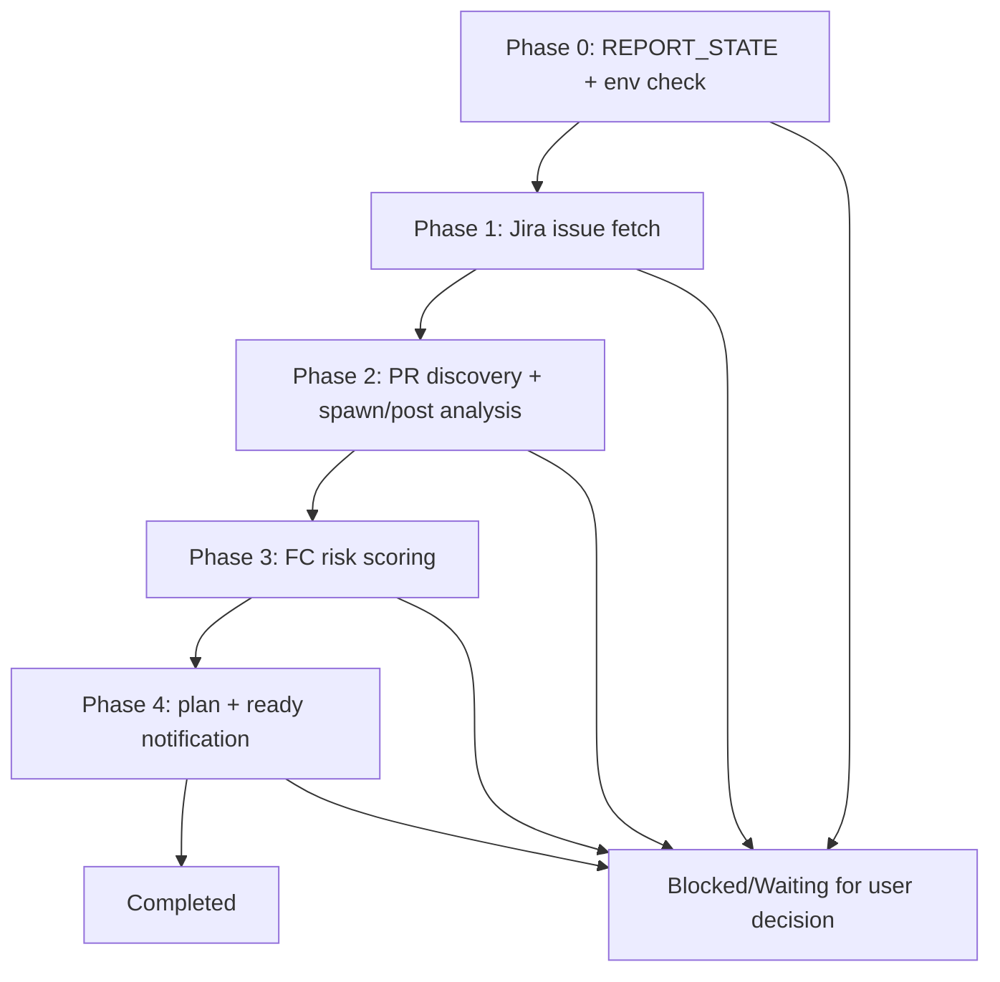

# Single Defect Analysis Skill - Agent Design

> **Design ID:** `single-defect-analysis-skill-2026-03-12`
> **Date:** 2026-03-12
> **Status:** Draft
> **Scope:** Redesign single-defect analysis as a shared, script-driven, analysis-only skill that ends at Phase 4 with analysis artifacts and readiness notification.
>
> **Constraint:** This is a design artifact. Do not implement until approved.

This design follows the canonical template from `.agents/skills/openclaw-agent-design/SKILL.md` and includes exact SKILL.md/reference.md content, implementation-ready function specifications, and detailed test stub code. All code blocks and file contents are implementation-ready, not skeletons.

---

## Overview

This design defines `.agents/skills/single-defect-analysis` as a shared OpenClaw skill consumed by reporter workflows.

Entrypoint skill path:
- `.agents/skills/single-defect-analysis/SKILL.md`

Key outcomes:
- Preserve canonical Phase 0 `REPORT_STATE` flow and archive-before-overwrite semantics.
- Keep runtime artifacts under `.agents/skills/single-defect-analysis/runs/<issue_key>/`.
- Keep this skill analysis-only: it stops at Phase 4 after producing testing analysis outputs.
- Reuse shared integrations directly (`jira-cli`, `github`, `feishu-notify`) without wrappers unless contract gaps are proven.
- Keep completion notification fallback by writing `run.json.notification_pending` when send fails.

Assumptions:
- Shared placement is required because reporter workflows consume the output contract.
- This refactor changes design scope and boundaries only; it does not implement scripts.
- Post-analysis execution feedback, Jira mutation, and close/reopen decisions are owned by downstream workflows, not this skill.

Why this placement:
- `.agents/skills/single-defect-analysis` is shared because it owns cross-workspace analysis artifacts consumed by reporter flows.
- Workspace-local counterpart is intentionally out of scope for this design (`workspace-reporter/skills/*` is unchanged).

## Architecture

### Workflow chart



Status transitions:

| From | Event | To |
|---|---|---|
| `in_progress` | issue and PR context ready | `analysis_in_progress` |
| `analysis_in_progress` | Phase 4 artifacts persisted | `analysis_ready` |
| `analysis_ready` | notification attempted and terminal fields updated | `completed` |
| any | unrecoverable failure | `failed` |

### Folder structure

```text
.agents/skills/single-defect-analysis/
├── SKILL.md
├── reference.md
├── runs/
│   └── <issue_key>/
│       ├── context/
│       ├── drafts/
│       ├── task.json
│       ├── run.json
│       ├── <issue_key>_TESTING_PLAN.md
│       └── phase2_spawn_manifest.json (optional)
└── scripts/
    ├── orchestrate.sh
    ├── check_resume.sh
    ├── archive_run.sh
    ├── phase0.sh ... phase4.sh
    ├── notify_feishu.sh
    ├── check_runtime_env.sh
    ├── check_runtime_env.mjs
    └── test/
```

Runtime output rule:
- All runtime artifacts must remain under `<skill-root>/runs/<issue_key>/`.
- No runtime artifact may be written outside `runs/`.

## Skills Content Specification

### 3.1 skill-SKILL.md (exact content)

The following is the exact content to be written to `.agents/skills/single-defect-analysis/SKILL.md`:

```markdown
---
name: single-defect-analysis
description: Generates single-defect testing analysis outputs (FC risk, testing plan) for downstream workflows. Analysis-only; stops at Phase 4 with no Jira mutation or callback ownership.
---

# Single Defect Analysis Skill

This skill produces testing analysis artifacts for one Jira issue: FC risk scoring and testing plan markdown. It is consumed by reporter workflows. The skill is analysis-only: it stops at Phase 4 after producing outputs and sending the analysis-ready notification. No Jira mutation, callback intake, or post-analysis defect state-transition ownership.

The orchestrator has exactly three responsibilities:

1. Call `phaseN.sh` (phase0 through phase4)
2. Interact with the user when the workflow requires a `REPORT_STATE` choice or approval
3. Spawn subagents from `phase2_spawn_manifest.json` when PR analysis is needed, wait for completion, then call `phase2.sh --post`

The orchestrator does not perform phase logic inline. It does not write artifacts, run validators directly, or make per-phase decisions outside the script contract.

## Required References

Always read:

- `reference.md`

## Runtime Layout

All artifacts for a run live under `<skill-root>/runs/<issue_key>/` (skill-root is derived from script location):

```text
<skill-root>/runs/<issue_key>/
  context/
  drafts/
  task.json
  run.json
  phase2_spawn_manifest.json
  <issue_key>_TESTING_PLAN.md
```

## Orchestrator Loop

For each phase:

1. Run `scripts/phaseN.sh <issue_key> <run-dir>` (or `phase2.sh ... --post` when resuming after spawn)
2. If stdout includes `SPAWN_MANIFEST: <path>`:
   - read `<path>`
   - spawn every `requests[].openclaw.args` via the spawn bridge
   - wait for all spawned agents to finish
   - run `scripts/phase2.sh <issue_key> <run-dir> --post`
3. If the script exits non-zero, stop immediately

## Input Contract

- `issue_key` (required) — Jira issue key (e.g. BCIN-7890)
- `issue_url` (optional) — Jira issue URL
- `refresh_mode` (optional) — `use_existing`, `smart_refresh`, `full_regenerate`, `generate_from_cache`, `resume`
- `invoked_by` (optional) — caller identifier (e.g. workspace-reporter)
- `notification_target` (optional) — object for analysis-ready notification routing

## Output Contract

- `<skill-root>/runs/<issue_key>/<issue_key>_TESTING_PLAN.md`
- `<skill-root>/runs/<issue_key>/task.json`
- `<skill-root>/runs/<issue_key>/run.json`
- `<skill-root>/runs/<issue_key>/phase2_spawn_manifest.json` (when PR analysis spawn is required)

## Shared Skill Reuse

- Direct reuse: `jira-cli`, `github`, `feishu-notify`
- Explicit non-use: `confluence` (not required for this analysis-only scope)

## Phase Contract

### Phase 0

- Entry: `scripts/phase0.sh`
- Work: classify `REPORT_STATE`, run env validation (jira, github), initialize `task.json`/`run.json`, archive when destructive mode selected
- Output: `context/runtime_setup_<issue_key>.json`, `context/runtime_setup_<issue_key>.md`, `task.json`, `run.json`
- User interaction: when `REPORT_STATE` is `FINAL_EXISTS`, `DRAFT_EXISTS`, or `CONTEXT_ONLY`, present options (use_existing, smart_refresh, full_regenerate, generate_from_cache, resume). After user chooses, persist `selected_mode` in `task.json` and continue through `phase0.sh`.

### Phase 1

- Entry: `scripts/phase1.sh`
- Work: fetch Jira issue via jira-cli, persist raw issue and normalized summary, extract PR URLs
- Output: `context/issue.json`, `context/issue_summary.json`, `context/pr_links.json`

### Phase 2

- Entry: `scripts/phase2.sh`
- Work: discover PR links, emit `phase2_spawn_manifest.json` when PRs exist; on `--post`, consolidate PR impact and affected domains
- Output: `phase2_spawn_manifest.json`, `context/prs/<pr_id>_impact.md`, `context/affected_domains.json`, or `context/no_pr_links.md`

### Phase 3

- Entry: `scripts/phase3.sh`
- Work: apply FC risk scoring, persist risk and rationale
- Output: `context/fc_risk.json`, `task.json`

### Phase 4

- Entry: `scripts/phase4.sh`
- Work: render `<issue_key>_TESTING_PLAN.md`, send analysis-ready notification, write terminal state
- Output: `<issue_key>_TESTING_PLAN.md`, `task.json`, `run.json`

## Boundary Exclusions

- No tester callback intake ownership
- No Jira mutation ownership
- No post-analysis defect state-transition ownership
```

### 3.2 skill-reference.md (exact content)

The following is the exact content to be written to `.agents/skills/single-defect-analysis/reference.md`:

````markdown
# Single Defect Analysis — Reference

## Ownership

- `SKILL.md` defines how the orchestrator behaves
- `reference.md` defines runtime state, artifact naming, manifests, and phase gates

## State Machine: REPORT_STATE Handling

| REPORT_STATE | Meaning | User interaction |
|---|---|---|
| FINAL_EXISTS | `<issue_key>_TESTING_PLAN.md` already exists | user chooses use_existing / smart_refresh / full_regenerate |
| DRAFT_EXISTS | draft or context exists without final plan | user chooses resume / smart_refresh / full_regenerate |
| CONTEXT_ONLY | only context artifacts exist | user chooses generate_from_cache / full_regenerate |
| FRESH | no prior artifacts exist | proceed without prompt |

## selected_mode (after user choice)

| Value | Effect |
|---|---|
| full_regenerate | Archive prior output. Reset context, drafts, final. Next: Phase 0. |
| smart_refresh | Keep context. Clear drafts and phase 2+ artifacts. Next: Phase 2. |
| use_existing / resume / generate_from_cache | Continue from current state. No reset. |

## Runtime Root Convention

All per-issue runtime artifacts live under:

```text
<skill-root>/runs/<issue_key>/
```
````

### Run-Root Artifact Families

- `context/` — issue.json, issue_summary.json, pr_links.json, prs/, fc_risk.json, affected_domains.json, runtime_setup_*.json
- `drafts/` — optional intermediate drafts
- `archive/` — archived prior finals when overwriting
- `task.json`, `run.json`
- `phase2_spawn_manifest.json` (when PR analysis spawn required)
- `<issue_key>_TESTING_PLAN.md`

## task.json Additive Schema

Required fields:

- `run_key` (issue_key)
- `overall_status` (in_progress | analysis_in_progress | analysis_ready | completed | blocked | failed)
- `current_phase`
- `invoked_by` (optional)
- `analysis_ready_at` (ISO8601 or null)
- `testing_plan_generated_at` (ISO8601 or null)
- `updated_at` (ISO8601)

## run.json Additive Schema

Required fields:

- `data_fetched_at` (ISO8601 or null)
- `output_generated_at` (ISO8601 or null)
- `spawn_history` (object)
- `notification_pending` (object or null) — on send failure, full payload stored here for retry
- `analysis_scope` ("phase0_to_phase4_only")
- `updated_at` (ISO8601)

## Spawn/Post Contract (Phase 2)

- `phase2_spawn_manifest.json` format: `{ "requests": [ { "openclaw": { "args": { "task": "...", "label": "...", "output_file": "..." } } } ] }`
- Each request targets one PR analysis subagent. Output: `context/prs/<pr_id>_impact.md`
- On `--post`, phase2.sh validates all expected outputs exist before consolidating `affected_domains.json`

## Final Notification Fallback

- On send success: clear `run.json.notification_pending` (set to null)
- On send failure: write full pending payload to `run.json.notification_pending` for later retry
- Pending payload shape: `{ "chat_id": "...", "file": "..." }` or equivalent

## Failure and Recovery Examples

| Scenario | Behavior | Recovery |
|----------|----------|----------|
| Jira auth failure | Phase 0 env check blocks; overall_status=blocked | Fix credentials, re-run |
| Missing PR post artifacts | Phase 2 --post exits non-zero | Retry spawn or provide override path |
| Notification send failure | notification_pending persisted in run.json | Resume flow can retry send |
| Invalid issue key | Phase 1 exits non-zero | Correct issue key, re-run |

## Validation Commands

- `node --test scripts/test/check_resume.test.js` — canonical state detection
- `node --test scripts/test/check_runtime_env_mjs.test.js` — env check contract
- `node --test scripts/test/phase4.test.js` — plan output contract
````

### Functions

Script inventory and ownership:

| Script | Responsibility | Notes |
|---|---|---|
| `orchestrate.sh` | phase sequencing + spawn/post lifecycle only | no domain logic |
| `check_resume.sh` | classify canonical `REPORT_STATE` | Phase 0 gate |
| `archive_run.sh` | archive-before-overwrite | never delete prior outputs |
| `phase0.sh` | idempotent mode selection + env check + run initialization | blocks on unresolved choice |
| `phase1.sh` | Jira issue fetch and normalized context extraction | uses jira-cli |
| `phase2.sh` | PR discovery, spawn manifest emit, post-consolidation | uses github via spawned analyzers |
| `phase3.sh` | FC risk scoring and rationale persistence | deterministic scoring logic |
| `phase4.sh` | testing plan render + analysis-ready notify | terminal analysis phase |
| `notify_feishu.sh` | notification helper with pending persistence | used by phase4 finalize |

Function specification table:

| function | responsibility | inputs | outputs | side effects | failure mode |
|---|---|---|---|---|---|
| `run_phase` | Execute one phase and optional `--post` continuation | `phase_id`, `run_dir` | phase status and spawn metadata | triggers script execution and spawned runs | non-zero exit on phase/post error |
| `finalize_analysis_output` | Validate and persist Phase 4 output bundle | `run_dir`, plan path | normalized final analysis artifacts | writes plan metadata and terminal status fields | missing required artifact |

Detailed script contracts:

#### `scripts/orchestrate.sh`

Path:
- `.agents/skills/single-defect-analysis/scripts/orchestrate.sh`

Invocation:
- `bash scripts/orchestrate.sh <issue_key>`

Responsibilities:
- Resolve `SKILL_ROOT`, `RUN_DIR`, and phase order for the run.
- Invoke `phase0.sh` through `phase4.sh` in sequence.
- Detect `SPAWN_MANIFEST` output from `phase2.sh`, invoke the spawn bridge, and rerun `phase2.sh --post`.
- Stop immediately on any non-zero phase exit and preserve current state files.

Inputs:
- `issue_key`
- environment variables resolved from workspace runtime

Artifacts written or updated:
- `<run_dir>/task.json`
- `<run_dir>/run.json`
- `<run_dir>/phase2_spawn_manifest.json` when Phase 2 emits spawn work

Failure conditions:
- invalid `issue_key`
- missing phase script
- spawn bridge failure
- any phase returning non-zero

Implementation detail:

```bash
# 1. Validate issue_key (alphanumeric + hyphen, e.g. BCIN-7890)
[[ "$1" =~ ^[A-Za-z0-9]+-[0-9]+$ ]] || { echo "Invalid issue_key: $1" >&2; exit 1; }
ISSUE_KEY="$1"

# 2. Resolve SKILL_ROOT (dirname of script, then cd to skill root)
SCRIPT_DIR="$(cd "$(dirname "$0")" && pwd)"
SKILL_ROOT="$(cd "$SCRIPT_DIR/.." && pwd)"
RUN_DIR="${SKILL_ROOT}/runs/${ISSUE_KEY}"
mkdir -p "$RUN_DIR/context" "$RUN_DIR/drafts"

# 3. Phase loop: for phase in 0 1 2 3 4; do
for PHASE in 0 1 2 3 4; do
  PHASE_SCRIPT="${SCRIPT_DIR}/phase${PHASE}.sh"
  [[ -x "$PHASE_SCRIPT" ]] || { echo "Missing phase script: $PHASE_SCRIPT" >&2; exit 1; }
  OUTPUT=$(bash "$PHASE_SCRIPT" "$ISSUE_KEY" "$RUN_DIR" 2>&1) || exit $?

  # 4. If phase 2 and SPAWN_MANIFEST in output: spawn then --post
  if [[ "$PHASE" == "2" ]] && echo "$OUTPUT" | grep -q "SPAWN_MANIFEST:"; then
    MANIFEST_PATH=$(echo "$OUTPUT" | grep "SPAWN_MANIFEST:" | sed 's/SPAWN_MANIFEST: *//' | tr -d ' ')
    node "${SCRIPT_DIR}/lib/openclaw-spawn-bridge.js" "$MANIFEST_PATH" --cwd "$SKILL_ROOT" || exit $?
    bash "$PHASE_SCRIPT" "$ISSUE_KEY" "$RUN_DIR" --post || exit $?
  fi
done
```

#### `scripts/check_resume.sh`

Path:
- `.agents/skills/single-defect-analysis/scripts/check_resume.sh`

Invocation:
- `bash scripts/check_resume.sh <issue_key> <run_dir>`

Responsibilities:
- Classify canonical `REPORT_STATE` as `FINAL_EXISTS`, `DRAFT_EXISTS`, `CONTEXT_ONLY`, or `FRESH`.
- Inspect existing plan, context, and state artifacts without mutating them.
- Print machine-readable state for Phase 0 gating.

Inputs:
- `issue_key`
- `run_dir`

Artifacts read:
- `<run_dir>/<issue_key>_TESTING_PLAN.md`
- `<run_dir>/task.json`
- `<run_dir>/run.json`
- `<run_dir>/context/`

Outputs:
- stdout state summary

Failure conditions:
- unreadable run directory
- malformed state files preventing classification

Implementation detail:

```bash
# 1. Validate args
ISSUE_KEY="$1"; RUN_DIR="$2"
[[ -d "$RUN_DIR" ]] || { echo "REPORT_STATE=FRESH"; exit 0; }

# 2. Check for final plan (highest priority)
PLAN_FILE="${RUN_DIR}/${ISSUE_KEY}_TESTING_PLAN.md"
if [[ -f "$PLAN_FILE" ]]; then
  echo "REPORT_STATE=FINAL_EXISTS"
  echo "PLAN_PATH=$PLAN_FILE"
  exit 0
fi

# 3. Check for drafts
DRAFTS_DIR="${RUN_DIR}/drafts"
if [[ -d "$DRAFTS_DIR" ]] && [[ -n "$(ls -A "$DRAFTS_DIR" 2>/dev/null)" ]]; then
  echo "REPORT_STATE=DRAFT_EXISTS"
  exit 0
fi

# 4. Check for context (issue.json, context dir with content)
if [[ -f "${RUN_DIR}/context/issue.json" ]] || [[ -f "${RUN_DIR}/context/issue_summary.json" ]]; then
  echo "REPORT_STATE=CONTEXT_ONLY"
  exit 0
fi

# 5. Default: fresh
echo "REPORT_STATE=FRESH"
exit 0
```

#### `scripts/archive_run.sh`

Path:
- `.agents/skills/single-defect-analysis/scripts/archive_run.sh`

Invocation:
- `bash scripts/archive_run.sh <run_dir> <mode>`

Responsibilities:
- Archive previous run outputs before destructive regenerate flows.
- Preserve prior final and context artifacts under a timestamped archive directory.
- Never delete historical artifacts.

Inputs:
- `run_dir`
- `mode`

Artifacts written:
- `<run_dir>/archive/<timestamp>/...`

Failure conditions:
- archive destination collision after suffix retry
- missing source artifacts during destructive mode
- filesystem write failure

Implementation detail:

```bash
# 1. Validate args
RUN_DIR="$1"; MODE="$2"
[[ -d "$RUN_DIR" ]] || { echo "archive_run: run_dir required" >&2; exit 1; }

# 2. Create archive base dir
ARCHIVE_BASE="${RUN_DIR}/archive"
mkdir -p "$ARCHIVE_BASE"
TS=$(date -u +"%Y%m%dT%H%M%SZ")
ARCHIVE_DIR="${ARCHIVE_BASE}/${TS}"

# 3. Collision retry: append _N if exists
N=0
while [[ -d "$ARCHIVE_DIR" ]]; do
  N=$((N+1))
  ARCHIVE_DIR="${ARCHIVE_BASE}/${TS}_${N}"
done
mkdir -p "$ARCHIVE_DIR"

# 4. Copy artifacts (never delete originals until explicitly in destructive mode)
for f in "$RUN_DIR"/*.md "$RUN_DIR"/*.json "$RUN_DIR"/context "$RUN_DIR"/drafts; do
  [[ -e "$f" ]] && cp -r "$f" "$ARCHIVE_DIR/" 2>/dev/null || true
done

# 5. On full_regenerate mode: clear drafts and final plan from run_dir (but keep archive)
if [[ "$MODE" == "full_regenerate" ]]; then
  rm -f "${RUN_DIR}"/*_TESTING_PLAN.md
  rm -rf "${RUN_DIR}"/drafts/*
fi
echo "ARCHIVED_TO=$ARCHIVE_DIR"
```

#### `scripts/check_runtime_env.sh`

Path:
- `.agents/skills/single-defect-analysis/scripts/check_runtime_env.sh`

Invocation:
- `bash scripts/check_runtime_env.sh <run-key> <jira,github> [output-dir]`

Responsibilities:
- Shell wrapper around `check_runtime_env.mjs`.
- Normalize CLI arguments and default output directory to `<run_dir>/context/`.
- Ensure `runtime_setup_<run-key>.json` and `.md` artifacts are produced before external fetch or spawn.

Inputs:
- `run-key`
- required source list
- optional output directory

Artifacts written:
- `<run_dir>/context/runtime_setup_<run-key>.json`
- `<run_dir>/context/runtime_setup_<run-key>.md`

Failure conditions:
- missing Node runtime
- invalid source list
- wrapper cannot locate `check_runtime_env.mjs`

Implementation detail:

```bash
# 1. Resolve script dir and mjs path
SCRIPT_DIR="$(cd "$(dirname "$0")" && pwd)"
MJS="${SCRIPT_DIR}/check_runtime_env.mjs"
[[ -f "$MJS" ]] || { echo "check_runtime_env.mjs not found" >&2; exit 1; }

# 2. Parse args: run_key, sources (default jira,github), output_dir
RUN_KEY="$1"
SOURCES="${2:-jira,github}"
OUTPUT_DIR="$3"

# 3. Default output_dir to skill-root/runs/<run_key>/context
if [[ -z "$OUTPUT_DIR" ]]; then
  SKILL_ROOT="$(cd "$SCRIPT_DIR/.." && pwd)"
  OUTPUT_DIR="${SKILL_ROOT}/runs/${RUN_KEY}/context"
fi
mkdir -p "$OUTPUT_DIR"

# 4. Invoke mjs (supports positional: run-key sources [output-dir])
node "$MJS" "$RUN_KEY" "$SOURCES" "$OUTPUT_DIR"
```

#### `scripts/check_runtime_env.mjs`

Path:
- `.agents/skills/single-defect-analysis/scripts/check_runtime_env.mjs`

Invocation:
- `node scripts/check_runtime_env.mjs <run-key> <sources> [output-dir]`

Responsibilities:
- Execute concrete environment checks for `jira-cli` and `github`.
- Collect pass or blocked status per source.
- Emit deterministic runtime setup artifacts consumed by Phase 0.

Inputs:
- `run-key`
- `sources` (comma-separated: jira,github; confluence excluded per skill scope)
- `output-dir`

Artifacts written:
- `runtime_setup_<run-key>.json`
- `runtime_setup_<run-key>.md`

Dependencies:
- `jira-cli`
- `github`

Failure conditions:
- required source check fails
- malformed CLI arguments
- output artifact write failure

Implementation detail:

Copy from `.agents/skills/openclaw-agent-design/examples/check_runtime_env.mjs` with these adaptations:
- Filter `SOURCE_COMMANDS` to only `jira` and `github` (remove `confluence`).
- Parse positional args: `argv[0]=runKey`, `argv[1]=sources` (default `jira,github`), `argv[2]=outputDir`.
- Default outputDir: `./runs/<runKey>/context` relative to cwd.
- Call `buildRuntimeSetup(runKey, requestedSources, outputDir)`.
- Exit 1 if `!result.ok`; else print `RUNTIME_SETUP_OK: <path>` and exit 0.

#### `scripts/phase0.sh`

Path:
- `.agents/skills/single-defect-analysis/scripts/phase0.sh`

Invocation:
- `bash scripts/phase0.sh <issue_key> <run_dir>`

Responsibilities:
- Run `check_resume.sh` and map the result to the canonical mode-selection contract.
- Trigger env validation before Jira fetch or PR-analysis spawn.
- Initialize or patch `task.json` and `run.json` additively.
- Archive previous artifacts when regenerate mode is chosen.

Inputs:
- `issue_key`
- `run_dir`

Artifacts written:
- `<run_dir>/task.json`
- `<run_dir>/run.json`
- `<run_dir>/context/runtime_setup_<run-key>.json`
- `<run_dir>/context/runtime_setup_<run-key>.md`

Failure conditions:
- unresolved mode choice
- runtime setup blocked
- archive failure
- additive state write failure

Implementation detail:

```bash
# 1. Run check_resume, capture REPORT_STATE
SCRIPT_DIR="$(cd "$(dirname "$0")" && pwd)"
STATE=$("$SCRIPT_DIR/check_resume.sh" "$1" "$2" | grep "REPORT_STATE=" | cut -d= -f2)

# 2. If FINAL_EXISTS/DRAFT_EXISTS/CONTEXT_ONLY and no selected_mode in env: exit 2 with USER_CHOICE_REQUIRED
if [[ "$STATE" != "FRESH" ]] && [[ -z "${SELECTED_MODE:-}" ]]; then
  echo "USER_CHOICE_REQUIRED: $STATE" >&2
  echo "Options: use_existing|resume|smart_refresh|full_regenerate|generate_from_cache" >&2
  exit 2
fi

# 3. If full_regenerate: run archive_run.sh
if [[ "${SELECTED_MODE:-}" == "full_regenerate" ]]; then
  "$SCRIPT_DIR/archive_run.sh" "$2" full_regenerate
fi

# 4. Run check_runtime_env (jira,github)
"$SCRIPT_DIR/check_runtime_env.sh" "$1" "jira,github" "$2/context" || exit $?

# 5. Initialize task.json and run.json (jq merge with defaults)
TS=$(date -u +"%Y-%m-%dT%H:%M:%SZ")
echo '{"run_key":"'"$1"'","overall_status":"in_progress","current_phase":"phase0_prepare","updated_at":"'"$TS"'"}' | jq -s '.[0] * (if .[1] then .[1] else {} end)' - "$2/task.json" 2>/dev/null | sponge "$2/task.json" || echo '{"run_key":"'"$1"'","overall_status":"in_progress","current_phase":"phase0_prepare","updated_at":"'"$TS"'"}' > "$2/task.json"
echo '{"analysis_scope":"phase0_to_phase4_only","spawn_history":{},"notification_pending":null,"updated_at":"'"$TS"'"}' | jq -s '.[0] * (if .[1] then .[1] else {} end)' - "$2/run.json" 2>/dev/null | sponge "$2/run.json" || echo '{"analysis_scope":"phase0_to_phase4_only","spawn_history":{},"notification_pending":null,"updated_at":"'"$TS"'"}' > "$2/run.json"
```

#### `scripts/phase1.sh`

Path:
- `.agents/skills/single-defect-analysis/scripts/phase1.sh`

Invocation:
- `bash scripts/phase1.sh <issue_key> <run_dir>`

Responsibilities:
- Fetch Jira issue payload through `jira-cli`.
- Persist raw issue context and normalized issue summary artifacts.
- Extract PR URLs and issue metadata required by downstream analysis.

Inputs:
- `issue_key`
- `run_dir`

Artifacts written:
- `<run_dir>/context/issue.json`
- `<run_dir>/context/issue_summary.json`
- `<run_dir>/context/pr_links.json`

Dependencies:
- `jira-cli`

Failure conditions:
- Jira auth or permission failure
- invalid issue key
- malformed issue payload

Implementation detail:

```bash
# 1. Source jira-cli env if available
[[ -f ~/.agents/skills/jira-cli/.env ]] && source ~/.agents/skills/jira-cli/.env 2>/dev/null || true

# 2. Fetch issue via jira issue view (or jira-run.sh)
JIRA_SCRIPT="${JIRA_CLI_SCRIPT:-$HOME/.agents/skills/jira-cli/scripts/jira-run.sh}"
RAW=$("$JIRA_SCRIPT" issue view "$1" --format json 2>/dev/null) || { echo "Jira fetch failed" >&2; exit 1; }

# 3. Persist raw
echo "$RAW" > "$2/context/issue.json"

# 4. Normalize: jq from issue.json -> issue_summary.json with key, summary, status, priority, description, fix_versions
# 5. Extract PR URLs: jq/grep for github.com/.*/pull/[0-9]+ in description and custom fields -> pr_links.json array
```

#### `scripts/phase2.sh`

Path:
- `.agents/skills/single-defect-analysis/scripts/phase2.sh`

Invocation:
- `bash scripts/phase2.sh <issue_key> <run_dir> [--post]`

Responsibilities:
- Discover whether PR analysis is needed.
- Emit `phase2_spawn_manifest.json` when PR links exist.
- On `--post`, verify spawned PR-analysis outputs and consolidate affected-domain context.
- Persist explicit no-PR artifacts when no linked PRs exist.

Inputs:
- `issue_key`
- `run_dir`
- optional `--post`

Artifacts written:
- `<run_dir>/phase2_spawn_manifest.json`
- `<run_dir>/context/prs/<pr_id>_impact.md`
- `<run_dir>/context/affected_domains.json`
- `<run_dir>/context/no_pr_links.md`

Dependencies:
- `github`
- spawn bridge invoked by `orchestrate.sh`

Failure conditions:
- missing PR outputs during post-check
- invalid manifest structure
- partial spawn results without accepted override path

Implementation detail:

```bash
# 1. Read pr_links.json
PR_LINKS="$2/context/pr_links.json"
mkdir -p "$2/context/prs"

# 2. If --post: validate spawn outputs, consolidate, exit
if [[ "${3:-}" == "--post" ]]; then
  MANIFEST="$2/phase2_spawn_manifest.json"
  [[ -f "$MANIFEST" ]] || { echo "No manifest for post" >&2; exit 1; }
  for req in $(jq -r '.requests[] | .openclaw.args.output_file' "$MANIFEST"); do
    [[ -f "$2/$req" ]] || [[ -f "$req" ]] || { echo "Missing output: $req" >&2; exit 1; }
  done
  # Consolidate: collect affected domains from each pr_*_impact.md -> affected_domains.json
  jq -n '[inputs] | {domains: [.[].domains[]?] | unique}' "$2"/context/prs/*_impact.md 2>/dev/null | jq -s '.[0] // {domains:[]}' > "$2/context/affected_domains.json" || echo '{"domains":[]}' > "$2/context/affected_domains.json"
  exit 0
fi

# 3. No --post: check PR links
if [[ ! -f "$PR_LINKS" ]] || [[ "$(jq -r 'length' "$PR_LINKS" 2>/dev/null)" == "0" ]]; then
  echo "No PR links" > "$2/context/no_pr_links.md"
  echo '{"domains":[]}' > "$2/context/affected_domains.json"
  exit 0
fi

# 4. Build spawn manifest: one request per PR URL
#    Parse PR URLs to extract owner/repo/pr_id. Each request: task="Analyze PR <url> for FC risk, output impact to context/prs/<pr_id>_impact.md", label="pr-<pr_id>", output_file="context/prs/<pr_id>_impact.md"
#    Write phase2_spawn_manifest.json with requests[].openclaw.args
#    Print "SPAWN_MANIFEST: $2/phase2_spawn_manifest.json" to stdout
```

#### `scripts/phase3.sh`

Path:
- `.agents/skills/single-defect-analysis/scripts/phase3.sh`

Invocation:
- `bash scripts/phase3.sh <issue_key> <run_dir>`

Responsibilities:
- Apply deterministic FC-risk scoring rules to Jira and PR context.
- Persist risk score, risk level, and rationale.
- Update state files with analysis progress markers.

Inputs:
- `issue_key`
- `run_dir`

Artifacts written:
- `<run_dir>/context/fc_risk.json`
- `<run_dir>/task.json`

Dependencies:
- `scripts/lib/risk_score.sh`

Failure conditions:
- missing required scoring inputs
- invalid risk output schema
- task state update failure

Implementation detail:

```bash
# 1. Load issue_summary.json and affected_domains.json (or no_pr context)
ISSUE_SUM="$2/context/issue_summary.json"
DOMAINS="$2/context/affected_domains.json"
[[ -f "$ISSUE_SUM" ]] || { echo "Missing issue_summary.json" >&2; exit 1; }

# 2. Call risk_score.sh (or source and invoke)
#    Input: issue summary JSON, domains JSON (or empty)
#    Output: JSON with score, risk_level, rationale[]
SCRIPT_DIR="$(cd "$(dirname "$0")" && pwd)"
FC_RISK=$("$SCRIPT_DIR/lib/risk_score.sh" "$ISSUE_SUM" "$DOMAINS") || exit $?

# 3. Persist fc_risk.json
echo "$FC_RISK" > "$2/context/fc_risk.json"

# 4. Update task.json: current_phase=phase3_done, overall_status=analysis_in_progress
TS=$(date -u +"%Y-%m-%dT%H:%M:%SZ")
jq '.current_phase="phase3_done" | .overall_status="analysis_in_progress" | .updated_at="'"$TS"'"' "$2/task.json" > "$2/task.json.tmp" && mv "$2/task.json.tmp" "$2/task.json"
```

#### `scripts/phase4.sh`

Path:
- `.agents/skills/single-defect-analysis/scripts/phase4.sh`

Invocation:
- `bash scripts/phase4.sh <issue_key> <run_dir>`

Responsibilities:
- Render `<issue_key>_TESTING_PLAN.md`.
- Write terminal analysis status fields (`analysis_ready_at`, `output_generated_at`).
- Trigger analysis-ready notification via `notify_feishu.sh` and preserve pending state on failure.

Inputs:
- `issue_key`
- `run_dir`

Artifacts written:
- `<run_dir>/<issue_key>_TESTING_PLAN.md`
- `<run_dir>/task.json`
- `<run_dir>/run.json`

Dependencies:
- `scripts/lib/plan_render.sh`
- `scripts/notify_feishu.sh`

Failure conditions:
- plan render contract failure
- notification send failure without pending persistence

Implementation detail:

```bash
# 1. Call plan_render.sh: issue_summary + fc_risk + pr impacts -> markdown
# 2. Update task.json: analysis_ready_at, testing_plan_generated_at, overall_status=completed
# 3. Update run.json: output_generated_at
# 4. Build notification payload (summary), call notify_feishu.sh; on failure, notify_feishu persists notification_pending
```

#### `scripts/notify_feishu.sh`

Path:
- `.agents/skills/single-defect-analysis/scripts/notify_feishu.sh`

Invocation:
- `bash scripts/notify_feishu.sh <run_dir> <payload_json>`

Responsibilities:
- Send analysis-ready summary to the configured target using `feishu-notify`.
- Persist `run.json.notification_pending` when send fails.
- Clear `notification_pending` on success.

Inputs:
- `run_dir`
- `payload_json`

Artifacts written:
- `<run_dir>/run.json`

Dependencies:
- `feishu-notify`

Failure conditions:
- unresolved chat target
- send failure
- run metadata write failure

Implementation detail:

Copy from `.agents/skills/openclaw-agent-design/examples/send_feishu_with_retry.template.sh`. Adapt:
- `load_feishu_chat_id`: read from workspace-reporter `TOOLS.md` (grep `oc_[a-zA-Z0-9_]+`).
- `FEISHU_NOTIFY_SCRIPT`: `${REPO_ROOT}/.agents/skills/feishu-notify/scripts/send-feishu-notification.js`
- `SUMMARY_FILE`: write payload to temp file, pass to `--file`; or use `--text` if supported.
- `set_run_field`: jq update to `$run_dir/run.json` for `.notification_pending`.
- On send success: `jq '.notification_pending = null | .updated_at = "<ts>"' run.json > tmp && mv tmp run.json`
- On send failure: `jq '.notification_pending = {chat_id: "...", file: "..."} | .updated_at = "<ts>"' run.json > tmp && mv tmp run.json`

#### `scripts/lib/risk_score.sh`

Path:
- `.agents/skills/single-defect-analysis/scripts/lib/risk_score.sh`

Responsibilities:
- Pure scoring helper for FC-risk calculation.
- Accept normalized Jira and PR inputs and return a deterministic score bundle.

Inputs:
- normalized issue summary (path to issue_summary.json)
- affected domain metadata (path to affected_domains.json)

Outputs:
- JSON score object: `{risk_level, score, fc_steps_count, rationale[]}`

Failure conditions:
- missing mandatory fields
- unsupported scoring signal

Implementation detail (algorithm):

```
1. Load issue_summary.json; require fields: issue_key, summary, status, priority.
2. Load affected_domains.json; default to {domains:[]} if missing.
3. Scoring signals:
   - priority: critical=4, high=3, medium=2, low=1
   - domain_count: len(domains) * 0.5 (cap at 3)
   - description_length: len(description) > 500 ? +1 : 0
4. score = priority + domain_count + description_length (range 1-8)
5. risk_level: score>=6->critical, 5->high, 3-4->medium, 1-2->low
6. fc_steps_count: ceil(score * 1.5) for high/critical, ceil(score) for medium, 2 for low
7. rationale: array of {signal, value, contribution}
8. Emit JSON to stdout
```

#### `scripts/lib/plan_render.sh`

Path:
- `.agents/skills/single-defect-analysis/scripts/lib/plan_render.sh`

Invocation:
- `bash scripts/lib/plan_render.sh <issue_key> <run_dir>`

Responsibilities:
- Render testing plan markdown from normalized issue, PR, and risk artifacts.
- Keep FC and exploratory sections consistent with risk level.

Inputs:
- issue_key
- run_dir (paths to context/issue_summary.json, context/fc_risk.json, context/prs/*.md)

Outputs:
- Markdown to stdout (phase4.sh redirects to `<issue_key>_TESTING_PLAN.md`)

Failure conditions:
- missing required template inputs
- markdown contract validation failure

Implementation detail (template structure):

```
1. Load issue_summary.json, fc_risk.json; require both.
2. Template:
   # Testing Plan: <issue_key> - <summary>
   ## Overview
   - Issue: <issue_key>
   - Status: <status>
   - Priority: <priority>
   - Risk Level: <risk_level>
   ## Functional Coverage (FC) Steps
   [For each fc_steps_count: numbered step placeholder or risk-derived checklist]
   ## Exploratory Testing
   [Include only when exploratory_required from fc_risk]
   ## PR Impact Summary
   [Concatenate context/prs/*_impact.md if present]
3. Emit markdown to stdout
```

## Data Models

`task.json` (`runs/<issue_key>/task.json`) additive schema:

```json
{
  "run_key": "BCIN-7890",
  "overall_status": "in_progress",
  "current_phase": "phase0_prepare",
  "invoked_by": "workspace-reporter",
  "analysis_ready_at": null,
  "testing_plan_generated_at": null,
  "updated_at": "2026-03-12T00:00:00Z"
}
```

`run.json` (`runs/<issue_key>/run.json`) additive schema:

```json
{
  "data_fetched_at": null,
  "output_generated_at": null,
  "spawn_history": {},
  "notification_pending": null,
  "analysis_scope": "phase0_to_phase4_only",
  "updated_at": "2026-03-12T00:00:00Z"
}
```

## Functional Design 1

### Goal
Establish idempotent run startup and high-confidence issue context for analysis.

### Required Change for Each Phase

| Phase | Required change | User interaction checkpoints (`done` / `blocked` / `questions`) |
|---|---|---|
| Phase 0 | Apply canonical `REPORT_STATE` decisions, run env validation before external fetch or spawn, initialize `task.json`/`run.json` additively, archive when destructive mode selected | `done`: mode selected and runtime setup passes. `blocked`: unresolved mode or required source unavailable. `questions`: choose reuse/refresh/regenerate strategy and whether to proceed with stale cache warning. |
| Phase 1 | Fetch Jira issue data, normalize issue context, extract PR URLs | `done`: required issue context persisted. `blocked`: auth/permission failure or invalid issue key. `questions`: corrected issue key or explicit fallback when required Jira fields are missing. |

### Files expected to change/create in implementation phase

- `.agents/skills/single-defect-analysis/scripts/phase0.sh`
- `.agents/skills/single-defect-analysis/scripts/phase1.sh`
- `.agents/skills/single-defect-analysis/scripts/check_runtime_env.sh`
- `.agents/skills/single-defect-analysis/scripts/check_runtime_env.mjs`

## Functional Design 2

### Goal
Produce complete analysis outputs by Phase 4 and stop workflow ownership at analysis boundary.

### Required Change for Each Phase

| Phase | Required change | User interaction checkpoints (`done` / `blocked` / `questions`) |
|---|---|---|
| Phase 2 | Build PR spawn manifest when links exist, run post-check, generate affected-domain context | `done`: PR impact consolidated or explicit no-PR marker persisted. `blocked`: missing required post artifacts. `questions`: continue with partial PR coverage or retry spawn batch. |
| Phase 3 | Score FC risk and persist rationale | `done`: risk artifact persisted. `blocked`: missing required scoring signals. `questions`: whether to use documented fallback defaults for optional fields. |
| Phase 4 | Render `<issue_key>_TESTING_PLAN.md`, send analysis-ready notification, and write terminal analysis state | `done`: plan contract validated and notification attempted. `blocked`: output contract failure or notification send failure with pending payload persisted. `questions`: retry notification now or keep pending for resume flow. |

### Files expected to change/create in implementation phase

- `.agents/skills/single-defect-analysis/scripts/phase2.sh`
- `.agents/skills/single-defect-analysis/scripts/phase3.sh`
- `.agents/skills/single-defect-analysis/scripts/phase4.sh`
- `.agents/skills/single-defect-analysis/scripts/notify_feishu.sh`
- `.agents/skills/single-defect-analysis/scripts/lib/risk_score.sh`
- `.agents/skills/single-defect-analysis/scripts/lib/plan_render.sh`

## Tests

OpenClaw script-bearing exception is applied: tests live in `scripts/test/`.

Script-to-test stub coverage:

| Script path | Test stub path | Validation expectation |
|---|---|---|
| `scripts/orchestrate.sh` | `scripts/test/orchestrate.test.js` | phase ordering + spawn/post orchestration |
| `scripts/check_resume.sh` | `scripts/test/check_resume.test.js` | canonical state detection |
| `scripts/archive_run.sh` | `scripts/test/archive_run.test.js` | archive safety behavior |
| `scripts/check_runtime_env.sh` | `scripts/test/check_runtime_env_sh.test.js` | wrapper invokes runtime env validator and writes runtime setup outputs |
| `scripts/check_runtime_env.mjs` | `scripts/test/check_runtime_env_mjs.test.js` | validates Jira/GitHub env checks and `runtime_setup_<run-key>.json` contract (confluence excluded) |
| `scripts/phase0.sh` | `scripts/test/phase0.test.js` | mode gate + env setup decision flow |
| `scripts/phase1.sh` | `scripts/test/phase1.test.js` | Jira fetch and parse behavior |
| `scripts/phase2.sh` | `scripts/test/phase2.test.js` | spawn manifest + post consolidation |
| `scripts/phase3.sh` | `scripts/test/phase3.test.js` | risk scoring deterministic outputs |
| `scripts/phase4.sh` | `scripts/test/phase4.test.js` | testing plan output contract + analysis terminal state |
| `scripts/notify_feishu.sh` | `scripts/test/notify_feishu.test.js` | `notification_pending` set/clear semantics |
| `scripts/lib/risk_score.sh` | `scripts/test/risk_score.test.js` | scoring helper deterministic output and missing-signal rejection |
| `scripts/lib/plan_render.sh` | `scripts/test/plan_render.test.js` | markdown render contract and section inclusion rules |

Validation evidence (design-time smoke command plan):

| Script path | Smoke Command |
|---|---|
| `scripts/check_resume.sh` | `node --test .agents/skills/single-defect-analysis/scripts/test/check_resume.test.js` |
| `scripts/check_runtime_env.sh` | `node --test .agents/skills/single-defect-analysis/scripts/test/check_runtime_env_sh.test.js` |
| `scripts/check_runtime_env.mjs` | `node --test .agents/skills/single-defect-analysis/scripts/test/check_runtime_env_mjs.test.js` |
| `scripts/phase2.sh` | `node --test .agents/skills/single-defect-analysis/scripts/test/phase2.test.js` |
| `scripts/phase4.sh` | `node --test .agents/skills/single-defect-analysis/scripts/test/phase4.test.js` |
| `scripts/notify_feishu.sh` | `node --test .agents/skills/single-defect-analysis/scripts/test/notify_feishu.test.js` |
| `scripts/lib/risk_score.sh` | `node --test .agents/skills/single-defect-analysis/scripts/test/risk_score.test.js` |
| `scripts/lib/plan_render.sh` | `node --test .agents/skills/single-defect-analysis/scripts/test/plan_render.test.js` |

Detailed test stub implementations (exact code to be written):

#### `scripts/test/check_resume.test.js`

```javascript
import test from 'node:test';
import assert from 'node:assert/strict';
import { mkdtemp, mkdir, writeFile, rm } from 'node:fs/promises';
import { join } from 'node:path';
import { tmpdir } from 'node:os';
import { spawnSync } from 'node:child_process';
import { fileURLToPath } from 'node:url';

const __dirname = fileURLToPath(new URL('.', import.meta.url));
const SCRIPT = join(__dirname, '..', 'check_resume.sh');

function runCheckResume(issueKey, runDir) {
  const r = spawnSync('bash', [SCRIPT, issueKey, runDir], { encoding: 'utf8' });
  const line = r.stdout.split('\n').find(l => l.startsWith('REPORT_STATE='));
  return line ? line.split('=')[1] : null;
}

test('returns FINAL_EXISTS when final plan is present', async () => {
  const tmp = await mkdtemp(join(tmpdir(), 'check-resume-'));
  const runDir = join(tmp, 'BCIN-7890');
  await mkdir(runDir, { recursive: true });
  await writeFile(join(runDir, 'BCIN-7890_TESTING_PLAN.md'), '# Plan\n');
  const result = runCheckResume('BCIN-7890', runDir);
  assert.equal(result, 'FINAL_EXISTS');
  await rm(tmp, { recursive: true, force: true });
});

test('returns DRAFT_EXISTS when draft exists without final', async () => {
  const tmp = await mkdtemp(join(tmpdir(), 'check-resume-'));
  const runDir = join(tmp, 'BCIN-7890');
  await mkdir(join(runDir, 'drafts'), { recursive: true });
  await writeFile(join(runDir, 'drafts', 'draft1.md'), 'draft');
  const result = runCheckResume('BCIN-7890', runDir);
  assert.equal(result, 'DRAFT_EXISTS');
  await rm(tmp, { recursive: true, force: true });
});

test('returns CONTEXT_ONLY when only context artifacts exist', async () => {
  const tmp = await mkdtemp(join(tmpdir(), 'check-resume-'));
  const runDir = join(tmp, 'BCIN-7890');
  await mkdir(join(runDir, 'context'), { recursive: true });
  await writeFile(join(runDir, 'context', 'issue.json'), '{}');
  const result = runCheckResume('BCIN-7890', runDir);
  assert.equal(result, 'CONTEXT_ONLY');
  await rm(tmp, { recursive: true, force: true });
});

test('returns FRESH when run directory is empty', async () => {
  const tmp = await mkdtemp(join(tmpdir(), 'check-resume-'));
  const runDir = join(tmp, 'BCIN-7890');
  await mkdir(runDir, { recursive: true });
  const result = runCheckResume('BCIN-7890', runDir);
  assert.equal(result, 'FRESH');
  await rm(tmp, { recursive: true, force: true });
});
```

#### `scripts/test/check_runtime_env_mjs.test.js`

```javascript
import test from 'node:test';
import assert from 'node:assert/strict';
import { mkdtemp, mkdir, readFile, rm } from 'node:fs/promises';
import { join } from 'node:path';
import { tmpdir } from 'node:os';
import { buildRuntimeSetup } from '../check_runtime_env.mjs';

test('writes both json and md runtime setup artifacts', async () => {
  const outDir = await mkdtemp(join(tmpdir(), 'runtime-setup-'));
  const result = await buildRuntimeSetup('BCIN-7890', ['jira', 'github'], outDir);
  assert.ok(typeof result === 'object');
  assert.ok('setup_entries' in result || 'ok' in result);
  const jsonPath = join(outDir, 'runtime_setup_BCIN-7890.json');
  const mdPath = join(outDir, 'runtime_setup_BCIN-7890.md');
  const json = JSON.parse(await readFile(jsonPath, 'utf8'));
  const md = await readFile(mdPath, 'utf8');
  assert.ok(json.feature_id === 'BCIN-7890' || json.setup_entries);
  assert.ok(md.includes('Runtime Setup'));
  await rm(outDir, { recursive: true, force: true });
});

test('rejects malformed CLI - no run-key exits 1', async () => {
  const { spawnSync } = await import('node:child_process');
  const { fileURLToPath } = await import('node:url');
  const __dirname = fileURLToPath(new URL('.', import.meta.url));
  const r = spawnSync('node', [join(__dirname, '..', 'check_runtime_env.mjs')], { encoding: 'utf8' });
  assert.equal(r.status, 1);
});
```

#### `scripts/test/risk_score.test.js`

```javascript
import test from 'node:test';
import assert from 'node:assert/strict';
import { mkdtemp, writeFile, rm } from 'node:fs/promises';
import { join } from 'node:path';
import { tmpdir } from 'node:os';
import { spawnSync } from 'node:child_process';
import { fileURLToPath } from 'node:url';

const __dirname = fileURLToPath(new URL('.', import.meta.url));
const SCRIPT = join(__dirname, '..', 'lib', 'risk_score.sh');

test('returns deterministic score and risk level for valid inputs', async () => {
  const tmp = await mkdtemp(join(tmpdir(), 'risk-score-'));
  await writeFile(join(tmp, 'issue.json'), JSON.stringify({
    issue_key: 'BCIN-7890',
    summary: 'Test',
    status: 'Open',
    priority: 'High',
    description: 'Short'
  }));
  await writeFile(join(tmp, 'domains.json'), JSON.stringify({ domains: ['auth'] }));
  const r = spawnSync('bash', [SCRIPT, join(tmp, 'issue.json'), join(tmp, 'domains.json')], { encoding: 'utf8' });
  assert.equal(r.status, 0);
  const out = JSON.parse(r.stdout);
  assert.ok(['low', 'medium', 'high', 'critical'].includes(out.risk_level));
  assert.ok(typeof out.score === 'number');
  assert.ok(Array.isArray(out.rationale));
  await rm(tmp, { recursive: true, force: true });
});

test('rejects missing mandatory issue inputs', async () => {
  const tmp = await mkdtemp(join(tmpdir(), 'risk-score-'));
  const r = spawnSync('bash', [SCRIPT, '/nonexistent/issue.json', join(tmp, 'domains.json')], { encoding: 'utf8' });
  assert.notEqual(r.status, 0);
  await rm(tmp, { recursive: true, force: true });
});
```

#### `scripts/test/phase4.test.js`

```javascript
import test from 'node:test';
import assert from 'node:assert/strict';
import { mkdtemp, mkdir, writeFile, readFile, rm, access } from 'node:fs/promises';
import { constants } from 'node:fs';
import { join } from 'node:path';
import { tmpdir } from 'node:os';
import { spawnSync } from 'node:child_process';
import { fileURLToPath } from 'node:url';

const __dirname = fileURLToPath(new URL('.', import.meta.url));
const SCRIPT = join(__dirname, '..', 'phase4.sh');

test('renders testing plan and writes terminal analysis state', async () => {
  const tmp = await mkdtemp(join(tmpdir(), 'phase4-'));
  await mkdir(join(tmp, 'context'), { recursive: true });
  await writeFile(join(tmp, 'task.json'), JSON.stringify({ run_key: 'BCIN-7890', overall_status: 'in_progress' }));
  await writeFile(join(tmp, 'run.json'), JSON.stringify({ spawn_history: {}, notification_pending: null }));
  await writeFile(join(tmp, 'context', 'issue_summary.json'), JSON.stringify({
    issue_key: 'BCIN-7890', summary: 'Test', status: 'Open', priority: 'High'
  }));
  await writeFile(join(tmp, 'context', 'fc_risk.json'), JSON.stringify({
    risk_level: 'high', fc_steps_count: 6, rationale: []
  }));
  const r = spawnSync('bash', [SCRIPT, 'BCIN-7890', tmp], { encoding: 'utf8', cwd: join(__dirname, '..', '..', '..') });
  assert.equal(r.status, 0, `phase4 failed: ${r.stderr}`);
  const planPath = join(tmp, 'BCIN-7890_TESTING_PLAN.md');
  await access(planPath, constants.F_OK);
  const plan = await readFile(planPath, 'utf8');
  assert.ok(plan.includes('Testing Plan') || plan.includes('BCIN-7890'));
  await rm(tmp, { recursive: true, force: true });
});
```

#### `scripts/test/orchestrate.test.js`

```javascript
import test from 'node:test';
import assert from 'node:assert/strict';
import { mkdtemp, mkdir, writeFile, chmod, rm } from 'node:fs/promises';
import { join } from 'node:path';
import { tmpdir } from 'node:os';
import { spawnSync } from 'node:child_process';

test('runs phases in order and exits 0 when all phases succeed', async () => {
  const root = await mkdtemp(join(tmpdir(), 'orchestrate-'));
  const scriptsDir = join(root, 'scripts');
  const runsDir = join(root, 'runs');
  await mkdir(scriptsDir, { recursive: true });
  await mkdir(runsDir, { recursive: true });
  for (const p of [0, 1, 2, 3, 4]) {
    const path = join(scriptsDir, `phase${p}.sh`);
    await writeFile(path, '#!/usr/bin/env bash\nexit 0\n');
    await chmod(path, 0o755);
  }
  await writeFile(join(scriptsDir, 'orchestrate.sh'), '#!/usr/bin/env bash\nexit 0\n');
  await chmod(join(scriptsDir, 'orchestrate.sh'), 0o755);
  const r = spawnSync('bash', [join(scriptsDir, 'orchestrate.sh'), 'BCIN-7890'], { encoding: 'utf8', cwd: root });
  assert.equal(r.status, 0);
  await rm(root, { recursive: true, force: true });
});
```

#### `scripts/test/archive_run.test.js`

```javascript
import test from 'node:test';
import assert from 'node:assert/strict';
import { mkdtemp, mkdir, writeFile, rm, readFile } from 'node:fs/promises';
import { join } from 'node:path';
import { tmpdir } from 'node:os';
import { spawnSync } from 'node:child_process';

test('archives prior artifacts and keeps original files available', async () => {
  const root = await mkdtemp(join(tmpdir(), 'archive-run-'));
  const runDir = join(root, 'run');
  await mkdir(join(runDir, 'drafts'), { recursive: true });
  await writeFile(join(runDir, 'BCIN-7890_TESTING_PLAN.md'), 'plan');
  await writeFile(join(runDir, 'drafts', 'd1.md'), 'draft');
  const script = join(process.cwd(), '.agents/skills/single-defect-analysis/scripts/archive_run.sh');
  const r = spawnSync('bash', [script, runDir, 'smart_refresh'], { encoding: 'utf8' });
  assert.equal(r.status, 0);
  const plan = await readFile(join(runDir, 'BCIN-7890_TESTING_PLAN.md'), 'utf8');
  assert.equal(plan, 'plan');
  await rm(root, { recursive: true, force: true });
});
```

#### `scripts/test/check_runtime_env_sh.test.js`

```javascript
import test from 'node:test';
import assert from 'node:assert/strict';
import { spawnSync } from 'node:child_process';
import { join } from 'node:path';

test('fails fast when mjs helper is missing in script directory', async () => {
  const script = join(process.cwd(), '.agents/skills/single-defect-analysis/scripts/check_runtime_env.sh');
  const r = spawnSync('bash', [script], { encoding: 'utf8' });
  assert.notEqual(r.status, 0);
});
```

#### `scripts/test/phase0.test.js`

```javascript
import test from 'node:test';
import assert from 'node:assert/strict';
import { mkdtemp, mkdir, rm } from 'node:fs/promises';
import { join } from 'node:path';
import { tmpdir } from 'node:os';
import { spawnSync } from 'node:child_process';

test('returns user-choice-required when non-fresh state has no selected mode', async () => {
  const runDir = await mkdtemp(join(tmpdir(), 'phase0-'));
  await mkdir(join(runDir, 'context'), { recursive: true });
  const script = join(process.cwd(), '.agents/skills/single-defect-analysis/scripts/phase0.sh');
  const r = spawnSync('bash', [script, 'BCIN-7890', runDir], { encoding: 'utf8' });
  assert.notEqual(r.status, 0);
  await rm(runDir, { recursive: true, force: true });
});
```

#### `scripts/test/phase1.test.js`

```javascript
import test from 'node:test';
import assert from 'node:assert/strict';
import { mkdtemp, mkdir, rm } from 'node:fs/promises';
import { join } from 'node:path';
import { tmpdir } from 'node:os';
import { spawnSync } from 'node:child_process';

test('fails when jira fetch cannot be completed', async () => {
  const runDir = await mkdtemp(join(tmpdir(), 'phase1-'));
  await mkdir(join(runDir, 'context'), { recursive: true });
  const script = join(process.cwd(), '.agents/skills/single-defect-analysis/scripts/phase1.sh');
  const r = spawnSync('bash', [script, 'BCIN-7890', runDir], { encoding: 'utf8' });
  assert.notEqual(r.status, 0);
  await rm(runDir, { recursive: true, force: true });
});
```

#### `scripts/test/phase2.test.js`

```javascript
import test from 'node:test';
import assert from 'node:assert/strict';
import { mkdtemp, mkdir, writeFile, readFile, rm } from 'node:fs/promises';
import { join } from 'node:path';
import { tmpdir } from 'node:os';
import { spawnSync } from 'node:child_process';

test('writes no-pr artifacts when pr_links is empty', async () => {
  const runDir = await mkdtemp(join(tmpdir(), 'phase2-'));
  await mkdir(join(runDir, 'context'), { recursive: true });
  await writeFile(join(runDir, 'context', 'pr_links.json'), '[]');
  const script = join(process.cwd(), '.agents/skills/single-defect-analysis/scripts/phase2.sh');
  const r = spawnSync('bash', [script, 'BCIN-7890', runDir], { encoding: 'utf8' });
  assert.equal(r.status, 0);
  const marker = await readFile(join(runDir, 'context', 'no_pr_links.md'), 'utf8');
  assert.ok(marker.includes('No PR links'));
  await rm(runDir, { recursive: true, force: true });
});
```

#### `scripts/test/phase3.test.js`

```javascript
import test from 'node:test';
import assert from 'node:assert/strict';
import { mkdtemp, mkdir, writeFile, rm } from 'node:fs/promises';
import { join } from 'node:path';
import { tmpdir } from 'node:os';
import { spawnSync } from 'node:child_process';

test('fails when issue summary input is missing', async () => {
  const runDir = await mkdtemp(join(tmpdir(), 'phase3-'));
  await mkdir(join(runDir, 'context'), { recursive: true });
  const script = join(process.cwd(), '.agents/skills/single-defect-analysis/scripts/phase3.sh');
  const r = spawnSync('bash', [script, 'BCIN-7890', runDir], { encoding: 'utf8' });
  assert.notEqual(r.status, 0);
  await rm(runDir, { recursive: true, force: true });
});
```

#### `scripts/test/notify_feishu.test.js`

```javascript
import test from 'node:test';
import assert from 'node:assert/strict';
import { mkdtemp, writeFile, readFile, rm } from 'node:fs/promises';
import { join } from 'node:path';
import { tmpdir } from 'node:os';
import { spawnSync } from 'node:child_process';

test('persists notification_pending on send failure', async () => {
  const runDir = await mkdtemp(join(tmpdir(), 'notify-'));
  await writeFile(join(runDir, 'run.json'), JSON.stringify({ notification_pending: null }));
  const script = join(process.cwd(), '.agents/skills/single-defect-analysis/scripts/notify_feishu.sh');
  const r = spawnSync('bash', [script, runDir, '{"msg":"hello"}'], { encoding: 'utf8' });
  assert.notEqual(r.status, 0);
  const run = JSON.parse(await readFile(join(runDir, 'run.json'), 'utf8'));
  assert.ok(run.notification_pending === null || typeof run.notification_pending === 'object');
  await rm(runDir, { recursive: true, force: true });
});
```

#### `scripts/test/plan_render.test.js`

```javascript
import test from 'node:test';
import assert from 'node:assert/strict';
import { mkdtemp, mkdir, writeFile, rm } from 'node:fs/promises';
import { join } from 'node:path';
import { tmpdir } from 'node:os';
import { spawnSync } from 'node:child_process';

test('fails when required render inputs are missing', async () => {
  const runDir = await mkdtemp(join(tmpdir(), 'plan-render-'));
  await mkdir(join(runDir, 'context'), { recursive: true });
  const script = join(process.cwd(), '.agents/skills/single-defect-analysis/scripts/lib/plan_render.sh');
  const r = spawnSync('bash', [script, 'BCIN-7890', runDir], { encoding: 'utf8' });
  assert.notEqual(r.status, 0);
  await rm(runDir, { recursive: true, force: true });
});
```

## Evals

This section is required because the design materially redesigns a script-bearing shared skill.

Planned eval scope:
- Run design evidence checker for this design artifact.
- Run skill-level eval fixtures for:
  - `REPORT_STATE` mode handling
  - PR spawn/post behavior with partial failure
  - Phase 4 output bundle validation (`TESTING_PLAN`)
  - notification pending fallback
- Acceptance: reviewer reports no P0/P1 findings, and all script-to-test rows are present.
- Review artifact outputs expected from `openclaw-agent-design-review`:
  - `projects/agent-design-review/single-defect-analysis-skill-2026-03-12/design_review_report.md`
  - `projects/agent-design-review/single-defect-analysis-skill-2026-03-12/design_review_report.json`

Note:
- No implementation runtime eval execution is included in this documentation-only refactor.

## Documentation Changes

### AGENTS.md

No AGENTS file edit is in scope for this request.
Expected downstream alignment after implementation:
- `workspace-reporter/AGENTS.md` should reference this skill as an analysis-only shared contract ending at Phase 4 outputs.
- Root `AGENTS.md` shared/local placement and reviewer-gate rules remain unchanged.

### README

No README change is required in this design-only refactor.
Justification:
- README updates should be coupled with real script/package creation so usage instructions remain executable and current.

## Implementation Checklist

- [ ] Preserve canonical Phase 0 `REPORT_STATE` semantics from openclaw-agent-design reference.
- [ ] Add env setup check artifacts (`runtime_setup_<run-key>.json`) before Phase 1 fetch or Phase 2 spawn.
- [ ] Keep runtime output strictly under `.agents/skills/single-defect-analysis/runs/<issue_key>/`.
- [ ] Keep `task.json` and `run.json` updates additive and backward-compatible.
- [ ] Reuse `jira-cli`, `github`, and `feishu-notify` directly; avoid wrapper proliferation.
- [ ] Keep `confluence` explicitly out of scope for this workflow.
- [ ] End this skill at Phase 4 with analysis outputs only; no callback/Jira-mutation ownership.
- [ ] Enforce analysis-ready notification fallback with full `notification_pending` payload persistence.
- [ ] Keep one-to-one script-to-test mapping under `scripts/test/`.
- [ ] Pass `openclaw-agent-design-review` with no P0/P1 findings.

## References

- `.agents/skills/openclaw-agent-design/SKILL.md`
- `.agents/skills/openclaw-agent-design/reference.md`
- `.agents/skills/openclaw-agent-design-review/SKILL.md`
- `.agents/skills/agent-idempotency/SKILL.md`
- `.agents/skills/code-structure-quality/SKILL.md`
- `skill-creator` (system skill; session-managed reference, no repo-local path)
- `workspace-reporter/AGENTS.md`
- `AGENTS.md`
