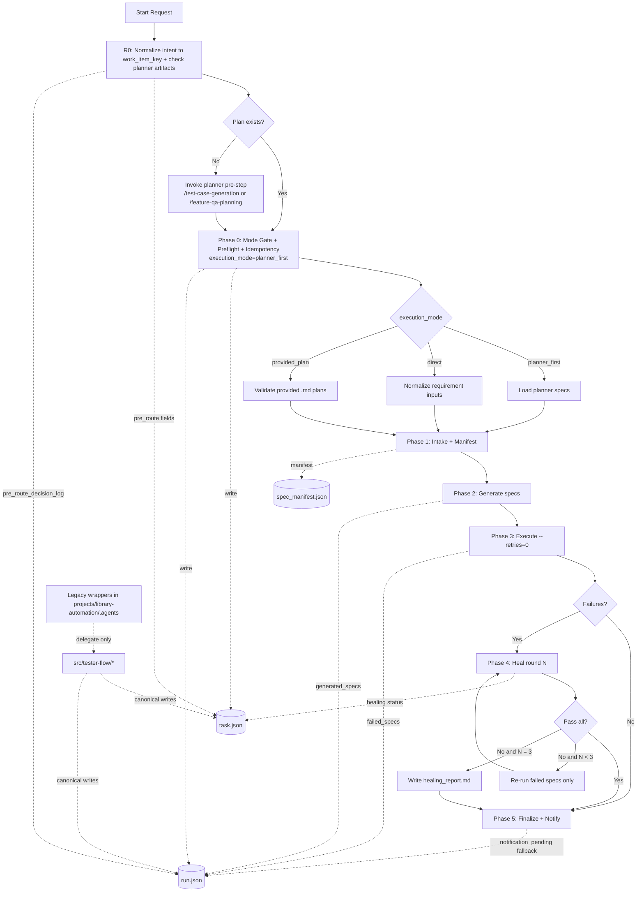

# Workspace-Tester Playwright Generation + Healing Implementation (Execution-Mode Ready)

## 1. Objective

Define one implementation-ready workflow that supports three execution modes and produces deterministic state/artifacts for:

1. Playwright spec generation from Markdown plans.
2. Baseline execution with deterministic retry settings.
3. Bounded healing (max 3 rounds).
4. Resume-safe state control.

---

## 2. Source of Truth and Effective Status

### 2.1 Effective Date

This document is effective on **March 3, 2026** and defines both:

1. canonical target architecture, and
2. mandatory migration behavior until full cutover is complete.

### 2.2 Path Base Contract (Single Base)

All relative paths in this document are resolved from:

- `workspace-tester/`

Examples:

1. planner workspace path: `../workspace-planner/projects/feature-plan/<work_item_key>/specs/`
2. canonical agents root: `.agents/workflows/`
3. canonical state root: `memory/tester-flow/runs/<work_item_key>/`

### 2.3 Canonical Targets (Normative)

1. `.agents` discovery default: `.agents`
2. Canonical workflow docs root: `.agents/workflows/`
3. Canonical orchestration code root: `src/tester-flow/`
4. Canonical run-state root: `memory/tester-flow/runs/<work_item_key>/`

### 2.4 Migration Compatibility (Until Cutover)

Current runnable assets also exist under `projects/library-automation/.agents/` and `projects/library-automation/runs/`.

Mandatory migration rule:

1. Project-local `.agents` scripts are wrapper-compatible only.
2. Canonical workflow entrypoints must exist under `.agents/workflows/`.
3. Canonical state writes must target `memory/tester-flow/runs/*`.
4. If optional mirror writes to `projects/library-automation/runs/*` are retained, set:
   - `run.json.legacy_path_used=true`
   - `run.json.legacy_path_reason=<reason>`

### 2.5 Blocker Rule

If `.agents/workflows/planner-spec-generation-healing.md` is missing, this design is not implementation-complete.

Variable legend:

1. `<work_item_key>`: work item identifier, for example `BCIN-6709`.

---

## 3. Scope and Non-Goals

### In Scope

1. Execution-mode routing and state registration.
2. Canonical path/discovery and migration compatibility rules.
3. Control/data state schemas and resume behavior.
4. Handoff contracts among planner, generator, healer.
5. Executable acceptance checks.

### Non-Goals

1. Replacing WDIO migration workflow semantics.
2. Redefining generator/healer skill internals.
3. CI pipeline design beyond commands/artifacts defined here.

---

## 4. Execution Modes and Input Contracts

Mode selection is mandatory before Phase 0 completes.

### 4.1 Mode Enum

1. `planner_first`
2. `direct`
3. `provided_plan`

### 4.2 Common Input Schema

```json
{
  "work_item_key": "BCIN-6709",
  "execution_mode": "planner_first",
  "new_run_on_mode_change": false,
  "framework_profile": "memory/tester-flow/framework-profile/library-automation.json"
}
```

Field definitions:

1. `work_item_key`: required string.
2. `execution_mode`: required enum.
3. `new_run_on_mode_change`: optional boolean; default `false`.
4. `framework_profile`: optional path override.

### 4.3 Mode-Specific Inputs

1. `planner_first`
   - required: planner specs directory
   - default source: `../workspace-planner/projects/feature-plan/<work_item_key>/specs/`

2. `direct`
   - required: requirements context path(s)
   - allowed kinds: `.md`, `.json`, `.txt`

3. `provided_plan`
   - required: explicit plan path list
   - allowed kinds: `.md` only

### 4.4 Plan Normalization and Validation

1. Expand input globs to concrete file list.
2. Deduplicate by absolute path.
3. Reject non-existent paths.
4. Reject directories after expansion.
5. Reject non-`.md` files in `provided_plan`.
6. Sort final list lexicographically for deterministic manifest generation.

### 4.5 Critical Seed Reference (Defined)

A **critical seed reference** is a required `**Seed:**` line in each scenario Markdown that points to reproducible data/setup context.

Validation:

1. If missing in `provided_plan` or `planner_first`, mark phase blocked.
2. In `direct`, seed may be synthesized once and persisted into generated intake Markdown before generation.

### 4.6 Pre-routing Phase `R0`: Intent Normalize + Plan Existence Check

This phase is mandatory and runs before Phase 0.

Input aliases:

1. `feature-id` -> `work_item_key`
2. `issue-key` -> `work_item_key`

Existence check paths:

1. `../workspace-planner/projects/feature-plan/<work_item_key>/qa_plan_final.md`
2. `../workspace-planner/projects/feature-plan/<work_item_key>/specs/`

Route rules:

1. Plan exists -> set `execution_mode=planner_first` and invoke `.agents/workflows/planner-spec-generation-healing.md`.
2. Plan missing -> invoke planner workflow first (`/test-case-generation` or upstream `/feature-qa-planning` path), then handoff to `.agents/workflows/planner-spec-generation-healing.md`.

User-case compatibility:

1. C1: user asks to test `<feature-id>` -> normalize via R0 -> same route logic.
2. C2: user asks to test `<issue-key>` -> normalize via R0 -> same route logic.

---

## 5. Canonical Paths

All paths are relative to `workspace-tester/`.

1. Planner specs source default:
   - `../workspace-planner/projects/feature-plan/<work_item_key>/specs/`
2. Tester intake specs:
   - `projects/library-automation/specs/feature-plan/<work_item_key>/`
3. Generated specs:
   - `projects/library-automation/tests/specs/feature-plan/<work_item_key>/`
4. Workflow docs (canonical):
   - `.agents/workflows/`
5. Runtime orchestration code (canonical):
   - `src/tester-flow/`
6. Run state (canonical):
   - `memory/tester-flow/runs/<work_item_key>/`
7. Compatibility wrappers (legacy only):
   - `projects/library-automation/.agents/`

---

## 6. State Control Model

### 6.1 `task.json` (Control Plane)

Path:

- `memory/tester-flow/runs/<work_item_key>/task.json`

Required fields:

```json
{
  "work_item_key": "BCIN-6709",
  "intent_source_type": "feature_id",
  "intent_input_raw": "BCIN-6709",
  "pre_route_status": "plan_exists",
  "planner_presolve_invoked": false,
  "overall_status": "running",
  "current_phase": "phase_2_generate",
  "execution_mode": "planner_first",
  "mode_decision_source": "user_input",
  "mode_locked": true,
  "planner_invocation_required": true,
  "plan_source_kind": "planner_output",
  "plan_source_path": "../workspace-planner/projects/feature-plan/BCIN-6709/specs",
  "agents_root": ".agents",
  "discovery_policy": "workspace_root_only",
  "phase_status": {
    "phase_0_preflight": "completed",
    "phase_1_intake": "completed",
    "phase_2_generate": "running",
    "phase_3_execute": "pending",
    "phase_4_heal": "pending",
    "phase_5_finalize": "pending"
  },
  "healing": {
    "max_rounds": 3,
    "current_round": 0,
    "status": "not_started"
  }
}
```

### 6.2 `run.json` (Data Plane)

Path:

- `memory/tester-flow/runs/<work_item_key>/run.json`

Required fields:

```json
{
  "execution_mode": "planner_first",
  "pre_route_decision_log": [
    {
      "at": "2026-03-03T00:00:00Z",
      "intent_source_type": "feature_id",
      "intent_input_raw": "BCIN-6709",
      "work_item_key": "BCIN-6709",
      "plan_existence": "exists",
      "route": "invoke_tester_workflow"
    }
  ],
  "planner_specs_source": "../workspace-planner/projects/feature-plan/BCIN-6709/specs",
  "resolved_plan_inputs": [],
  "planner_artifact_path": null,
  "intake_manifest_path": "memory/tester-flow/runs/BCIN-6709/context/spec_manifest.json",
  "generated_specs": [],
  "failed_specs": [],
  "mode_transition_log": [
    {
      "at": "2026-03-03T00:00:00Z",
      "from": null,
      "to": "planner_first",
      "reason": "initial_mode_gate"
    }
  ],
  "legacy_path_used": false,
  "legacy_path_reason": null,
  "notification_pending": null
}
```

### 6.3 Resume and Override Rules

1. Resume requires requested mode == persisted mode.
2. If mode differs and `new_run_on_mode_change=false`, fail fast.
3. If mode differs and `new_run_on_mode_change=true`, create a new run namespace:
   - `memory/tester-flow/runs/<work_item_key>/mode-shift-<timestamp>/`

### 6.4 Schema Migration Table (Old -> New)

| Legacy source | Canonical target | Backfill/drop policy |
|---|---|---|
| `task.feature_key` | `task.work_item_key` | Rename on load, keep read fallback for one migration cycle. |
| `task.phases` | `task.phase_status` | Map phase statuses by key. |
| `task.current_phase=phase_0_idempotency` | `task.current_phase=phase_0_preflight` | Map old phase names to new names at read time. |
| `task` missing routing fields | add `intent_source_type`, `intent_input_raw`, `pre_route_status`, `planner_presolve_invoked` | Backfill during R0 normalization. |
| `task.healing.*` | `task.healing.*` | Preserve as-is; ensure `max_rounds=3`. |
| `task` missing mode fields | add `execution_mode`, `mode_decision_source`, `mode_locked`, `plan_source_kind`, `plan_source_path` | Backfill during Phase 0 init. |
| `run.run_key` | derived from `task.work_item_key` | Keep read compatibility; do not write in canonical schema. |
| `run.report_state` | unchanged | Preserve and write canonical value. |
| `run.data_fetched_at` | unchanged | Preserve and write canonical value. |
| `run.output_generated_at` | unchanged | Preserve and write canonical value. |
| `run.output_approved_at` | unchanged | Preserve if present; optional in v2. |
| `run.tester_specs_dir` | optional compatibility field | Preserve on read; optional write. |
| `run.archive_log` | optional compatibility field | Preserve on read; optional write. |
| `run` missing routing log | add `pre_route_decision_log[]` | Backfill first entry during R0 normalization. |
| `run.generated_specs` | unchanged | Preserve and append deduplicated items. |
| `run.failed_specs` | unchanged | Preserve and overwrite per execution/healing round. |
| `runs/<key>/task.json` under project root | `memory/tester-flow/runs/<key>/task.json` | Canonical write target; optional mirror copy only. |
| `runs/<key>/run.json` under project root | `memory/tester-flow/runs/<key>/run.json` | Canonical write target; optional mirror copy only. |

---

## 7. Phase Workflow (Actionable)

## R0: Intent Normalize + Plan Existence Check

Inputs:

1. raw user intent (`feature-id` or `issue-key`)

Actions:

1. Normalize alias to `work_item_key`.
2. Check planner artifacts:
   - `../workspace-planner/projects/feature-plan/<work_item_key>/qa_plan_final.md`
   - `../workspace-planner/projects/feature-plan/<work_item_key>/specs/`
3. If artifacts exist:
   - set `pre_route_status=plan_exists`
   - set `execution_mode=planner_first`
   - route directly to `.agents/workflows/planner-spec-generation-healing.md`
4. If artifacts are missing:
   - set `pre_route_status=plan_missing`
   - set `planner_presolve_invoked=true`
   - invoke planner pre-step (`/test-case-generation` or upstream `/feature-qa-planning`)
   - after planner outputs are ready, handoff to `.agents/workflows/planner-spec-generation-healing.md`
5. Append `pre_route_decision_log` entry in `run.json`.

## Phase 0: Preflight + Mode Gate + Idempotency

Inputs:

1. normalized `work_item_key`
2. `execution_mode` from R0 decision
3. optional source paths

Actions:

1. Resolve agents root to `.agents`.
2. Validate mode inputs and normalize paths.
3. Load/create framework profile.
4. Classify report state (`FINAL_EXISTS`, `DRAFT_EXISTS`, `CONTEXT_ONLY`, `FRESH`).
5. Persist mode + preflight state to `task.json` and `run.json`.

## Phase 1: Intake + Manifest

Actions:

1. Copy/normalize specs into tester intake path.
2. Build `spec_manifest.json` with:
   - source path
   - hash
   - modified timestamp
   - inferred scenario id
   - target `.spec.ts` output path

## Phase 2: Generation

Actions:

1. Invoke `playwright-test-generator` per manifest item.
2. Pass source markdown, seed, target path, framework profile.
3. Retry one time on generation failure.
4. Record generated outputs and failures.

## Phase 3: Execution

Actions:

1. Run generated suite with `--retries=0`.
2. Capture failed spec list and logs.

## Phase 4: Healing (Max 3)

Actions:

1. Invoke `playwright-test-healer` for failed specs only.
2. Re-run failed set only.
3. Stop at pass-all or round 3.
4. If unresolved after round 3, write `healing_report.md`.

## Phase 5: Finalize + Notification

Actions:

1. Write execution summary.
2. Set final state.
3. Send Feishu notification.
4. On send failure, set `run.json.notification_pending=<full payload>`.

Verification:

```bash
jq -r '.notification_pending // empty' memory/tester-flow/runs/<work_item_key>/run.json
```

---

## 8. Handoff Contracts

### Planner -> Tester

Required:

1. `work_item_key`
2. planner markdown directory

Tester output:

1. `spec_manifest.json`

### Tester -> Generator

Required per item:

1. source markdown path
2. `**Seed:**` reference
3. target output path
4. framework profile path

### Tester -> Healer

Required on fail:

1. failed spec path list
2. execution command and logs
3. source markdown paths
4. framework profile path
5. optional WDIO source mapping

Constraints:

1. max 3 rounds
2. preserve test intent
3. do not remove steps silently

---

## 9. Retry and Failure Policy

1. Generation retry: one retry per failed item.
2. Execution retry: none in baseline execution phase.
3. Healing retry: max 3 rounds, failed-only rerun.
4. Hard blockers:
   - missing mode-required source paths
   - missing critical seed reference
   - missing canonical `.agents` entrypoint
   - invalid mode transition without override

---

## 10. Executable Acceptance Checks

All checks are required for readiness.

| ID | Command | Expected result | Assertion path |
|---|---|---|---|
| MODE-01 | `jq -r '.execution_mode' memory/tester-flow/runs/<work_item_key>/task.json` | one of `planner_first/direct/provided_plan` | `task.json.execution_mode` |
| MODE-02 | `jq -r '.execution_mode' memory/tester-flow/runs/<work_item_key>/run.json` | matches task mode | `run.json.execution_mode` |
| ROUTE-01 | `jq -r '.intent_source_type' memory/tester-flow/runs/<work_item_key>/task.json` | `feature_id` or `issue_key` | `task.json.intent_source_type` |
| ROUTE-02 | `jq -r '.pre_route_status' memory/tester-flow/runs/<work_item_key>/task.json` | `plan_exists` or `plan_missing` | `task.json.pre_route_status` |
| ROUTE-03 | `jq -r '.pre_route_decision_log | length' memory/tester-flow/runs/<work_item_key>/run.json` | `>= 1` | `run.json.pre_route_decision_log` |
| ROUTE-04 | `if [ -f ../workspace-planner/projects/feature-plan/<work_item_key>/qa_plan_final.md ]; then echo EXISTS; else echo MISSING; fi` | output matches `pre_route_status` | planner existence routing |
| ROUTE-05 | `jq -r '.planner_presolve_invoked' memory/tester-flow/runs/<work_item_key>/task.json` | `true` only when plan missing | `task.json.planner_presolve_invoked` |
| PATH-01 | `test -f .agents/workflows/planner-spec-generation-healing.md && echo OK` | prints `OK` | canonical workflow root |
| PATH-02 | `jq -r '.agents_root' memory/tester-flow/runs/<work_item_key>/task.json` | `.agents` | `task.json.agents_root` |
| STATE-01 | `jq -r '.mode_transition_log | length' memory/tester-flow/runs/<work_item_key>/run.json` | `>= 1` | `run.json.mode_transition_log` |
| HEAL-01 | `jq -r '.healing.max_rounds' memory/tester-flow/runs/<work_item_key>/task.json` | `3` | `task.json.healing.max_rounds` |
| HEAL-02 | `test -f memory/tester-flow/runs/<work_item_key>/healing/healing_report.md && echo REPORT` | `REPORT` only when unresolved | healing artifact path |
| NOTIFY-01 | `jq -r '.notification_pending // ""' memory/tester-flow/runs/<work_item_key>/run.json` | empty on success, payload on failure | `run.json.notification_pending` |
| FLOW-01 | `jq -r '.generated_specs | length' memory/tester-flow/runs/<work_item_key>/run.json` | `> 0` after generation | `run.json.generated_specs` |
| FLOW-02 | `jq -r '.failed_specs | length' memory/tester-flow/runs/<work_item_key>/run.json` | non-increasing across heal rounds | `run.json.failed_specs` |
| FLOW-03 | `jq -r '.healing.current_round' memory/tester-flow/runs/<work_item_key>/task.json` | `<= 3` always | `task.json.healing.current_round` |

Behavior smoke command (phase 2->4 contract):

```bash
WORK_ITEM_KEY=<work_item_key>
# generate + execute baseline + heal loop are expected to update canonical state files
# workflow invocation may be agent-driven; assertion checks below are mandatory post-run
jq -r '.generated_specs | length' "memory/tester-flow/runs/$WORK_ITEM_KEY/run.json"
jq -r '.healing.current_round' "memory/tester-flow/runs/$WORK_ITEM_KEY/task.json"
```

---

## 11. Documentation Impact

README impact status: **User-facing README update required**.

Required updates:

1. `AGENTS.md`
   - mode gate and canonical discovery policy.
2. `MEMORY.md`
   - state file map and migration notes.
3. User-facing README update:
   - `README_TESTER_FLOW.md`
   - include mode usage, path policy, and failure triage.

---

## 12. Rollout Milestones

1. M0 Bootstrap:
   - create `.agents/workflows/` and register canonical entrypoints.
2. M1 Runtime migration:
   - move executable logic to `src/tester-flow/`.
   - convert project-local scripts to wrappers.
3. M2 State migration:
   - canonical writes to `memory/tester-flow/runs/`.
   - optional mirror outputs retained temporarily.
4. M3 Enforcement:
   - reject implicit project-local `.agents` discovery.
   - enforce acceptance checks as preflight gate.
5. M4 Legacy cleanup:
   - remove project-local wrappers after adoption criteria pass.

---

## 13. Architecture Chart (Mermaid)



---

## 14. Definition of Done

Ready for implementation only when all are true:

1. `.agents` default discovery resolves to `.agents` from `workspace-tester/`.
2. R0 routing contract maps both `feature-id` and `issue-key` to the same `work_item_key` flow.
3. Existence-based routing is enforced before Phase 0.
4. Mode gate is persisted in both state files.
5. Schema migration/backfill rules are implemented.
6. Acceptance checks are executable and passing.
7. User-facing README update is applied.
